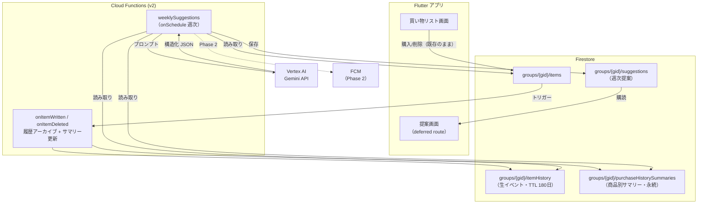

# AI提案機能 — 概要とロードマップ（ドラフト）

Gemini を活用し、グループの買い物履歴から「購入忘れの指摘」と「次期購入アイテムの提案」を
週次で生成・配信する機能の設計ドラフト。

元になった構成案（Gemini を活用した買い物リスト提案システムの戦略と構成案）を、
現在のコードベース・Firestore 構造に合わせて再設計したものである。

## ドキュメント構成

| ドキュメント | 内容 |
|---|---|
| 本書 | 全体像・元構成案とのギャップ・フェーズ計画 |
| [01-履歴データ設計.md](./01-履歴データ設計.md) | Phase 0: 履歴捕捉（itemHistory / purchaseHistorySummaries）・TTL・Security Rules |
| [02-週次提案パイプライン設計.md](./02-週次提案パイプライン設計.md) | Phase 1: スケジュール実行・Gemini 呼び出し・プロンプト・提案保存 |
| [03-提案の表示と通知設計.md](./03-提案の表示と通知設計.md) | Phase 1: アプリ内表示 / Phase 2: FCM プッシュ |
| [04-コスト試算と運用.md](./04-コスト試算と運用.md) | コスト試算・監視・キルスイッチ・Blaze 移行 |
| [05-未解決論点と決定ログ.md](./05-未解決論点と決定ログ.md) | 決定事項と要判断事項の一覧 |

---

## 1. 解決したい課題（元構成案より）

- **購入忘れ**: 定期的に購入すべき消耗品や、リストから削除されたアイテムの買い忘れ。
- **買い物計画の非効率性**: 何を・いつ買うべきかを手動で判断する手間。
- **履歴データの活用不足**: 過去の購買履歴が将来の買い物計画に活かされていない。

## 2. 元構成案と現実装のギャップ

元構成案はそのままでは現実装に適用できない。主なギャップと本ドラフトでの解決方針:

| # | 元構成案の前提 | 現実装 | 本ドラフトの方針 |
|---|---|---|---|
| 1 | アイテム status は `pending / bought / claiming` | `ItemStatus.active / purchased` の 2 値 + 「買います」は `buyingBy` 非 null の論理状態（`lib/domain/entities/item.dart`） | 現実装の status 体系を正とする |
| 2 | `quantity` / `lastPurchasedAt` / `purchaseCount` / `updatedAt` フィールドが存在 | いずれも存在しない | アイテム本体には追加せず、サマリードキュメント側で保持（01 参照） |
| 3 | 論理削除（`isDeleted` フラグ）で履歴を保持 | **物理削除**（`deleteItem` / `deletePurchasedItems` / `deleteItemsByTag`） | 論理削除は採用しない。Functions の削除/更新トリガーでイベントをアーカイブ（01 参照） |
| 4 | 提案は `users/{userId}/suggestions` に保存 | リストはグループ共有（`groups/{groupId}/items`） | **`groups/{groupId}/suggestions`** に保存。提案はグループの関心事 |
| 5 | 集約 Function（月次）+ 物理削除 Function（月次）を別途運用 | — | 集約は削除/購入トリガー内で**インクリメンタル**に実施、生履歴の削除は **Firestore ネイティブ TTL** で代替。バッチ Function 2 本を不要化 |
| 6 | FCM で即プッシュ配信 | `UserDoc.fcmToken` フィールド定義のみ。`firebase_messaging` 未導入 | Phase 1 はアプリ内表示のみ、Phase 2 で FCM（03 参照） |
| 7 | Cloud Functions 前提 | `functions/` なし。サーバーサイドコードゼロ。Spark プラン想定 | Phase 0 で `functions/` 新設 + **Blaze プラン移行**（前提条件） |

## 3. 全体アーキテクチャ

設計上の柱:

1. **クライアント無変更で履歴を捕捉する**: Firestore トリガーは物理削除でも削除時点の
   スナップショットを受け取れる。既存のクエリ・削除フロー・テストに一切手を入れない。
2. **集約は最初からインクリメンタル**: 生データ全件を Gemini に渡す事態を構造的に回避し、
   トークンコストと Firestore 読み取りを初日から最小化する。
3. **提案はグループ単位**: 「牛乳を買い忘れていませんか」は共有リストへの提案であり、
   メンバー全員が同じ提案を見る。通知のみユーザー単位でファンアウトする。

## 4. フェーズ計画

| フェーズ | 内容 | ユーザー可視 | 前提 |
|---|---|---|---|
| **Phase 0** | Blaze 移行 / `functions/` 新設 / 履歴アーカイブトリガー + インクリメンタル集約 / TTL 設定 / Security Rules 追加 | なし（裏側のみ） | — |
| **Phase 1** | 週次 `onSchedule` → Gemini（structured output）→ `suggestions` 保存 + アプリ内提案画面 | **提案画面** | Phase 0 + 履歴が数週間蓄積されていること |
| **Phase 2** | FCM プッシュ配信（`firebase_messaging` 導入・トークン管理・3 プラットフォーム対応） | プッシュ通知 | Phase 1 |
| **Phase 3** | 提案へのフィードバック還流（採用/却下をプロンプトへ）・`Group.plan` 連動の有料機能化 | 提案精度向上・プラン差別化 | Phase 2 |

> **重要**: Phase 0 のデプロイ以降にしか履歴は蓄積されない（過去データのバックフィルは
> 物理削除済みのため不可能）。Phase 1 の提案品質は履歴量に依存するため、
> **Phase 0 を可能な限り早期に**デプロイし、Phase 1 の開発期間中に履歴を貯めるのが合理的。

## 5. スコープ外（本ドラフトでは扱わない）

- 商品マスタ・バーコード連携などの商品データベース化
- 提案のリアルタイム生成（オンデマンド実行）。週次バッチのみ
- グループをまたいだユーザー個人の購買分析
