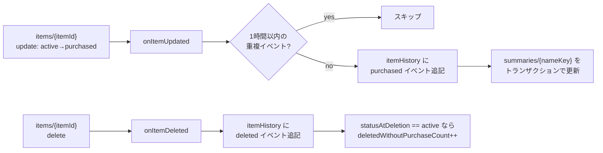

# 01. 履歴データ設計（Phase 0）（ドラフト）

AI 提案の入力となる購買履歴を、**クライアントを一切変更せずに** Cloud Functions の
Firestore トリガーで捕捉・集約する設計。

## 1. 方式の選定

### 1.1 検討した 3 方式

| 方式 | 概要 | 評価 |
|---|---|---|
| (a) 論理削除（元構成案） | アイテムに `isDeleted` / `deletedAt` を追加し、クライアントは物理削除をやめる | ❌ 不採用。全クエリに `isDeleted` フィルタが必要になり、`watchItems`・`deletePurchasedItems`・Security Rules・既存テストすべてに波及。`deletePurchasedItems` の「一括削除」の意味論も再定義が必要 |
| (b) クライアント二重書き込み | 削除/購入時にアプリが履歴コレクションへも書き込む | ❌ 不採用。オフライン時の整合性・改ざん耐性・全リポジトリメソッドの改修が必要 |
| (c) **Functions トリガー（採用）** | `onDocumentDeleted` / `onDocumentUpdated` で削除・購入イベントをサーバー側で捕捉 | ✅ クライアント無変更。削除トリガーは物理削除でも**削除時点の全フィールドのスナップショット**を受け取れる。集約も同一トリガー内で完結 |

### 1.2 捕捉するイベント

削除イベントだけでは不十分である点に注意。購入サイクル分析の本質は「いつ購入されたか」であり、
削除されずに「購入済み ⇄ 未購入」をトグルされ続けるアイテム（定番品の典型的な使われ方）は
削除イベントに現れない。よって **2 種類のイベント** を捕捉する:

| イベント | トリガー | 発火条件 |
|---|---|---|
| `purchased`（購入） | `onDocumentUpdated('groups/{groupId}/items/{itemId}')` | status が `active` → `purchased` に**遷移**したとき（前後比較で判定。それ以外の update は無視） |
| `deleted`（削除） | `onDocumentDeleted('groups/{groupId}/items/{itemId}')` | ドキュメント削除時（単品削除・購入済み一括削除・タグ連動削除のすべてで発火） |

> **トグルノイズ**: 誤タップ等で `purchased` → `active` → `purchased` と短時間に往復すると
> 購入イベントが重複する。直近イベントから **1 時間以内の同一アイテムの再購入イベントは
> 記録をスキップ**する（トリガー内で直近イベントを 1 件読んで判定）。

## 2. スキーマ

### 2.1 生イベント: `groups/{groupId}/itemHistory/{eventId}`

`eventId` は自動 ID。**追記専用**（更新しない）。

| フィールド | 型 | 内容 |
|---|---|---|
| `type` | string | `'purchased'` \| `'deleted'` |
| `itemId` | string | 元アイテムのドキュメント ID |
| `name` | string | 商品名（イベント時点のスナップショット） |
| `nameKey` | string | 正規化キー（§4）。サマリーとの突合に使用 |
| `tagId` | string? | イベント時点のタグ ID |
| `statusAtDeletion` | string? | `deleted` のみ。削除時点の status（`purchased` で削除＝買った後の整理、`active` で削除＝購入せず取り下げ、の区別に使う） |
| `purchasedBy` | string? | `purchased` のみ。`buyingBy ?? buyerId`（宣言者がいた場合） |
| `addedBy` | string? | アイテム追加者 uid |
| `itemCreatedAt` | timestamp? | アイテムの作成日時（リスト滞在期間の算出用） |
| `occurredAt` | timestamp | イベント発生日時（serverTimestamp） |
| `expiresAt` | timestamp | `occurredAt + 180日`。**Firestore TTL ポリシーの対象フィールド** |

- `note` / `imageUrl` は保存しない（分析に不要・プライバシー/容量の観点）。
- 週次パイプラインは直近 8 週間程度の `occurredAt` 範囲クエリで読む
  → 複合インデックス `(occurredAt DESC)` をコレクション単位で用意。

### 2.2 商品別サマリー: `groups/{groupId}/purchaseHistorySummaries/{nameKey}`

ドキュメント ID = `nameKey`（§4）。トリガー内で**トランザクションを使いインクリメンタル更新**する。
元構成案の「月次集約バッチ」はこれにより不要。

| フィールド | 型 | 内容 |
|---|---|---|
| `name` | string | 代表表記（最後に観測した生の商品名） |
| `purchaseCount` | number | 購入イベント累計 |
| `deletedWithoutPurchaseCount` | number | `active` のまま削除された累計（「結局買わなかった」シグナル） |
| `firstPurchasedAt` | timestamp? | 初回購入日時 |
| `lastPurchasedAt` | timestamp? | 最終購入日時 |
| `totalCycleDays` | number | 購入間隔（日）の累計。`avgCycleDays = totalCycleDays / (purchaseCount - 1)` を導出 |
| `lastTagId` | string? | 最後に付いていたタグ |
| `updatedAt` | timestamp | 最終更新（グループの活動判定にも使用） |

- 平均購入サイクルは「累計 ÷ 回数」で導出できるよう累計値で持つ
  （移動平均にしたくなった場合も累計値があれば再計算可能）。
- サマリーは軽量（1 商品 1 ドキュメント）なので TTL 対象外・永続保持。
  これが Gemini プロンプトの主たる入力となり、長期傾向を生データなしで表現する。

### 2.3 更新フロー



- `deletePurchasedItems`（一括削除）はドキュメント数ぶん `onItemDeleted` が発火する。
  各イベントは独立して処理されるため特別扱い不要。
- `statusAtDeletion == purchased` の削除は「購入完了後の整理」であり、購入イベントは
  status 遷移時に記録済みのためサマリーの購入系フィールドは更新しない。

## 3. 物理削除（保持期間）

- 生イベント（`itemHistory`）: **Firestore ネイティブ TTL ポリシー**を `expiresAt` に設定し、
  180 日で自動削除。TTL 削除は読み書き課金なし・Function 不要。
  元構成案の「履歴データ物理削除 Function（月次）」はこれで代替する。
- サマリー: 永続。グループ解散時は既存の `disbandGroup`（クライアント）がグループ文書
  本体のみを削除しサブコレクションを掃除していないため孤児化する。これを
  `onDocumentDeleted('groups/{groupId}')` トリガー（`onGroupDeleted`、PR3）で
  `recursiveDelete` により再帰削除して解消する（§8 参照）。

> TTL ポリシーは `firebase deploy` では設定できない（gcloud / コンソールで設定）。
> セットアップ手順として `docs/開発ガイド/` に手順化する（Phase 0 実装時）。

## 4. 商品名の正規化（`nameKey`）

サマリーのキーとして商品名を使うため、表記ゆれを機械的に吸収する:

1. Unicode NFKC 正規化（全角英数→半角、半角カナ→全角カナ等）
2. 前後トリム + 連続空白の除去
3. 小文字化

その結果を **base64url(SHA-1) 等でハッシュ化したものをドキュメント ID に使う**
（`/` や Firestore の ID 制約・長すぎる商品名を回避。生の表記は `name` フィールドに保持）。

**意味的な同一視**（「牛乳」と「明治おいしい牛乳」）は Phase 0 では行わない。
週次パイプラインがサマリー一覧をそのまま Gemini に渡し、**意味的なグルーピングは
Gemini 側の理解力に委ねる**（[02](./02-週次提案パイプライン設計.md) §3）。
形態素解析や埋め込みによる事前クラスタリングは費用対効果が出てから検討する。

## 5. Security Rules（追加分ドラフト）

履歴・サマリーは**クライアントから書き込み不可**とする（Functions の Admin SDK は
Security Rules をバイパスするため、サーバー側の書き込みには影響しない）。
読み取りは既存の items / tags と同じ「グループメンバーのみ」。

```text
// groups/{groupId} 配下に追加
match /itemHistory/{eventId} {
  allow read: if request.auth != null
              && request.auth.uid in
                 get(/databases/$(database)/documents/groups/$(groupId))
                 .data.memberIds;
  allow write: if false;  // Functions（Admin SDK）のみ
}

match /purchaseHistorySummaries/{nameKey} {
  allow read: if request.auth != null
              && request.auth.uid in
                 get(/databases/$(database)/documents/groups/$(groupId))
                 .data.memberIds;
  allow write: if false;  // Functions（Admin SDK）のみ
}
```

> Phase 1 で `suggestions` のルールを追加する（[03](./03-提案の表示と通知設計.md) §2）。

## 6. `functions/` の新設

Phase 0 で初めてサーバーサイドコードが入る。構成案:

- 言語: **TypeScript**（firebase-functions v2 SDK / Node.js 22）
- リージョン: `asia-northeast1`（Firestore ロケーションと揃える。現プロジェクトの
  Firestore ロケーションは実装時に要確認）
- ディレクトリ: リポジトリ直下 `functions/`（`firebase.json` に `functions` 設定を追加）
- テスト: `firebase-functions-test` + エミュレータ。CI（`test` ジョブ）への組み込み方は
  Phase 0 実装時に検討（Flutter コンテナと Node の分離が必要）
- Docker: 開発環境統一方針に合わせ、Node 22 + firebase-tools のサービスを
  `docker-compose.yml` に追加するか、既存 flutter イメージに Node を同梱するかを実装時に決定
- ディレクトリ構成（#52 で層分割済み）: `src/bootstrap.ts`（setGlobalOptions /
  initializeApp）、`src/index.ts`（トリガーの re-export のみ）、`src/lib/`（純粋ロジック）、
  `src/data/`（firebase-admin I/O 層）、`src/triggers/`（薄い trigger wrapper）。詳細は
  `functions/README.md` を参照。

## 7. 制約・注意事項

- **バックフィル不可**: 過去のアイテムは物理削除済みのため、履歴はトリガーのデプロイ
  時点から蓄積が始まる。Phase 1 の提案品質確保のため Phase 0 の早期デプロイが重要。
- **旧フィールドの扱い**: `isBought: true` への更新（旧クライアントが残っていた場合）は
  購入イベントとして検知できない。現状 Flutter 版クライアントは `status` のみ書き込む
  （`firestore_item_repository.dart` の `setPurchased`）ため実害はないが、トリガーの
  発火条件は新フィールド `status` のみを見ることを明記しておく。
- **トリガーの遅延・順序**: Firestore トリガーは at-least-once 配信であり、稀な重複実行が
  ありうる。購入イベントの重複は §1.2 のクールダウンで実用上吸収する。
  サマリー更新はトランザクション内で行い、二重インクリメントの完全排除が必要になった
  場合は `eventId` ベースの冪等キー導入を検討（初期はクールダウンで十分と判断）。

## 8. PR2 実装メモ（履歴捕捉コア）

- **occurredAt の決定方法**: `serverTimestamp()` ではなく、トリガーの `event.time`
  （ISO8601 文字列）を `Date.parse` して採用。`serverTimestamp()` はトランザクション
  内で `FieldValue` のプレースホルダとなり、`computeExpiresAt` や購入サイクル計算
  （前回 `lastPurchasedAt` との差分）に必要な「確定した数値」をトリガー実行時点で
  得られないため。`event.time` はイベント発生時刻のため決定論的に `expiresAt` を
  算出できる。
- **クールダウン判定の実装**: `itemHistory` を `where('itemId', '==', itemId)
  .where('type', '==', 'purchased').orderBy('occurredAt', 'desc').limit(1)` で
  1件読み、`isWithinCooldown(lastOccurredAtMs, now, 1時間)` で判定。複合インデックス
  `(itemId ASC, type ASC, occurredAt DESC)` を `firestore.indexes.json` に追加した。
- **トランザクション構成**: `itemHistory` への追記（`set`、自動ID）と
  `purchaseHistorySummaries/{nameKey}` の読み取り→更新（`applyPurchaseToSummary` /
  `applyDeletionToSummary`）を同一トランザクション内で実行（`recordEventAndUpdateSummary`）。
- **純粋関数の単位**: `src/lib/history.ts`（イベント判定・ペイロード構築・サマリー
  集約・クールダウン判定）と `src/lib/name_key.ts`（nameKey 正規化）に分離。
  いずれも `firebase-functions` / `firebase-admin` 非依存で vitest 単体テスト済み。
- **未対応・PR3 送り**:
  - `groups/{groupId}` 削除時の `itemHistory` / `purchaseHistorySummaries`
    サブコレクション再帰削除（§3 参照）。
  - Firestore ネイティブ TTL ポリシー（`itemHistory.expiresAt`、180日）の
    手動セットアップ手順化。
  - エミュレータ統合テスト（firebase-functions-test 等）は本 PR では追加せず、
    まず純粋ロジックの vitest 単体テストを優先した。

## 9. PR3 実装メモ（グループ削除カスケード）

- **`onGroupDeleted`（`onDocumentDeleted('groups/{groupId}', { timeoutSeconds: 300,
  memory: '512MiB' })`）**: `disbandGroup`（`firestore_group_repository.dart`）が
  グループ文書のみを削除した後に発火し、
  `getFirestore().recursiveDelete(db.collection('groups').doc(groupId))` で
  グループ配下の全サブコレクション（`items` / `tags` / `itemHistory` /
  `purchaseHistorySummaries` / 旧 `lists` とその nested を含む）を再帰削除する。
  `recursiveDelete` はサブコレクションを自動列挙するため、コレクション名を
  ハードコードする必要がない（将来の新規サブコレクションにも追従）。
  トリガー発火時点でグループ文書自体は既に削除済みのため `recursiveDelete` の
  対象は実質サブコレクションのみとなる。大きめのグループに備え `timeoutSeconds`
  / `memory` をデフォルトより大きく設定。
- **`onItemDeleted` のグループ解散ガード**: `onGroupDeleted` の `recursiveDelete`
  は `items/{itemId}` を物理削除するため、各アイテムに対して `onItemDeleted` も
  （at-least-once で）発火する。このとき記録をそのまま行うと、
  `recursiveDelete` が既にスキャン・削除済みの `itemHistory` /
  `purchaseHistorySummaries` に対して新たな `deleted` イベント・サマリー更新が
  書き戻され、特に TTL 対象外の `purchaseHistorySummaries` が**再度孤児化して
  永久に残存**してしまう。これを防ぐため、`onItemDeleted` はイベント記録の前に
  親グループ文書 `groups/{groupId}` の存在を `get()` で確認し、存在しない場合は
  即座に return して記録をスキップする。`disbandGroup` はグループ文書を
  サブコレクション削除より先に削除する（`onGroupDeleted` はグループ文書削除を
  契機に発火する）ため、`recursiveDelete` によるアイテム削除時には常に
  親グループ文書が非存在 → 確実にガードが効く。通常の単品削除・購入済み一括削除・
  タグ連動削除では親グループ文書が存在するため、この分岐には入らず従来どおり
  記録される。読み取りコストは `onItemDeleted` 実行ごとに `get()` 1 回分の追加。
- **`onItemUpdated` は変更なし**: `recursiveDelete` は削除のみを行うため
  `onDocumentUpdated` は発火せず、ガードは不要（スコープを広げない）。
- **未対応・将来事項**:
  - 超大規模グループ（アイテム数・履歴件数が非常に多い場合）での
    `recursiveDelete` の `timeoutSeconds: 300` 超過。発生時は分割削除や
    Cloud Tasks 化を検討。
  - `onGroupDeleted` / `onItemDeleted` ガードのエミュレータ統合テストは
    本 PR では未実施（PR2 と同様、純粋ロジックの vitest 単体テストを優先）。
