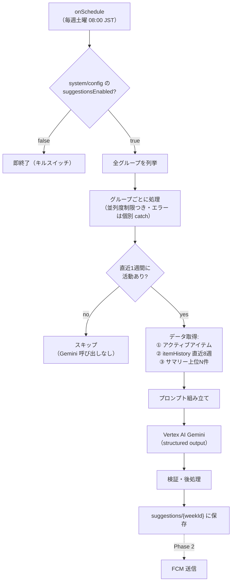

# 02. 週次提案パイプライン設計（Phase 1）（ドラフト）

週に一度、グループごとの履歴 + 現在のリストを Gemini に渡し、
「購入忘れの指摘」「次期購入アイテムの提案」を生成して Firestore に保存するパイプライン。

## 1. 実行基盤とスケジュール

- **Functions v2 の `onSchedule`** を使用する。元構成案の「Cloud Scheduler → HTTP Function」
  構成は不要（`onSchedule` がデプロイ時に Scheduler ジョブを自動作成・管理する。
  HTTP エンドポイントを公開しないぶん安全でもある）。
- スケジュール: **毎週土曜 08:00 JST**（`schedule: 'every saturday 08:00'`,
  `timeZone: 'Asia/Tokyo'`）。週末のまとめ買い前に提案が届いていることを狙う。
  曜日・時刻は要オーナー判断（[05](./05-未解決論点と決定ログ.md)）。

## 2. 処理フロー



### 2.1 グループのスキップ条件（コスト最適化の第一防壁）

以下のいずれかに該当するグループは Gemini を呼ばずにスキップ:

- 直近 1 週間に `itemHistory` イベントが 0 件 **かつ** アクティブアイテムの追加が 0 件
  （休眠グループ）
- サマリーが一定数未満（例: 3 商品未満。履歴が薄すぎて提案の根拠がない）

### 2.2 入力データの形（プロンプトに埋める前の中間表現）

| ソース | 取得内容 | 目安サイズ |
|---|---|---|
| `items`（アクティブ） | `name` / タグ名 / `status` / `createdAt` | 〜50 件 |
| `itemHistory`（直近 8 週） | `type` / `name` / `occurredAt` / `statusAtDeletion` を週単位に圧縮（「W24: 牛乳 購入, 卵 購入, …」形式） | 〜100 イベント |
| `purchaseHistorySummaries` | `purchaseCount` 上位 N 件（例: 30 件）の `name` / `purchaseCount` / `lastPurchasedAt` / 平均サイクル日数 | 30 行 |

長期傾向はサマリーが担うため、生イベントは 8 週間で足りる
（[01](./01-履歴データ設計.md) のインクリメンタル集約が前提）。

## 3. プロンプト設計

### 3.1 構成

- **system instruction**（固定・キャッシュ可能）: 役割（買い物アドバイザー）、
  出力言語、判断基準、出力スキーマの意味、禁止事項（リストに既にある商品を提案しない等）。
- **user prompt**（グループごとに動的生成）:

```text
今日は {today} です。

【現在の買い物リスト（未購入）】
- 牛乳（タグ: 急ぎ）
- ...

【よく買う商品（累計購入回数・平均購入間隔・最終購入日）】
- 牛乳: 12回 / 約7日ごと / 最終 6/3
- 卵: 9回 / 約10日ごと / 最終 5/28
- ...

【直近8週間の購入・削除イベント（週単位）】
W21: 牛乳 購入, 卵 購入, ティッシュ 削除(未購入)
...

この家族の購買パターンを分析し、(1) 平均購入間隔から考えてそろそろ切れるはずなのに
リストに無い商品（購入忘れの可能性）、(2) 次の買い物で買うとよさそうな商品、を提案してください。
表記ゆれ（例: 「牛乳」と「明治おいしい牛乳」）は同一商品として扱ってください。
```

- 表記ゆれの意味的同一視はこのようにプロンプトで Gemini に委ねる（[01](./01-履歴データ設計.md) §4）。
- 出力言語は当面 **日本語固定**。ユーザー/グループのロケールは Firestore に永続化されて
  いないため、多言語化はロケール保存の設計とセットで Phase 3 以降
  （[05](./05-未解決論点と決定ログ.md)）。

### 3.2 構造化出力（responseSchema）

Vertex AI の structured output で JSON スキーマを強制し、パース失敗系のハンドリングを
最小化する:

```jsonc
{
  "forgottenItems": [          // 最大 5 件
    {
      "name": "string",        // 商品名
      "reason": "string",      // 1文の根拠（例: 平均7日間隔だが最終購入から12日経過）
      "confidence": "high | medium | low"
    }
  ],
  "recommendedItems": [        // 最大 5 件
    { "name": "string", "reason": "string" }
  ]
}
```

### 3.3 後処理・検証

スキーマ強制でも内容の検証は行う:

- アクティブリストに既に存在する商品（`nameKey` 一致）の提案は除外
- 件数上限（各 5 件）・文字数上限（reason 100 文字程度）を超過分カット
- 空の提案（両配列とも 0 件）の場合は `suggestions` ドキュメントを `status: 'empty'`
  で保存し、Phase 2 では通知を送らない

## 4. モデルと Vertex AI 設定

- モデル: **Gemini の Flash 系最新安定版**（執筆時点の想定は `gemini-2.5-flash`。
  実装時に最新の安定版・料金を再確認すること）。週次バッチ・要約済み入力という
  ワークロードに Pro 系は過剰。
- リージョン: `asia-northeast1`（Functions と同居）。
- 認証: Functions のサービスアカウントに `roles/aiplatform.user` を付与
  （API キーをコードや環境変数に置かない）。
- `temperature` は低め（0.2〜0.4）、`maxOutputTokens` は 1,024 程度に制限。
- 緊急性のないバッチ処理のため、将来コストが効いてきたら **Batch Prediction
  （約 50% 割引）** への移行を検討（初期は同期呼び出しで十分）。

## 5. 提案の保存: `groups/{groupId}/suggestions/{weekId}`

ドキュメント ID = ISO 週番号（例: `2026-W24`）。**同一週の再実行は上書き**となり、
リトライ・手動再実行が自然に冪等になる。

| フィールド | 型 | 内容 |
|---|---|---|
| `generatedAt` | timestamp | 生成日時 |
| `model` | string | 使用モデル ID（後から品質を追跡するため） |
| `status` | string | `'ready'` \| `'empty'` |
| `forgottenItems` | array | `{ name, reason, confidence }` |
| `recommendedItems` | array | `{ name, reason }` |
| `inputStats` | map | `{ activeItems: n, historyEvents: n, summaries: n }`（デバッグ・品質分析用） |

保持: 直近 12 週ぶん残れば十分。`expiresAt`（90 日）を持たせ `itemHistory` と同じく
TTL で自動削除する。

## 6. エラー処理・信頼性

- グループ単位で try/catch し、1 グループの失敗が全体を止めない。
  失敗は structured log（`logger.error` + groupId）で記録。
- Gemini 呼び出しは 1 回リトライ（指数バックオフ）。それでも失敗したら当該グループは
  今週スキップ（翌週に自然回復）。
- 関数全体のタイムアウトは 540 秒、`memory: 512MiB` 目安。
- **キルスイッチ**: `system/config` ドキュメント（トップレベル）の
  `suggestionsEnabled: bool` を冒頭で確認。コスト暴走・品質事故の際にデプロイなしで停止できる
  （[04](./04-コスト試算と運用.md) §4）。

## 7. スケーラビリティ

初期実装は「全グループを 1 関数内で逐次/低並列処理」とするが、グループ数が増えると
タイムアウトに当たる。**`processGroup(groupId)` を独立した純粋関数として切り出して
おき**、しきい値（目安: 数百グループ、または実行時間が 300 秒超）に達したら
スケジュール関数を「Cloud Tasks へのエンキューのみ」に変更し、
`onTaskDispatched` 関数でグループ単位に分散処理する構成へ移行する。
初期からの Tasks 導入は構成の複雑化に見合わないため見送る。
