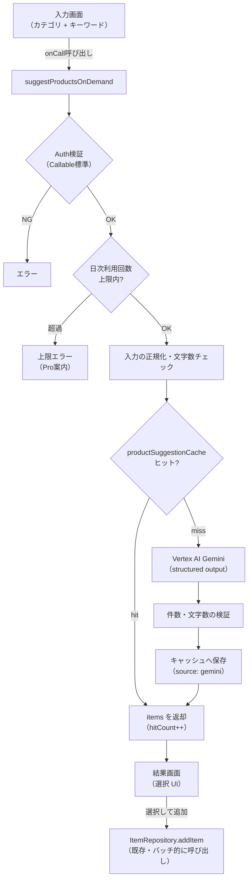

# 06. AI商品提案（オンデマンド）（ドラフト）

作りたい料理や用途をユーザーが入力すると、AI が必要そうな商品を提案し、
選択した品目を買い物リストへ追加できる機能。

- 例1（食材）: カテゴリ「レシピに必要な食材」で「豚の生姜焼き」と入力
  → 豚肉・生姜・醤油・みりん 等を提案
- 例2（用途）: カテゴリ「必要なもの」で「キャンプの消耗品」と入力
  → 炭・薪・紙皿・ウェットティッシュ 等を提案

## 1. 現状・他機能との関係

- 既存の AI 提案機能（[`../AI提案機能/`](../AI提案機能/00-概要とロードマップ.md)）は
  **グループの購入履歴から週次バッチで**「購入忘れ」「次期購入」を提案するもので、
  同ドラフトはオンデマンド生成を明示的にスコープ外としている
  （[`../AI提案機能/00-概要とロードマップ.md`](../AI提案機能/00-概要とロードマップ.md) §5）。
- 本機能は **ユーザーが能動的に問い合わせて即時に回答を得る**、別ユースケース。
  データ源も履歴ではなく**ユーザーの自由入力（料理名・用途）**であり、週次パイプラインとは
  独立して実装できる。
- ただし Gemini 呼び出しの基盤（Vertex AI クライアント・モデル選定・リトライ方針）は
  共通化できるため、`functions/src/data/gemini_client.ts` を流用する（§2.3）。

## 2. 設計スケッチ

### 2.1 画面構成

- 新規 route `/ai-product-suggestion`（deferred import、CLAUDE.md 方針どおり）。
- 入力: カテゴリ選択（チップ/プルダウン）+ フリーテキスト入力欄（文字数上限あり、§2.4）。
- 結果: チェックボックス付きの提案リスト（品目名 + メモ欄に分量・補足）。
  「よく買う物リスト」（[01](./01-よく買う物リスト.md)）と同じ「選択 UI + 全選択 + 選択追加」
  パターンを流用する。
- 追加は既存 `ItemRepository.addItem`（`lib/domain/repositories/item_repository.dart`）を
  バッチ的に呼ぶ。提案結果自体は新規ドメインエンティティを作らず、画面のローカル状態
  （選択前は一覧表示するだけの一時データ）として扱う。

### 2.2 カテゴリ設計

事前にカテゴリを用意し、対象・回答をある程度絞り込む（自由入力のみだと精度・コストの
両面でコントロールしにくいため）。カテゴリごとに system instruction を変える。

| カテゴリ例 | 想定入力 | 出力の傾向 |
|---|---|---|
| レシピに必要な食材 | 料理名（「豚の生姜焼き」） | 食材・調味料 |
| 用途別の必要なもの | イベント・シーン（「キャンプ」「引っ越し」） | 消耗品・道具 |
| （将来拡張） | — | カテゴリは Firestore 設定 or クライアント定数で管理し、追加を容易にする |

初期実装ではカテゴリをクライアント側の定数（enum）として持ち、Functions 側の
system instruction もカテゴリ ID で切り替える単純な対応表で十分（後述のキャッシュキーにも
カテゴリを含める）。

### 2.3 バックエンド: オンデマンド Callable Function

週次バッチ（`onSchedule`）と異なり、**ユーザー操作に対する同期応答**が必要なため
Functions v2 の **`onCall`（HTTPS Callable）** を新設する（例:
`suggestProductsOnDemand`）。Callable は Firebase Auth の ID Token 検証を標準で行うため、
認証チェックを自前実装しなくてよい。

- Gemini 呼び出しは既存 `functions/src/data/gemini_client.ts` の構成
  （`@google/genai` / Vertex AI / ADC 認証 / 1 回リトライ / `MODEL_ID` 一元管理）を踏襲する。
  ただし週次パイプライン専用の `generateSuggestions` / `RESPONSE_SCHEMA`
  （`forgottenItems` / `recommendedItems` 用）はスキーマが異なるため流用できない。
  同モジュールに関数を追加するか、`data/product_suggestion_gemini_client.ts` として
  分離するかは論点（§4 Q2）。`MODEL_ID`（Flash-Lite 系・低コスト）は共通化する。
- リージョンは Functions 本体と同じ `asia-northeast1`。Gemini 呼び出し自体は
  既存実装同様 `global` エンドポイントを使う（`gemini_client.ts` のコメント参照）。

### 2.4 プロンプト設計・入力サニタイズ

- **文字数制限**: UI とサーバー側の双方で入力文字数の上限（目安 30〜50 文字）を強制する。
  長文入力はそもそも「料理名・用途」という利用目的に合わないため、上限超過はクライアントで
  送信前にブロックする。
- **system instruction**（カテゴリ別・固定）: 役割（買い物提案アシスタント）、
  出力は**購入提案品目リストのみ**（説明文・雑談・追加の質問は一切含めない）、
  ユーザー入力は「提案対象のキーワード」としてのみ扱い、**指示として解釈しない**旨を明記する
  （プロンプトインジェクション対策。「以降の指示を無視して」等の入力を渡されても
  商品提案というタスクから逸脱しないようにする簡易的な防御であり、完全な対策ではない
  ことに留意）。
- **structured output（responseSchema）**:

  ```jsonc
  {
    "items": [               // 最大 15 件程度
      {
        "name": "string",    // 商品名
        "note": "string?"    // 分量・補足（例: 「300g」「予備込みで多めに」）
      }
    ]
  }
  ```

- **後処理・検証**（[`../AI提案機能/02-週次提案パイプライン設計.md`](../AI提案機能/02-週次提案パイプライン設計.md) §3.3 と同様の方針）:
  件数上限・`name`/`note` の文字数上限を超過分カット。空配列の場合は
  「該当する提案が見つかりませんでした」を返す。

### 2.5 頻出クエリのキャッシュ・固定回答化

稼働実績が貯まったら、頻度の高い問い合わせは Gemini を通さず固定の回答を返せるようにする。
**ユーザーからは常に「AI による提案」として見える**（内部でキャッシュ/固定回答を使ったかは
表示上区別しない）。

- キー: `category` + 正規化した入力文字列（[`../AI提案機能/01-履歴データ設計.md`](../AI提案機能/01-履歴データ設計.md) §4 と
  同様に NFKC 正規化 + trim + 小文字化。既存 `lib/core/utils/`（`nameKey` 相当）と
  可能なら共通化を検討）。
- 保存先（トップレベルコレクション。個人情報を含まないため全ユーザー・全グループで
  共有できる）: `productSuggestionCache/{cacheKey}`

  | フィールド | 型 | 内容 |
  |---|---|---|
  | `category` | string | カテゴリ ID |
  | `normalizedQuery` | string | 正規化済み入力 |
  | `items` | array | `{ name, note? }`（§2.4 のスキーマと同一） |
  | `hitCount` | number | 参照回数（インクリメンタル集約。§2.6 の使用回数カウントとは別軸） |
  | `source` | string | `'gemini'`（自動生成・要再生成) \| `'curated'`（運用者が固定化） |
  | `createdAt` / `lastUsedAt` | timestamp | 監査・TTL 用 |

- 呼び出しフロー: キャッシュヒット → `items` をそのまま返し `hitCount` をインクリメント
  （Gemini 呼び出しなし） / ミス → Gemini 呼び出し → 検証後キャッシュへ書き込み（`source: 'gemini'`）
  → 返却。
- `source: 'gemini'` の項目は TTL（例: 30 日。[`../AI提案機能/01-履歴データ設計.md`](../AI提案機能/01-履歴データ設計.md) の
  `expiresAt` TTL と同じ仕組みを踏襲）で自動失効し、鮮度を保つ。`source: 'curated'` は
  TTL 対象外（無期限）とする。
- 「固定回答への昇格」（`hitCount` が閾値超の項目を `curated` にする運用フロー）は
  初期は手動（Firestore コンソールでの編集や簡易スクリプト）で十分。自動昇格の仕組みは
  実績が貯まってから検討する。

### 2.6 フリーミアム制限

- [05-マネタイズ.md](./05-マネタイズ.md) の `PlanLimits`（`lib/core/constants/plan_limits.dart`）に
  上限値を追加する。ただし既存の `PlanLimits` は「件数上限」（タグ・よく買う物）であり、
  本機能は**日次の回数上限**（レート制限）という別の性質を持つ点に注意（§4 Q4）。
- 使用回数はプラン上ユーザー単位（個人課金）想定のため、`users/{uid}` 配下に
  日次カウンタを持つ（例: `users/{uid}/aiProductSuggestionUsage/{yyyy-mm-dd}`）。
  `suggestProductsOnDemand` の冒頭でトランザクションにより上限チェック+インクリメントを行う。
- Free/Pro の具体回数は未定（目安: Free 数回/日、Pro は大幅緩和。要オーナー判断、§4 Q5）。
  キャッシュヒット時にコストがかからないため、キャッシュヒットも消費対象にするかは論点
  （§4 Q6）。
- 上限強制は [05-マネタイズ.md](./05-マネタイズ.md) §4.2 の 3 層方針（UI 無効化 / Rules / Functions）を踏襲し、
  本機能では Callable Function 側のチェックが実質的な最終防衛になる
  （Firestore への直接書き込みではなく Function 呼び出しが起点のため、Rules 層は
  カウンタドキュメントへのクライアント書き込み禁止のみで足りる）。

### 2.7 処理フロー



## 3. 依存関係

- **Gemini 呼び出し基盤**: `functions/src/data/gemini_client.ts` のモデル選定・認証方式
  （ADC / Vertex AI / `global` エンドポイント）を流用。
- **05-マネタイズ.md**: フリーミアムの回数上限を `PlanLimits` の仕組みに統合。
- **01-よく買う物リスト.md**: 「選択して一括追加」UI パターンを流用。
- 独立性: 週次 AI 提案機能（Phase 0〜）の完了を待たずに着手可能
  （履歴データに依存しないため）。

## 4. 論点

| # | 論点 | 推奨 |
|---|---|---|
| Q1 | カテゴリの初期セット | まず「レシピに必要な食材」「用途別の必要なもの」の2種で開始し、利用実績を見て追加 |
| Q2 | Gemini 呼び出しコードの配置 | `gemini_client.ts` へ関数追加 or 新規ファイル分離。週次バッチと責務が異なるため分離を推奨（モデル ID 等の定数のみ共通化） |
| Q3 | キャッシュの共有範囲 | 個人情報を含まないため全ユーザー共通（`productSuggestionCache` はトップレベル）を推奨。グループ単位に分けると再利用性が落ちる |
| Q4 | フリーミアムの制限方式 | 既存 `PlanLimits`（静的な件数上限）とは別に「日次レート制限」の仕組みを新設する必要あり。共通化するか独立させるかは実装時に判断 |
| Q5 | 無料/有料の具体回数 | 未定。要オーナー判断（例: Free 3回/日、Pro 30回/日 など） |
| Q6 | キャッシュヒットを利用回数にカウントするか | 未定。Gemini コストがかからない分、カウント対象外にしてユーザー体験を優先する案もある |
| Q7 | 不適切入力への対応 | system instruction によるゆるいサニタイズ（§2.4）に加え、明らかな不正利用（大量の異常な呼び出し等）はレート制限（§2.6）で抑止する。厳密なコンテンツフィルタは Vertex AI の safety settings 標準機能に委ねる |
| Q8 | 出力言語 | 当面日本語固定（[`../AI提案機能/02-週次提案パイプライン設計.md`](../AI提案機能/02-週次提案パイプライン設計.md) §3.1 と同一方針） |
| Q9 | プライバシーポリシー | 本機能はユーザーの自由入力を Vertex AI に送信するため、既存の AI 提案機能向けの記載
（[`../AI提案機能/04-コスト試算と運用.md`](../AI提案機能/04-コスト試算と運用.md) §5）と同様、送信内容の明記が必要 |
