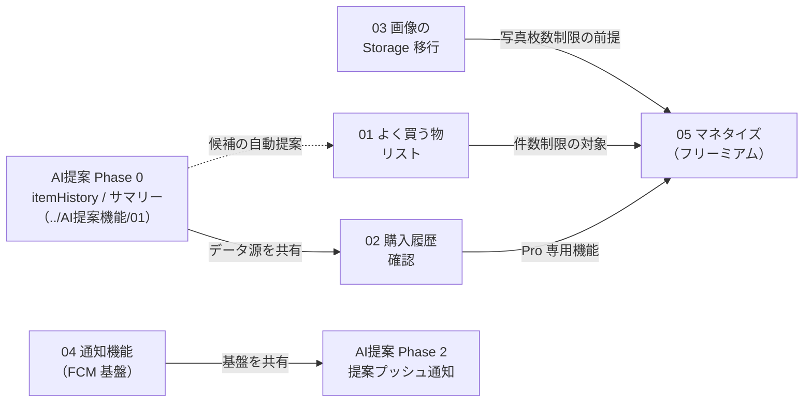

# 機能構想 — 索引（ドラフト）

今後実装したい機能の構想を書き出したもの。各ドキュメントは「目的 → 現状 → 設計スケッチ →
依存関係 → 論点」の構成で、実装着手時に正式な設計（`docs/内部設計/`）へ昇格させる。

## 一覧

| ドキュメント | 機能 | 既存計画との対応 | 想定フェーズ |
|---|---|---|---|
| [01-よく買う物リスト.md](./01-よく買う物リスト.md) | 定番品テンプレートと一括追加 | Epic-04（S04-01〜03） | Phase 2 |
| [02-購入履歴確認.md](./02-購入履歴確認.md) | 買った物の履歴・統計の閲覧 | Pro 機能「履歴・統計ダッシュボード」 | Phase 2〜 |
| [03-商品画像のStorage移行.md](./03-商品画像のStorage移行.md) | Base64 直格納から Firebase Storage へ | Epic-05 の本格化（ドメインモデル §5 既載） | 早期推奨 |
| [04-通知機能.md](./04-通知機能.md) | FCM 基盤とイベント通知 | REMAINING_TASKS「プッシュ通知の実送信」 | Phase 2 |
| [05-マネタイズ.md](./05-マネタイズ.md) | 投げ銭 → フリーミアムの実装 | サービス展開計画「収益モデル」 | MVP〜Phase 2 |

## 機能間の依存関係と推奨実装順

ポイント:

- **02 購入履歴確認は AI 提案機能 Phase 0 とデータ基盤が完全に共通**
  （`itemHistory` / `purchaseHistorySummaries`）。Phase 0 を先にデプロイすれば、
  履歴確認機能は「画面を作るだけ」になる。逆に履歴確認を先にやるなら
  Phase 0 のスキーマで実装すべきで、独自スキーマを作らないこと。
- **03 画像移行は他機能に先行して早期に**実施したい。Firestore ドキュメントに Base64 を
  抱えたままよく買う物リスト（テンプレート複製）や履歴を作ると、肥大したデータの
  コピーが増えて移行コストが膨らむ。
- **04 通知基盤は AI 提案 Phase 2 と共通**。どちらを先にやってももう一方は送信ロジックの
  追加だけで済むよう、基盤（トークン管理・許可フロー）と個別通知を分けて設計する。
- **05 マネタイズの Free/Pro 境界は 01・02・03 の制限値に依存**するため、
  各機能の実装時点から制限を意識した作り（上限チェックの共通化）にしておく。
