# アクティビティ図

このドキュメントは、[ユースケース.md](./ユースケース.md) の各 UC について「処理の流れ」と
「分岐（どんな条件で何が起きるか）」をアクティビティ図（mermaid `flowchart`）で示す。
1 UC = 1 図を原則とする。

> **本書の方針**: 図中には**具体的な関数名・クラス名・API 名を極力書かず**、処理の意味と分岐の
> 説明に集中する。実装エントリ（画面 / コントローラ / リポジトリのクラス・メソッド）は
> [ユースケース.md](./ユースケース.md) の各 UC 表、エラーコード（`AppErrorCode`）の正本は
> [エラー仕様.md](../外部仕様/エラー仕様.md) を参照。動的なデータの流れは
> [データフロー.md](./データフロー.md)、状態の遷移は [状態遷移.md](./状態遷移.md) を参照。

## 凡例

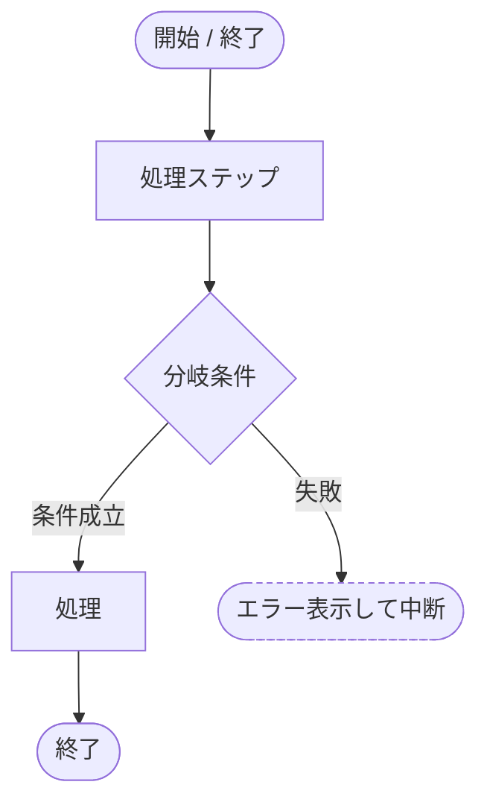
```mermaid
flowchart TD
    S([開始 / 終了]) --> A[処理ステップ]
    A --> Q{分岐条件}
    Q -->|条件成立| B[処理]
    Q -->|失敗| ERR([エラー表示して中断]):::err
    B --> E([終了])
    classDef err stroke-dasharray: 4 3
```

- **角丸（stadium）** = 開始 / 終了。
- **長方形** = 処理ステップ（何をするか）。
- **ひし形** = 分岐（バリデーション / ガード条件）。
- **破線枠の終了** = 失敗してエラー表示で終わる経路（UI はトースト or インライン表示）。
- 一覧の更新が必要な書き込み系 UC は、**保存後にリアルタイム同期で一覧へ自動反映**される
  （画面側で明示的に再描画しない）。図では「自動反映」と注記する。詳細は
  [データフロー (a)](./データフロー.md#a-snapshots-双方向購読)。

---

## 1. 認証（Epic-00）

### UC-A1 サインアップ

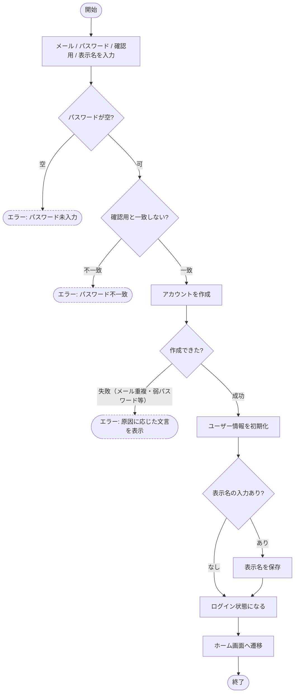
```mermaid
flowchart TD
    S([開始]) --> IN[メール / パスワード / 確認用 / 表示名を入力]
    IN --> V1{パスワードが空?}
    V1 -->|空| E1([エラー: パスワード未入力]):::err
    V1 -->|可| V2{確認用と一致しない?}
    V2 -->|不一致| E2([エラー: パスワード不一致]):::err
    V2 -->|一致| SU[アカウントを作成]
    SU --> SUQ{作成できた?}
    SUQ -->|失敗（メール重複・弱パスワード等）| E3([エラー: 原因に応じた文言を表示]):::err
    SUQ -->|成功| DOC[ユーザー情報を初期化]
    DOC --> DN{表示名の入力あり?}
    DN -->|あり| UP[表示名を保存]
    DN -->|なし| OK[ログイン状態になる]
    UP --> OK
    OK --> RT[ホーム画面へ遷移]
    RT --> E([終了])
    classDef err stroke-dasharray: 4 3
```

### UC-A2 ログイン

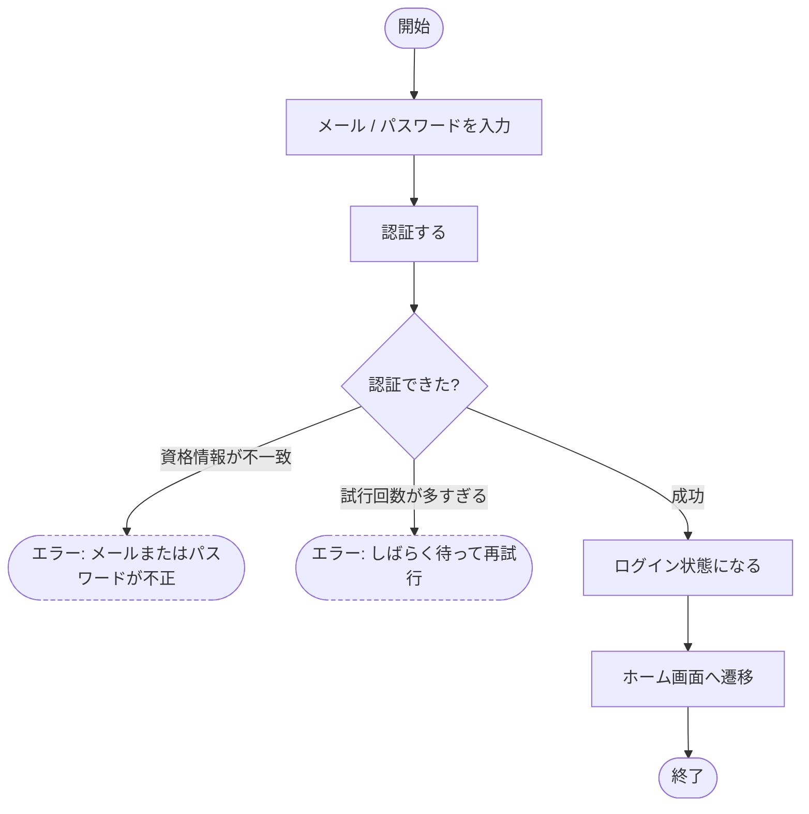
```mermaid
flowchart TD
    S([開始]) --> IN[メール / パスワードを入力]
    IN --> AUTH[認証する]
    AUTH --> Q{認証できた?}
    Q -->|資格情報が不一致| E1([エラー: メールまたはパスワードが不正]):::err
    Q -->|試行回数が多すぎる| E2([エラー: しばらく待って再試行]):::err
    Q -->|成功| OK[ログイン状態になる]
    OK --> RT[ホーム画面へ遷移]
    RT --> E([終了])
    classDef err stroke-dasharray: 4 3
```

### UC-A3 ログアウト

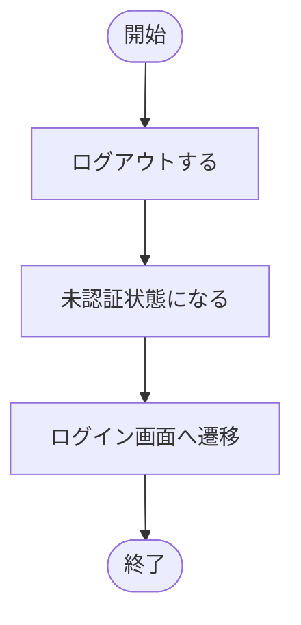
```mermaid
flowchart TD
    S([開始]) --> C[ログアウトする]
    C --> OK[未認証状態になる]
    OK --> RT[ログイン画面へ遷移]
    RT --> E([終了])
```

### UC-A4 プロフィール編集

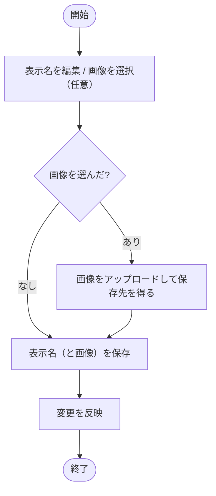
```mermaid
flowchart TD
    S([開始]) --> IN[表示名を編集 / 画像を選択（任意）]
    IN --> Q{画像を選んだ?}
    Q -->|あり| UP[画像をアップロードして保存先を得る]
    Q -->|なし| SAVE[表示名（と画像）を保存]
    UP --> SAVE
    SAVE --> OK[変更を反映]
    OK --> E([終了])
```

### UC-A5 退会

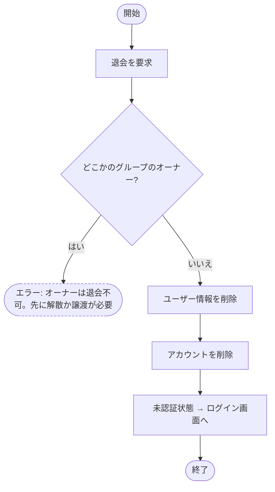
```mermaid
flowchart TD
    S([開始]) --> REQ[退会を要求]
    REQ --> Q{どこかのグループのオーナー?}
    Q -->|はい| E1([エラー: オーナーは退会不可。先に解散か譲渡が必要]):::err
    Q -->|いいえ| D1[ユーザー情報を削除]
    D1 --> D2[アカウントを削除]
    D2 --> OK[未認証状態 → ログイン画面へ]
    OK --> E([終了])
    classDef err stroke-dasharray: 4 3
```

> オーナーは先に [UC-G3 脱退](#uc-g3-脱退) か [UC-G4 解散](#uc-g4-解散) が必要。

---

## 2. グループ（Epic-00 / Epic-03）

### UC-G1 グループ作成

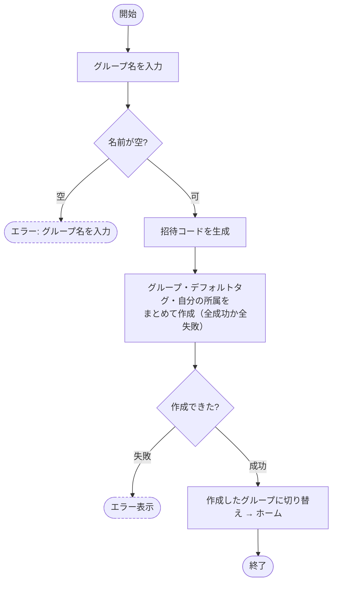
```mermaid
flowchart TD
    S([開始]) --> IN[グループ名を入力]
    IN --> V{名前が空?}
    V -->|空| E1([エラー: グループ名を入力]):::err
    V -->|可| GEN[招待コードを生成]
    GEN --> B[グループ・デフォルトタグ・自分の所属を\nまとめて作成（全成功か全失敗）]
    B --> CM{作成できた?}
    CM -->|失敗| E2([エラー表示]):::err
    CM -->|成功| OK[作成したグループに切り替え → ホーム]
    OK --> E([終了])
    classDef err stroke-dasharray: 4 3
```

### UC-G2 グループ名変更

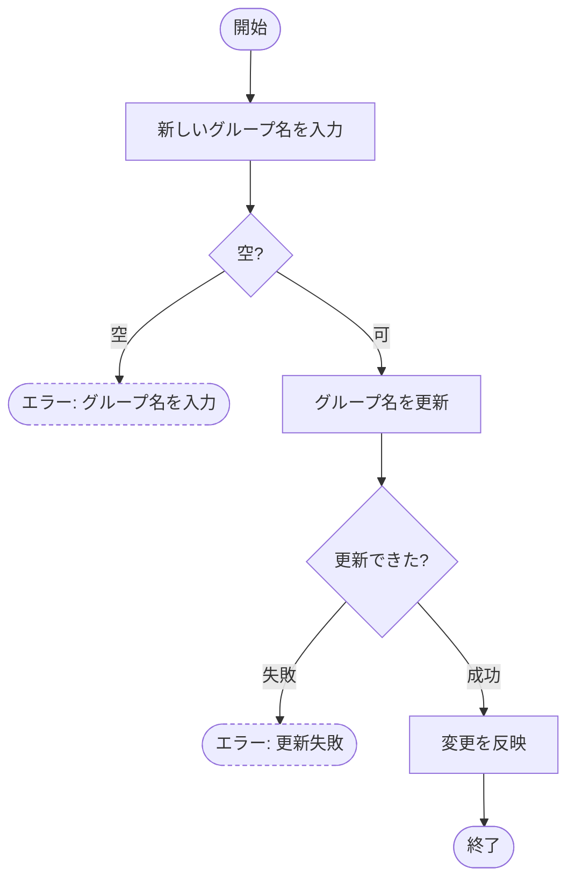
```mermaid
flowchart TD
    S([開始]) --> IN[新しいグループ名を入力]
    IN --> V{空?}
    V -->|空| E1([エラー: グループ名を入力]):::err
    V -->|可| UPD[グループ名を更新]
    UPD --> Q{更新できた?}
    Q -->|失敗| E2([エラー: 更新失敗]):::err
    Q -->|成功| OK[変更を反映]
    OK --> E([終了])
    classDef err stroke-dasharray: 4 3
```

### UC-G3 脱退

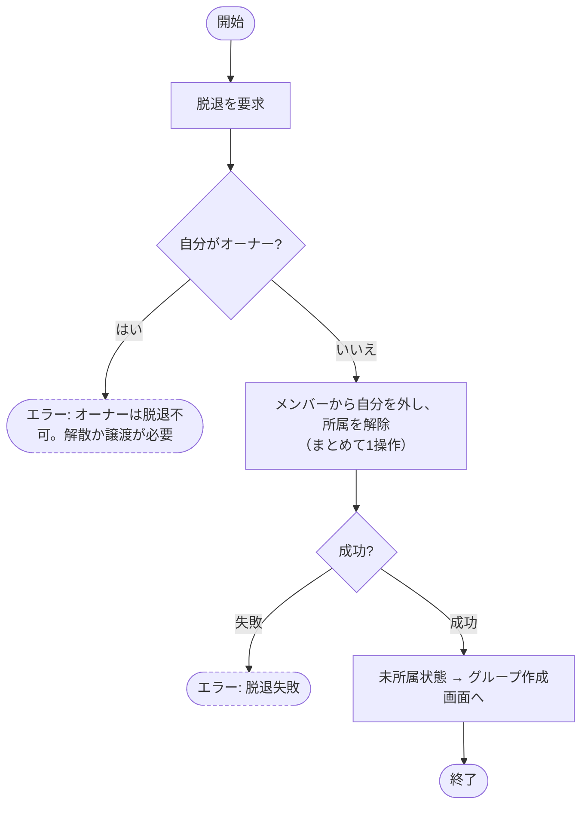
```mermaid
flowchart TD
    S([開始]) --> REQ[脱退を要求]
    REQ --> Q1{自分がオーナー?}
    Q1 -->|はい| E1([エラー: オーナーは脱退不可。解散か譲渡が必要]):::err
    Q1 -->|いいえ| B[メンバーから自分を外し、所属を解除\n（まとめて1操作）]
    B --> Q2{成功?}
    Q2 -->|失敗| E2([エラー: 脱退失敗]):::err
    Q2 -->|成功| OK[未所属状態 → グループ作成画面へ]
    OK --> E([終了])
    classDef err stroke-dasharray: 4 3
```

### UC-G4 解散

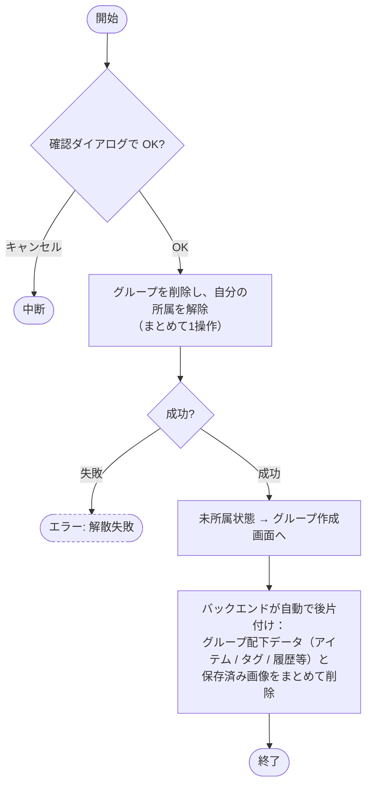
```mermaid
flowchart TD
    S([開始]) --> CF{確認ダイアログで OK?}
    CF -->|キャンセル| E0([中断])
    CF -->|OK| B[グループを削除し、自分の所属を解除\n（まとめて1操作）]
    B --> CM{成功?}
    CM -->|失敗| E1([エラー: 解散失敗]):::err
    CM -->|成功| OK[未所属状態 → グループ作成画面へ]
    OK --> FN[バックエンドが自動で後片付け：\nグループ配下データ（アイテム / タグ / 履歴等）と\n保存済み画像をまとめて削除]
    FN --> E([終了])
    classDef err stroke-dasharray: 4 3
```

### UC-G5 グループ切替

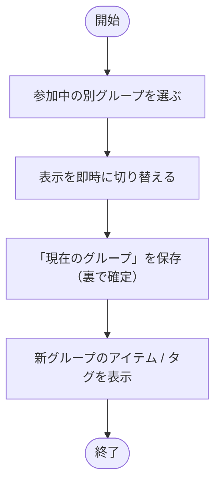
```mermaid
flowchart TD
    S([開始]) --> SEL[参加中の別グループを選ぶ]
    SEL --> LOCAL[表示を即時に切り替える]
    LOCAL --> PERSIST[「現在のグループ」を保存（裏で確定）]
    PERSIST --> OK[新グループのアイテム / タグを表示]
    OK --> E([終了])
```

### UC-G6 招待コード参加

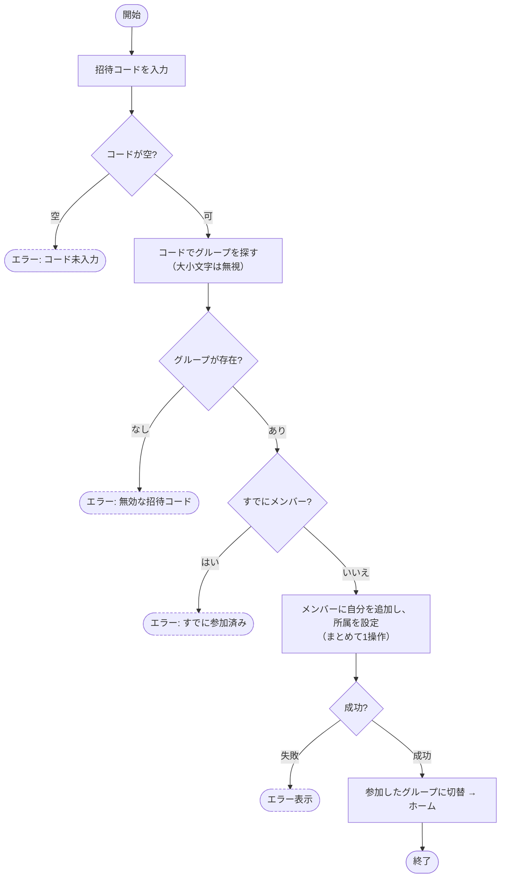
```mermaid
flowchart TD
    S([開始]) --> IN[招待コードを入力]
    IN --> V{コードが空?}
    V -->|空| E0([エラー: コード未入力]):::err
    V -->|可| GET[コードでグループを探す（大小文字は無視）]
    GET --> Q1{グループが存在?}
    Q1 -->|なし| E1([エラー: 無効な招待コード]):::err
    Q1 -->|あり| Q2{すでにメンバー?}
    Q2 -->|はい| E2([エラー: すでに参加済み]):::err
    Q2 -->|いいえ| B[メンバーに自分を追加し、所属を設定\n（まとめて1操作）]
    B --> Q3{成功?}
    Q3 -->|失敗| E3([エラー表示]):::err
    Q3 -->|成功| OK[参加したグループに切替 → ホーム]
    OK --> E([終了])
    classDef err stroke-dasharray: 4 3
```

> 未ログインで招待リンクを開いた経路は [データフロー (b-2)](./データフロー.md#b-2-招待リンク経由未ログイン経路-176)。

### UC-G7 招待コード共有

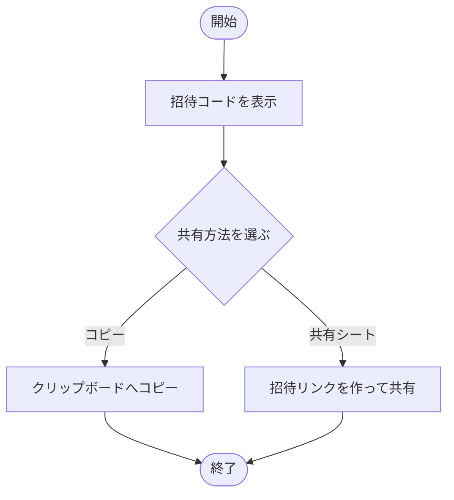
```mermaid
flowchart TD
    S([開始]) --> SHOW[招待コードを表示]
    SHOW --> SEL{共有方法を選ぶ}
    SEL -->|コピー| CP[クリップボードへコピー]
    SEL -->|共有シート| SP[招待リンクを作って共有]
    CP --> E([終了])
    SP --> E
```

### UC-G8 メンバー強制退場

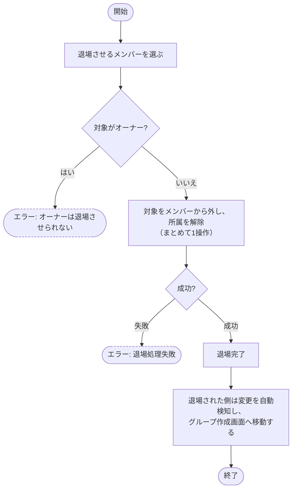
```mermaid
flowchart TD
    S([開始]) --> SEL[退場させるメンバーを選ぶ]
    SEL --> Q1{対象がオーナー?}
    Q1 -->|はい| E1([エラー: オーナーは退場させられない]):::err
    Q1 -->|いいえ| B[対象をメンバーから外し、所属を解除\n（まとめて1操作）]
    B --> Q2{成功?}
    Q2 -->|失敗| E2([エラー: 退場処理失敗]):::err
    Q2 -->|成功| OK[退場完了]
    OK --> NOTE[退場された側は変更を自動検知し、\nグループ作成画面へ移動する]
    NOTE --> E([終了])
    classDef err stroke-dasharray: 4 3
```

---

## 3. タグ（Epic-00 / #142）

### UC-T1 タグ作成

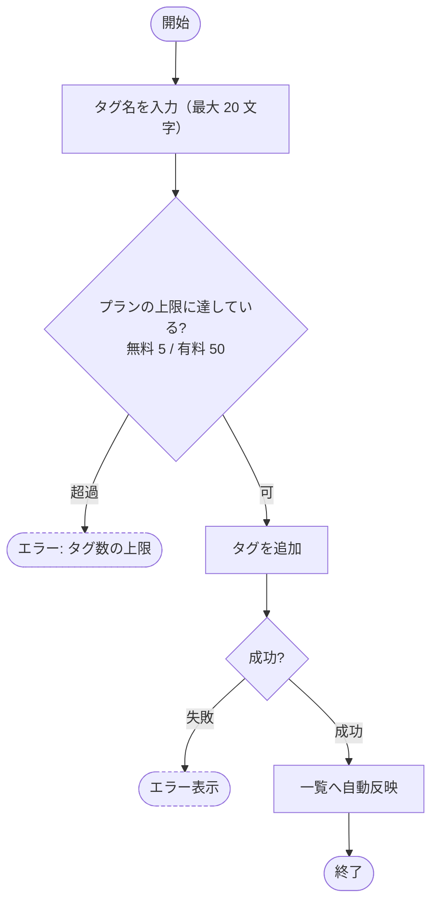
```mermaid
flowchart TD
    S([開始]) --> IN[タグ名を入力（最大 20 文字）]
    IN --> Q1{プランの上限に達している?\n無料 5 / 有料 50}
    Q1 -->|超過| E1([エラー: タグ数の上限]):::err
    Q1 -->|可| W[タグを追加]
    W --> Q2{成功?}
    Q2 -->|失敗| E2([エラー表示]):::err
    Q2 -->|成功| OK[一覧へ自動反映]
    OK --> E([終了])
    classDef err stroke-dasharray: 4 3
```

### UC-T2 タグ名変更

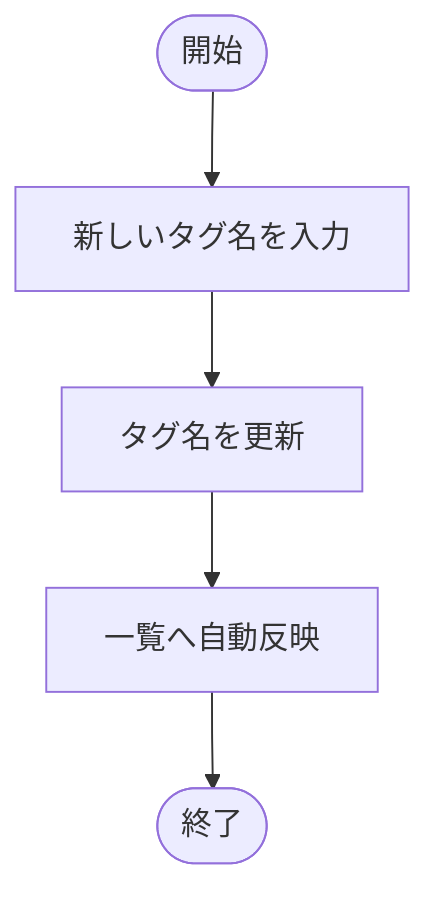
```mermaid
flowchart TD
    S([開始]) --> IN[新しいタグ名を入力]
    IN --> UPD[タグ名を更新]
    UPD --> OK[一覧へ自動反映]
    OK --> E([終了])
```

### UC-T3 タグ削除

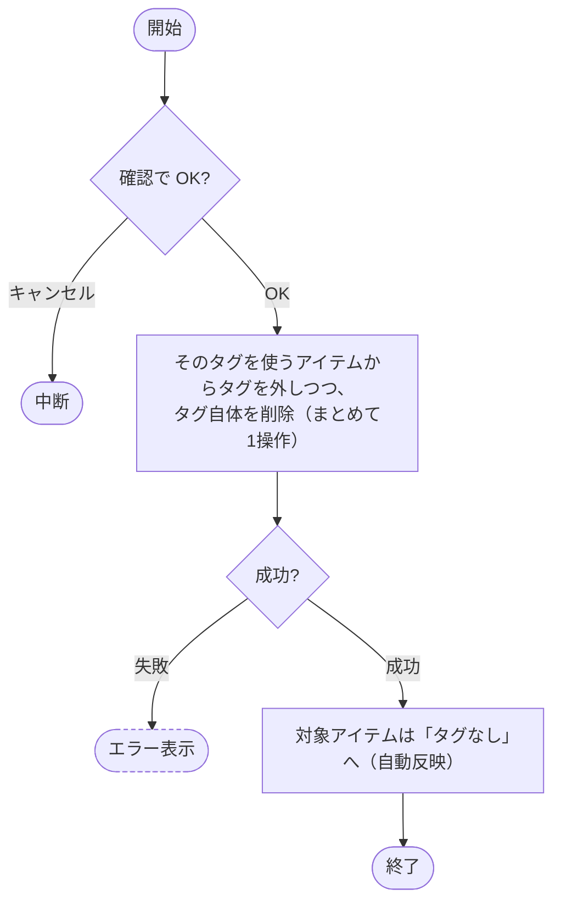
```mermaid
flowchart TD
    S([開始]) --> CF{確認で OK?}
    CF -->|キャンセル| E0([中断])
    CF -->|OK| B[そのタグを使うアイテムからタグを外しつつ、\nタグ自体を削除（まとめて1操作）]
    B --> CM{成功?}
    CM -->|失敗| E1([エラー表示]):::err
    CM -->|成功| OK[対象アイテムは「タグなし」へ（自動反映）]
    OK --> E([終了])
    classDef err stroke-dasharray: 4 3
```

### UC-T4 タグフィルタ（読み取りのみ）

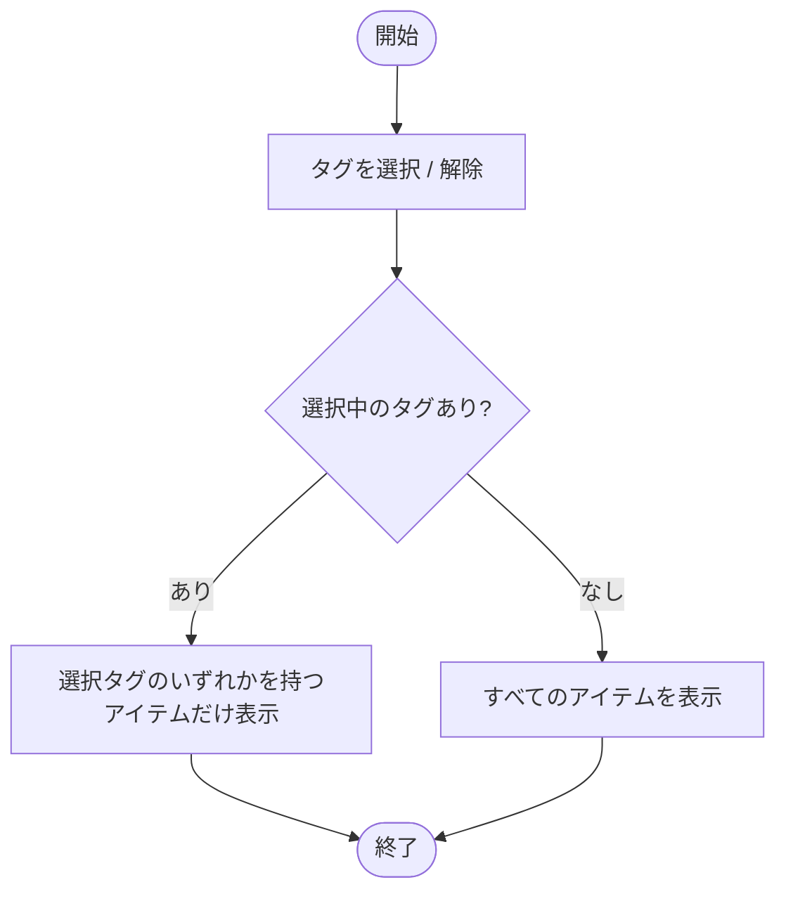
```mermaid
flowchart TD
    S([開始]) --> SEL[タグを選択 / 解除]
    SEL --> F{選択中のタグあり?}
    F -->|あり| OR[選択タグのいずれかを持つアイテムだけ表示]
    F -->|なし| ALL[すべてのアイテムを表示]
    OR --> E([終了])
    ALL --> E
```

---

## 4. アイテム（Epic-00 / Epic-02 / Epic-06）

### UC-I1 アイテム追加（画像は 2 段階で保存）

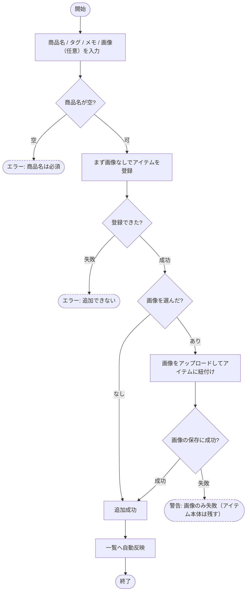
```mermaid
flowchart TD
    S([開始]) --> IN[商品名 / タグ / メモ / 画像（任意）を入力]
    IN --> V{商品名が空?}
    V -->|空| E1([エラー: 商品名は必須]):::err
    V -->|可| ADD[まず画像なしでアイテムを登録]
    ADD --> Q1{登録できた?}
    Q1 -->|失敗| E2([エラー: 追加できない]):::err
    Q1 -->|成功| Q2{画像を選んだ?}
    Q2 -->|なし| OK[追加成功]
    Q2 -->|あり| UP[画像をアップロードしてアイテムに紐付け]
    UP --> Q3{画像の保存に成功?}
    Q3 -->|失敗| W([警告: 画像のみ失敗（アイテム本体は残す）]):::err
    Q3 -->|成功| OK
    OK --> RFR[一覧へ自動反映]
    RFR --> E([終了])
    classDef err stroke-dasharray: 4 3
```

> 「先に登録 → 後から画像を紐付け」とするのは、確定したアイテム ID を画像の保存先に使うため。
> 流れの詳細は [アーキテクチャ概要 §3](./アーキテクチャ概要.md#3-アイテム追加のシーケンス)。

### UC-I2 アイテム編集

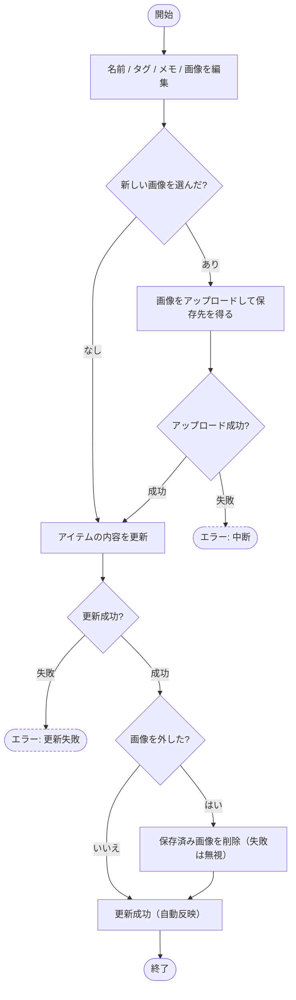
```mermaid
flowchart TD
    S([開始]) --> IN[名前 / タグ / メモ / 画像を編集]
    IN --> Q1{新しい画像を選んだ?}
    Q1 -->|あり| UP[画像をアップロードして保存先を得る]
    Q1 -->|なし| UPD[アイテムの内容を更新]
    UP --> Q2{アップロード成功?}
    Q2 -->|失敗| E1([エラー: 中断]):::err
    Q2 -->|成功| UPD
    UPD --> Q3{更新成功?}
    Q3 -->|失敗| E2([エラー: 更新失敗]):::err
    Q3 -->|成功| Q4{画像を外した?}
    Q4 -->|はい| DEL[保存済み画像を削除（失敗は無視）]
    Q4 -->|いいえ| OK[更新成功（自動反映）]
    DEL --> OK
    OK --> E([終了])
    classDef err stroke-dasharray: 4 3
```

### UC-I3 アイテム削除

```mermaid
flowchart TD
    S([開始]) --> CF{確認で OK?}
    CF -->|キャンセル| E0([中断])
    CF -->|OK| C[アイテムを削除]
    C --> Q{成功?}
    Q -->|失敗| E1([エラー: 削除失敗]):::err
    Q -->|成功| OK[一覧から消える]
    OK --> FN[バックエンドが自動で：\n購入履歴に「削除」を記録し、保存済み画像を削除]
    FN --> E([終了])
    classDef err stroke-dasharray: 4 3
```

### UC-I4 「買った」を反映

```mermaid
flowchart TD
    S([開始]) --> TAP[チェックを ON にする]
    TAP --> SET[購入済みにする]
    SET --> OK[パートナーの画面にも自動反映]
    OK --> FN[バックエンドが購入履歴に記録\n（短時間に繰り返した重複は無視）]
    FN --> E([終了])
```

> 未購入に戻す操作も同様の流れ（購入状態を戻す）。状態の全体像は [状態遷移 §1](./状態遷移.md#1-item-ライフサイクル)。

### UC-I5 「買います」宣言

```mermaid
flowchart TD
    S([開始]) --> TAP[「買います」を押す]
    TAP --> Q1{他人がすでに宣言中?}
    Q1 -->|はい| DLG{上書き確認で OK?}
    DLG -->|キャンセル| E0([中断])
    DLG -->|OK| SET[自分を担当として設定]
    Q1 -->|いいえ| SET
    SET --> OK[自分が担当として表示（自動反映）]
    OK --> E([終了])
```

> 取り消しは自分が宣言した場合のみ可能。詳細は [状態遷移 §1](./状態遷移.md#1-item-ライフサイクル)。

### UC-I6 「買った」通知受信（計画）

```mermaid
flowchart TD
    S([開始]):::plan --> NOTE[計画: 購入を契機にバックエンドが\nプッシュ通知を送る]
    NOTE --> CUR[現状: 通知の ON/OFF 設定を保存するのみ]
    CUR --> E([未実装]):::plan
    classDef plan stroke-dasharray: 5 5
```

---

## 5. AI 週次提案（#37 / #40 / #41）

### UC-S0 履歴アーカイブ＋週次提案生成（システム）

ユーザー操作なしで動く 2 系統の自動処理。詳細は
[データフロー (f)](./データフロー.md#f-ai-週次提案フロー37--40--41)。

```mermaid
flowchart TD
    subgraph TRG[購入 / 削除のたびに（裏側で逐次）]
        T0([アイテムが購入 / 削除される]) --> T2[購買履歴に記録し、商品ごとの集計を更新]
    end
    subgraph WK[毎週土 08:00（定期実行）]
        W0([スケジュール起動]) --> W1{提案機能が有効?\nキルスイッチ}
        W1 -->|無効| WE([何もせず終了]):::plan
        W1 -->|有効（既定）| W2[グループごとに、現在のリストと\n直近の購買履歴 / 集計をまとめる]
        W2 --> W3[生成AI に渡して\n「購入忘れ」「次期候補」を作らせる]
        W3 --> W4[その週の提案として保存]
        W4 --> WED([終了])
    end
    classDef plan stroke-dasharray: 5 5
```

### UC-S1 提案を閲覧

```mermaid
flowchart TD
    S([開始]) --> BADGE[ホームの AI 提案ボタン\n（未読があればバッジ表示）]
    BADGE --> TAP[タップして提案画面を開く]
    TAP --> SUB[その週の最新提案を取得]
    SUB --> Q{提案がある?}
    Q -->|なし / 空| EMPTY[空の状態を表示]
    Q -->|あり| SHOW[「購入忘れ」「次期候補」をカードで表示]
    SHOW --> READ[既読にする（未読バッジを消す）]
    EMPTY --> READ
    READ --> E([終了])
```

> 未読判定は「最新提案の週」と「最後に開いた週」の比較で行う（端末ローカルに既読を記録）。

### UC-S2 提案をリストに追加

```mermaid
flowchart TD
    S([開始]) --> TAP[提案カードの「リストに追加」を押す]
    TAP --> ADD[買い物リストにアイテムを追加]
    ADD --> OK[一覧へ自動反映]
    OK --> E([終了])
```

### UC-S3 提案到着通知（計画）

```mermaid
flowchart TD
    S([開始]):::plan --> NOTE[計画: 週次提案ができた後に\nプッシュ通知で知らせる（AI 提案 Phase 2）]
    NOTE --> E([未実装]):::plan
    classDef plan stroke-dasharray: 5 5
```

---

## 7. よく買う物（#43）

### UC-F1 テンプレート一覧・追加

直接追加はアイテム追加（UC-I1）と同じ 2 段保存で画像に対応する。

```mermaid
flowchart TD
    S([開始]) --> IN[テンプレート名・タグ・メモ・写真を入力]
    IN --> Q1{プランの上限に達している?\n無料 10 / 有料 無制限}
    Q1 -->|超過| E1([エラー: よく買う物の上限\nfavorites.error.limit_exceeded]):::err
    Q1 -->|可| W[ステップ1: addFavorite\nimageUrl 空・既存最大 order + 1 を付与]
    W --> Q2{ドキュメント作成成功?}
    Q2 -->|失敗| E2([エラー表示]):::err
    Q2 -->|成功| Q3{新規画像あり?}
    Q3 -->|なし| OK[一覧へ自動反映（watchFavorites ストリーム）]
    Q3 -->|あり| UP[ステップ2: uploadFavoriteImage →\nupdateFavorite で imageUrl 更新\n（best-effort: 失敗してもテンプレート本体は残す）]
    UP --> OK
    OK --> E([終了])
    classDef err stroke-dasharray: 4 3
```

> **編集時**: 新規画像があれば `uploadFavoriteImage` → `updateFavorite` で URL 更新。画像を外した場合は更新後に `deleteFavoriteImage` を best-effort 実行。**削除時**: ドキュメント削除後に `deleteFavoriteImage` を best-effort 実行して孤児画像を防ぐ（favorites には Functions トリガが無いため）。画像パスは `groups/{groupId}/favoriteItems/{favoriteId}.jpg` で、グループ削除時は `onGroupDeleted` の `groups/{gid}/` prefix 一括削除で清掃される。

### UC-F2 アイテムからテンプレートへ昇格

```mermaid
flowchart TD
    S([開始]) --> BTN[item_edit_modal の\n「よく買う物に追加」ボタンを押す]
    BTN --> Q1{プランの上限に達している?}
    Q1 -->|超過| E1([エラー: よく買う物の上限\nfavorites.error.limit_exceeded]):::err
    Q1 -->|可| COPY[name / tagId / note / imageUrl をコピーして\nFavoriteItemRepository.addFavorite を呼ぶ\n※画像は既存 URL のコピーのみ。新規アップロードなし]
    COPY --> Q2{成功?}
    Q2 -->|失敗| E2([エラー表示]):::err
    Q2 -->|成功| TOAST[favorites.promoted トースト表示]
    TOAST --> E([終了])
    classDef err stroke-dasharray: 4 3
```

### UC-F3 テンプレートを買い物リストへ一括追加

```mermaid
flowchart TD
    S([開始]) --> SEL[よく買う物一覧でチェックボックスを選択]
    SEL --> BTN[「リストに追加 (N)」ボタンを押す]
    BTN --> DEDUP[filterNewFavorites:\n未購入アクティブ品名と normalizeName 突合\n→ 重複をスキップリストに分離]
    DEDUP --> Q1{追加対象が 0 件?}
    Q1 -->|すべて重複| SKIP[skipped_count トースト表示\n選択解除して終了]
    SKIP --> E([終了])
    Q1 -->|1件以上| INSERT[現在の最小 order より小さい order を\n選択順で割り当て ItemRepository.addItem で先頭挿入]
    INSERT --> Q2{成功?}
    Q2 -->|失敗| E2([エラー表示]):::err
    Q2 -->|成功| TOAST[added_count / skipped_count トースト表示\n選択解除]
    TOAST --> E
    classDef err stroke-dasharray: 4 3
```

---

## 6. 関連ドキュメント

- [ユースケース.md](./ユースケース.md) — UC 一覧・アクター・**実装エントリ（クラス / メソッド）の索引**
- [データフロー.md](./データフロー.md) — リアルタイム同期・招待参加・AI 提案フロー
- [状態遷移.md](./状態遷移.md) — Item / 認証 / グループのライフサイクル
- [アーキテクチャ概要.md](./アーキテクチャ概要.md) — レイヤー構成・アイテム追加シーケンス
- [`docs/外部仕様/エラー仕様.md`](../外部仕様/エラー仕様.md) — `AppErrorCode` と i18n キーの正本
