# アクティビティ図

このドキュメントは、[ユースケース.md](./ユースケース.md) の各 UC について「処理の概要」を
アクティビティ図（mermaid `flowchart`）で示す。1 UC = 1 図を原則とし、入力バリデーション →
コントローラ（`presentation/providers/`）→ リポジトリ（`data/repositories/`）→ Firestore /
Cloud Functions までの分岐とエラーコードを俯瞰できるようにする。

- 静的なレイヤー構造は [アーキテクチャ概要.md](./アーキテクチャ概要.md)、動的なデータの動きは
  [データフロー.md](./データフロー.md)、状態の遷移は [状態遷移.md](./状態遷移.md) を参照。
- エラーコード（`AppErrorCode`）の一覧は [エラー仕様.md](../外部仕様/エラー仕様.md) を参照。

## 凡例

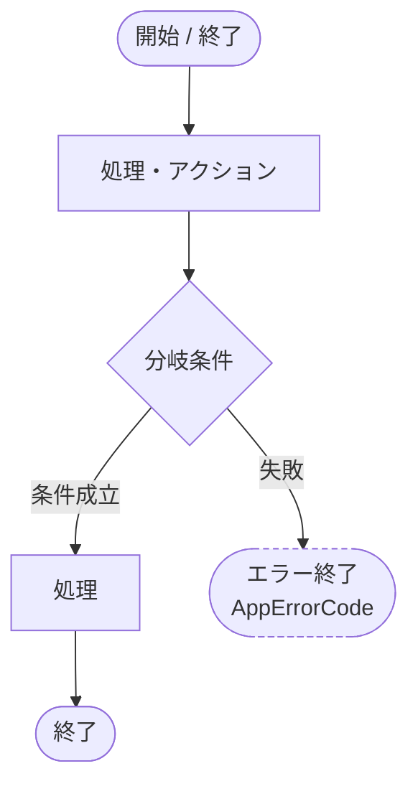
```mermaid
flowchart TD
    S([開始 / 終了]) --> A[処理・アクション]
    A --> Q{分岐条件}
    Q -->|条件成立| B[処理]
    Q -->|失敗| ERR([エラー終了<br/>AppErrorCode]):::err
    B --> E([終了])
    classDef err stroke-dasharray: 4 3
```

- **角丸（stadium）** = 開始 / 終了。
- **長方形** = 処理。ノード内に主要実装エントリ（メソッド名）を併記する。
- **ひし形** = 分岐（バリデーション / ガード）。
- **破線枠の終了** = `AppError` を throw して終わる経路（UI はトースト or インライン表示）。
- 書き込み系 UC の **一覧反映は `snapshots()` 購読** 経由で自動再描画される（図では「（snapshots で再描画）」と注記）。詳細は [データフロー (a)](./データフロー.md#a-snapshots-双方向購読)。

---

## 1. 認証（Epic-00）

### UC-A1 サインアップ

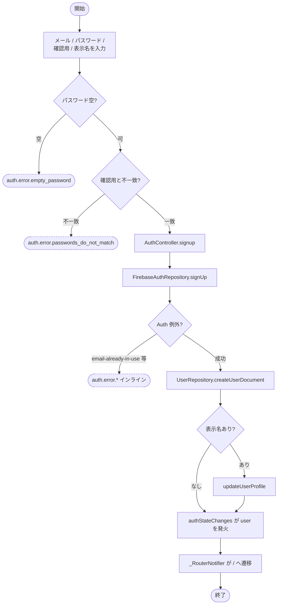
```mermaid
flowchart TD
    S([開始]) --> IN[メール / パスワード /\n確認用 / 表示名を入力]
    IN --> V1{パスワード空?}
    V1 -->|空| E1([auth.error.empty_password]):::err
    V1 -->|可| V2{確認用と不一致?}
    V2 -->|不一致| E2([auth.error.passwords_do_not_match]):::err
    V2 -->|一致| C[AuthController.signup]
    C --> SU[FirebaseAuthRepository.signUp]
    SU --> SUQ{Auth 例外?}
    SUQ -->|email-already-in-use 等| E3([auth.error.* インライン]):::err
    SUQ -->|成功| DOC[UserRepository.createUserDocument]
    DOC --> DN{表示名あり?}
    DN -->|あり| UP[updateUserProfile]
    DN -->|なし| OK
    UP --> OK[authStateChanges が user を発火]
    OK --> RT[_RouterNotifier が / へ遷移]
    RT --> E([終了])
    classDef err stroke-dasharray: 4 3
```

### UC-A2 ログイン

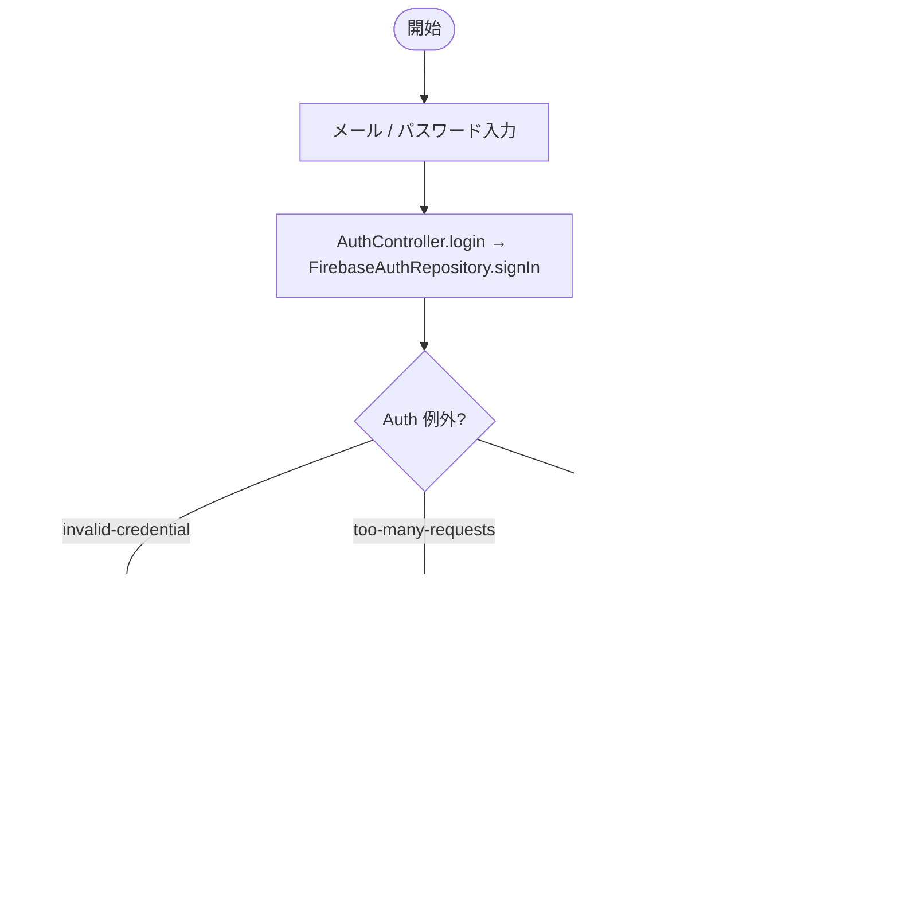
```mermaid
flowchart TD
    S([開始]) --> IN[メール / パスワード入力]
    IN --> C[AuthController.login → FirebaseAuthRepository.signIn]
    C --> Q{Auth 例外?}
    Q -->|invalid-credential| E1([auth.error.invalid_credential]):::err
    Q -->|too-many-requests| E2([auth.error.too_many_requests]):::err
    Q -->|成功| OK[authStateChanges が user を発火]
    OK --> RT[_RouterNotifier が認証状態を再評価 → /]
    RT --> E([終了])
    classDef err stroke-dasharray: 4 3
```

> `user-not-found` / `wrong-password` は SDK 統合により `invalid-credential` に寄せられる（[エラー仕様 §1](../外部仕様/エラー仕様.md#1-認証エラーapperror-経由)）。

### UC-A3 ログアウト

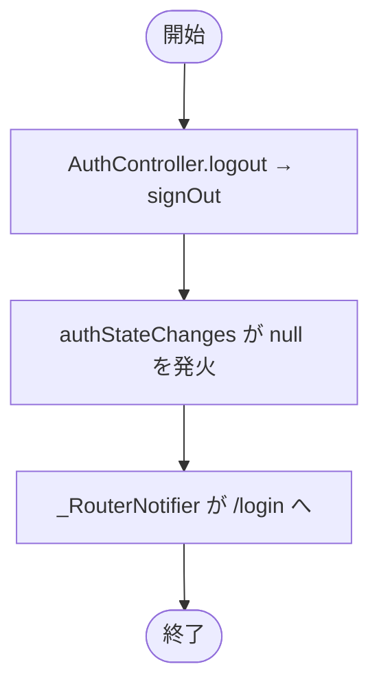
```mermaid
flowchart TD
    S([開始]) --> C[AuthController.logout → signOut]
    C --> OK[authStateChanges が null を発火]
    OK --> RT[_RouterNotifier が /login へ]
    RT --> E([終了])
```

### UC-A4 プロフィール編集

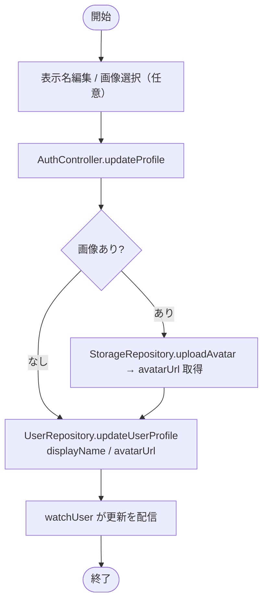
```mermaid
flowchart TD
    S([開始]) --> IN[表示名編集 / 画像選択（任意）]
    IN --> C[AuthController.updateProfile]
    C --> Q{画像あり?}
    Q -->|あり| UP[StorageRepository.uploadAvatar → avatarUrl 取得]
    Q -->|なし| UPD
    UP --> UPD[UserRepository.updateUserProfile\ndisplayName / avatarUrl]
    UPD --> OK[watchUser が更新を配信]
    OK --> E([終了])
    classDef err stroke-dasharray: 4 3
```

### UC-A5 退会

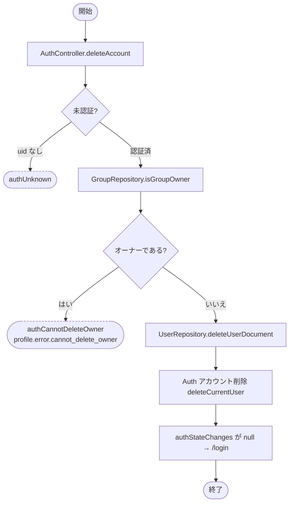
```mermaid
flowchart TD
    S([開始]) --> C[AuthController.deleteAccount]
    C --> Q1{未認証?}
    Q1 -->|uid なし| E0([authUnknown]):::err
    Q1 -->|認証済| G[GroupRepository.isGroupOwner]
    G --> Q2{オーナーである?}
    Q2 -->|はい| E1([authCannotDeleteOwner<br/>profile.error.cannot_delete_owner]):::err
    Q2 -->|いいえ| D1[UserRepository.deleteUserDocument]
    D1 --> D2[Auth アカウント削除 deleteCurrentUser]
    D2 --> OK[authStateChanges が null → /login]
    OK --> E([終了])
    classDef err stroke-dasharray: 4 3
```

> オーナーは先に [UC-G3 脱退](#uc-g3-脱退) か [UC-G4 解散](#uc-g4-解散) が必要。

---

## 2. グループ（Epic-00 / Epic-03）

### UC-G1 グループ作成

```mermaid
flowchart TD
    S([開始]) --> IN[グループ名入力]
    IN --> V{名前が空?}
    V -->|空| E1([group.create.error.empty_name]):::err
    V -->|可| C[GroupController.createGroup]
    C --> GEN[招待コード生成（8 文字英数）]
    GEN --> B[FirestoreGroupRepository.createGroup\nWriteBatch]
    B --> B1[groups/&#123;gid&#125; 作成\nownerId=自分 / memberIds は自分のみ]
    B --> B2[デフォルトタグ作成\n（急ぎ / まとめ買い）]
    B --> B3[users/&#123;uid&#125;.groupId = gid]
    B1 --> CM{commit 成功?}
    B2 --> CM
    B3 --> CM
    CM -->|失敗| E2([AppError トースト]):::err
    CM -->|成功| OK[GroupController が group を更新 → /]
    OK --> E([終了])
    classDef err stroke-dasharray: 4 3
```

### UC-G2 グループ名変更

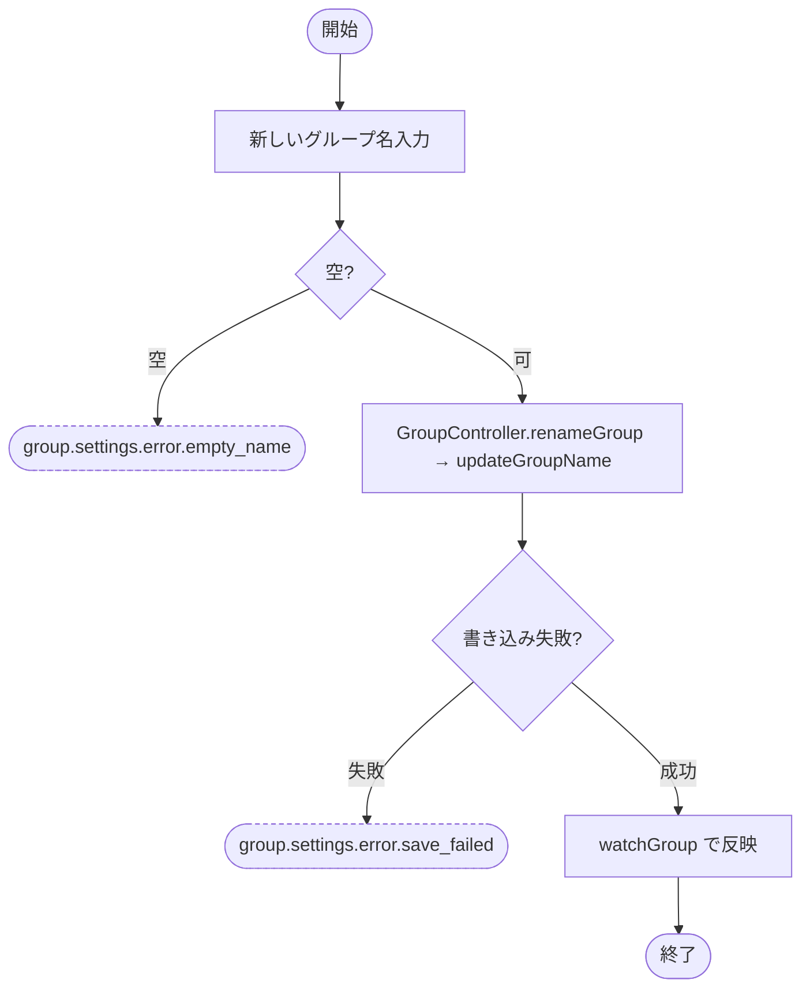
```mermaid
flowchart TD
    S([開始]) --> IN[新しいグループ名入力]
    IN --> V{空?}
    V -->|空| E1([group.settings.error.empty_name]):::err
    V -->|可| C[GroupController.renameGroup → updateGroupName]
    C --> Q{書き込み失敗?}
    Q -->|失敗| E2([group.settings.error.save_failed]):::err
    Q -->|成功| OK[watchGroup で反映]
    OK --> E([終了])
    classDef err stroke-dasharray: 4 3
```

### UC-G3 脱退

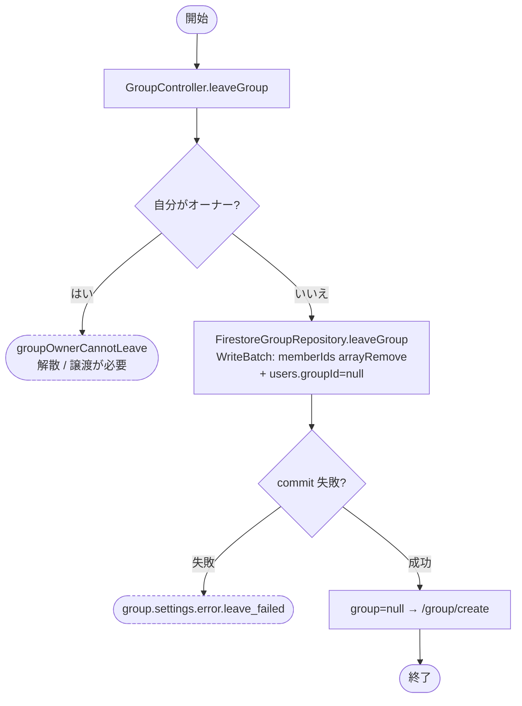
```mermaid
flowchart TD
    S([開始]) --> C[GroupController.leaveGroup]
    C --> Q1{自分がオーナー?}
    Q1 -->|はい| E1([groupOwnerCannotLeave<br/>解散 / 譲渡が必要]):::err
    Q1 -->|いいえ| B[FirestoreGroupRepository.leaveGroup\nWriteBatch: memberIds arrayRemove\n+ users.groupId=null]
    B --> Q2{commit 失敗?}
    Q2 -->|失敗| E2([group.settings.error.leave_failed]):::err
    Q2 -->|成功| OK[group=null → /group/create]
    OK --> E([終了])
    classDef err stroke-dasharray: 4 3
```

### UC-G4 解散

```mermaid
flowchart TD
    S([開始]) --> CF{確認ダイアログ OK?}
    CF -->|キャンセル| E0([中断])
    CF -->|OK| C[GroupController.disbandGroup]
    C --> B[FirestoreGroupRepository.disbandGroup\nWriteBatch]
    B --> B1[実行者の users.groupId=null\n（対象一致時のみ・#177）]
    B --> B2[groups/&#123;gid&#125; 削除]
    B1 --> CM{commit 成功?}
    B2 --> CM
    CM -->|失敗| E1([group.settings.error.disband_failed]):::err
    CM -->|成功| OK[group=null → /group/create]
    OK --> FN[Cloud Function onGroupDeleted]
    FN --> FN1[recursiveDelete で配下\nitems/tags/itemHistory/... 清掃 #37]
    FN --> FN2[Storage の商品画像を prefix 削除 #38]
    FN1 --> E([終了])
    FN2 --> E
    classDef err stroke-dasharray: 4 3
```

### UC-G5 グループ切替

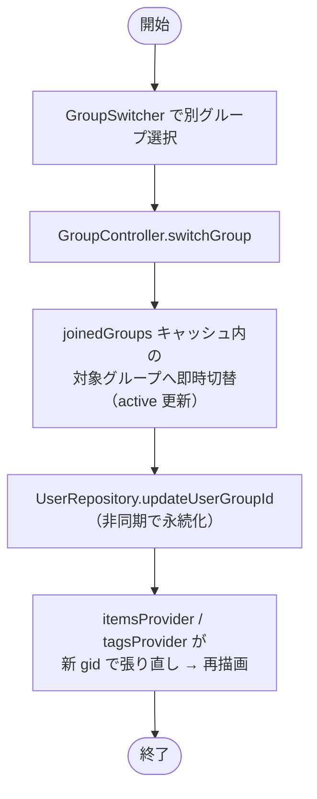
```mermaid
flowchart TD
    S([開始]) --> SEL[GroupSwitcher で別グループ選択]
    SEL --> C[GroupController.switchGroup]
    C --> LOCAL[joinedGroups キャッシュ内の\n対象グループへ即時切替（active 更新）]
    LOCAL --> PERSIST[UserRepository.updateUserGroupId\n（非同期で永続化）]
    PERSIST --> OK[itemsProvider / tagsProvider が\n新 gid で張り直し → 再描画]
    OK --> E([終了])
```

### UC-G6 招待コード参加

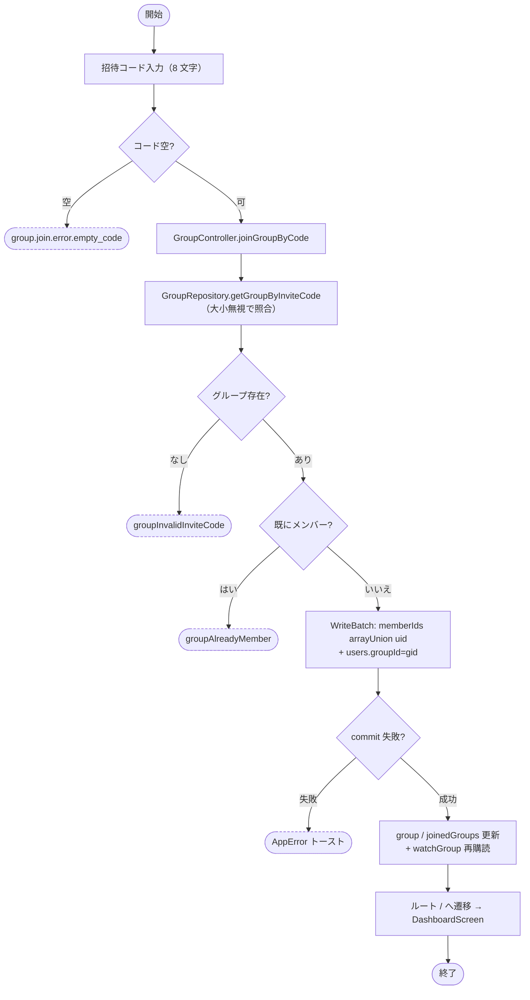
```mermaid
flowchart TD
    S([開始]) --> IN[招待コード入力（8 文字）]
    IN --> V{コード空?}
    V -->|空| E0([group.join.error.empty_code]):::err
    V -->|可| C[GroupController.joinGroupByCode]
    C --> GET[GroupRepository.getGroupByInviteCode\n（大小無視で照合）]
    GET --> Q1{グループ存在?}
    Q1 -->|なし| E1([groupInvalidInviteCode]):::err
    Q1 -->|あり| Q2{既にメンバー?}
    Q2 -->|はい| E2([groupAlreadyMember]):::err
    Q2 -->|いいえ| B[WriteBatch: memberIds arrayUnion uid\n+ users.groupId=gid]
    B --> Q3{commit 失敗?}
    Q3 -->|失敗| E3([AppError トースト]):::err
    Q3 -->|成功| OK[group / joinedGroups 更新\n+ watchGroup 再購読]
    OK --> RT[ルート / へ遷移 → DashboardScreen]
    RT --> E([終了])
    classDef err stroke-dasharray: 4 3
```

> 未ログインで招待リンク（`?code=`）を開いた経路は [データフロー (b-2)](./データフロー.md#b-2-招待リンク経由未ログイン経路-176)。

### UC-G7 招待コード共有

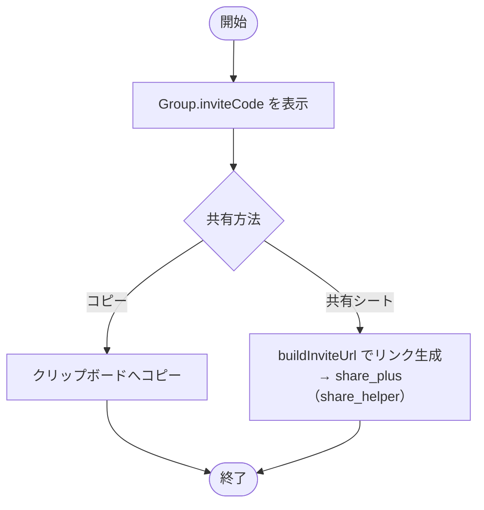
```mermaid
flowchart TD
    S([開始]) --> SHOW[Group.inviteCode を表示]
    SHOW --> SEL{共有方法}
    SEL -->|コピー| CP[クリップボードへコピー]
    SEL -->|共有シート| SP[buildInviteUrl でリンク生成\n→ share_plus（share_helper）]
    CP --> E([終了])
    SP --> E
```

### UC-G8 メンバー強制退場

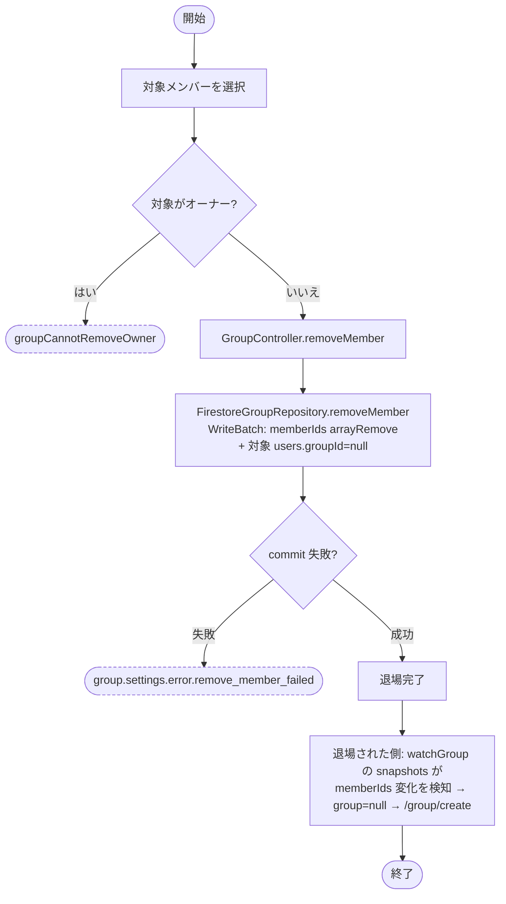
```mermaid
flowchart TD
    S([開始]) --> SEL[対象メンバーを選択]
    SEL --> Q1{対象がオーナー?}
    Q1 -->|はい| E1([groupCannotRemoveOwner]):::err
    Q1 -->|いいえ| C[GroupController.removeMember]
    C --> B[FirestoreGroupRepository.removeMember\nWriteBatch: memberIds arrayRemove\n+ 対象 users.groupId=null]
    B --> Q2{commit 失敗?}
    Q2 -->|失敗| E2([group.settings.error.remove_member_failed]):::err
    Q2 -->|成功| OK[退場完了]
    OK --> NOTE[退場された側: watchGroup の snapshots が\nmemberIds 変化を検知 → group=null → /group/create]
    NOTE --> E([終了])
    classDef err stroke-dasharray: 4 3
```

---

## 3. タグ（Epic-00 / #142）

### UC-T1 タグ作成

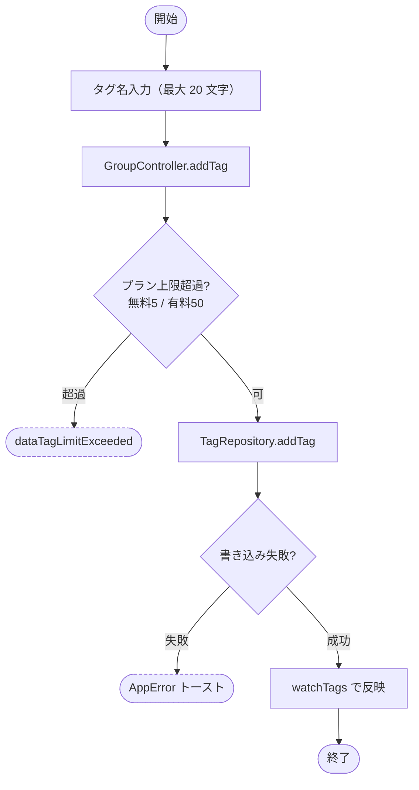
```mermaid
flowchart TD
    S([開始]) --> IN[タグ名入力（最大 20 文字）]
    IN --> C[GroupController.addTag]
    C --> Q1{プラン上限超過?\n無料5 / 有料50}
    Q1 -->|超過| E1([dataTagLimitExceeded]):::err
    Q1 -->|可| W[TagRepository.addTag]
    W --> Q2{書き込み失敗?}
    Q2 -->|失敗| E2([AppError トースト]):::err
    Q2 -->|成功| OK[watchTags で反映]
    OK --> E([終了])
    classDef err stroke-dasharray: 4 3
```

### UC-T2 タグ名変更

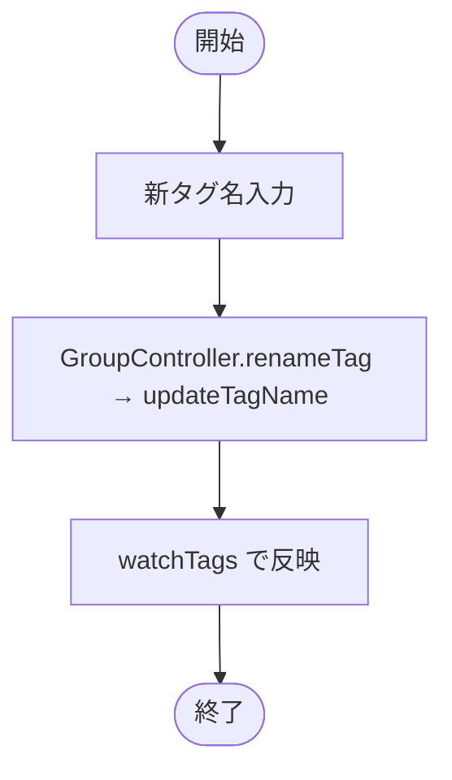
```mermaid
flowchart TD
    S([開始]) --> IN[新タグ名入力]
    IN --> C[GroupController.renameTag → updateTagName]
    C --> OK[watchTags で反映]
    OK --> E([終了])
```

### UC-T3 タグ削除

```mermaid
flowchart TD
    S([開始]) --> CF{確認 OK?}
    CF -->|キャンセル| E0([中断])
    CF -->|OK| C[GroupController.deleteTag]
    C --> GET[tagId を参照する items を取得]
    GET --> B[FirestoreTagRepository.deleteTagAndClearItems\nWriteBatch]
    B --> B1[items の tagId を FieldValue.delete]
    B --> B2[tags/&#123;tagId&#125; 削除]
    B1 --> CM{commit 成功?}
    B2 --> CM
    CM -->|失敗| E1([AppError トースト]):::err
    CM -->|成功| OK[タグなしセクションへ移動（snapshots で再描画）]
    OK --> E([終了])
    classDef err stroke-dasharray: 4 3
```

### UC-T4 タグフィルタ（読み取りのみ）

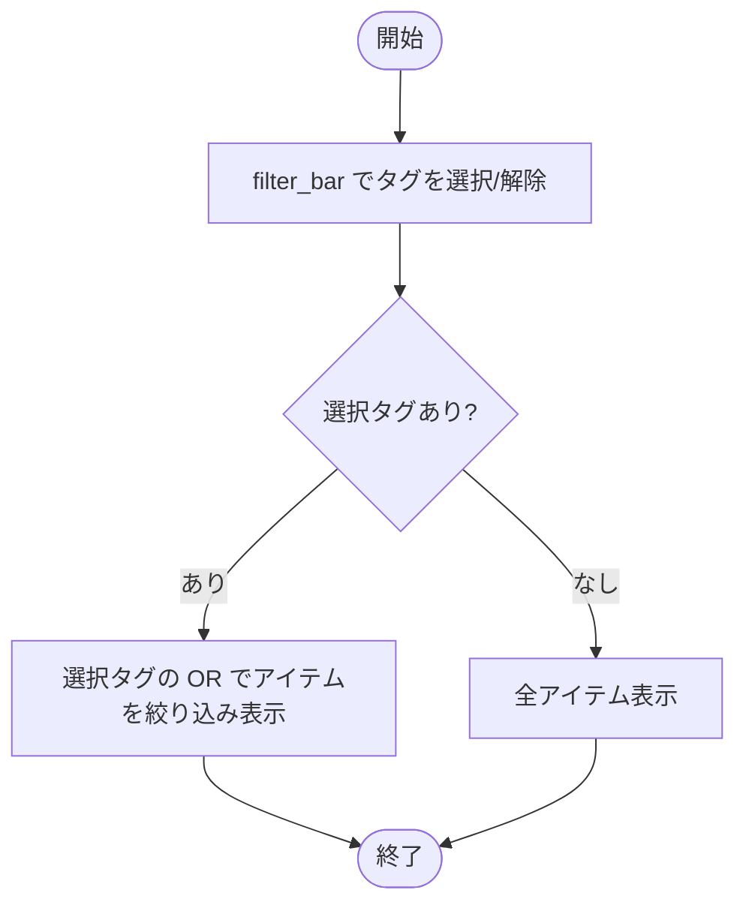
```mermaid
flowchart TD
    S([開始]) --> SEL[filter_bar でタグを選択/解除]
    SEL --> F{選択タグあり?}
    F -->|あり| OR[選択タグの OR でアイテムを絞り込み表示]
    F -->|なし| ALL[全アイテム表示]
    OR --> E([終了])
    ALL --> E
```

---

## 4. アイテム（Epic-00 / Epic-02 / Epic-06）

### UC-I1 アイテム追加（画像 2 段保存）

```mermaid
flowchart TD
    S([開始]) --> IN[商品名 / タグ / メモ / 画像（任意）入力]
    IN --> V{商品名が空?}
    V -->|空| E1([item.name_required]):::err
    V -->|可| ADD[ItemRepository.addItem\nimageUrl='' で作成 → itemId 確定]
    ADD --> Q1{addItem 失敗?}
    Q1 -->|失敗| E2([app.error.add]):::err
    Q1 -->|成功| Q2{画像あり?}
    Q2 -->|なし| OK[追加成功トースト]
    Q2 -->|あり| UP[StorageRepository.uploadItemImage\ngroups/&#123;gid&#125;/items/&#123;itemId&#125;.jpg]
    UP --> UPD[updateItemDetails で imageUrl 更新]
    UPD --> Q3{画像ステップ失敗?}
    Q3 -->|失敗| W([app.error.update<br/>本体は残す・best-effort]):::err
    Q3 -->|成功| OK
    OK --> RFR[（snapshots で一覧再描画）]
    RFR --> E([終了])
    classDef err stroke-dasharray: 4 3
```

> シーケンス詳細は [アーキテクチャ概要 §3](./アーキテクチャ概要.md#3-アイテム追加のシーケンス)。

### UC-I2 アイテム編集

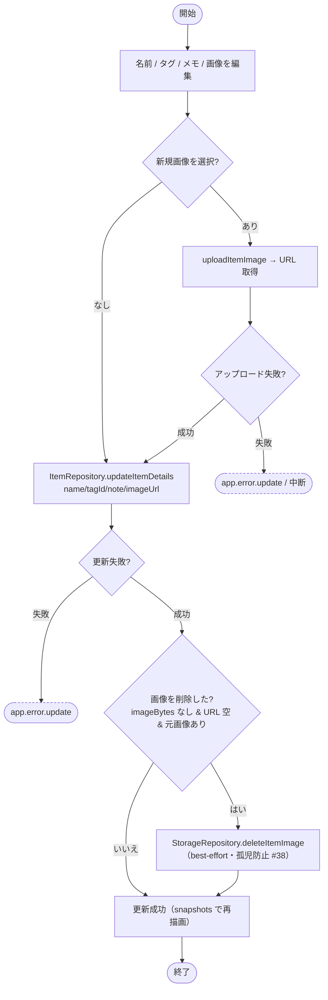
```mermaid
flowchart TD
    S([開始]) --> IN[名前 / タグ / メモ / 画像を編集]
    IN --> Q1{新規画像を選択?}
    Q1 -->|あり| UP[uploadItemImage → URL 取得]
    Q1 -->|なし| UPD
    UP --> Q2{アップロード失敗?}
    Q2 -->|失敗| E1([app.error.update / 中断]):::err
    Q2 -->|成功| UPD
    UPD[ItemRepository.updateItemDetails\nname/tagId/note/imageUrl] --> Q3{更新失敗?}
    Q3 -->|失敗| E2([app.error.update]):::err
    Q3 -->|成功| Q4{画像を削除した?\nimageBytes なし & URL 空 & 元画像あり}
    Q4 -->|はい| DEL[StorageRepository.deleteItemImage\n（best-effort・孤児防止 #38）]
    Q4 -->|いいえ| OK
    DEL --> OK[更新成功（snapshots で再描画）]
    OK --> E([終了])
    classDef err stroke-dasharray: 4 3
```

### UC-I3 アイテム削除

```mermaid
flowchart TD
    S([開始]) --> CF{確認 OK?}
    CF -->|キャンセル| E0([中断])
    CF -->|OK| C[ItemRepository.deleteItem]
    C --> Q{削除失敗?}
    Q -->|失敗| E1([app.error.delete]):::err
    Q -->|成功| OK[一覧から消える（snapshots）]
    OK --> FN[Cloud Function onItemDeleted\nitemHistory に deleted 記録 #37\n+ Storage 画像 best-effort 削除 #38]
    FN --> E([終了])
    classDef err stroke-dasharray: 4 3
```

### UC-I4 「買った」を反映

```mermaid
flowchart TD
    S([開始]) --> TAP[ItemCard のチェック ON]
    TAP --> C[ItemRepository.setPurchased gid,itemId,true]
    C --> OK[status='purchased'（buyingBy は保持）\nsnapshots でパートナーにも反映]
    OK --> FN[onItemUpdated: active→purchased を検知し\nitemHistory に purchased 記録・サマリー更新 #37\n（直近1時間の重複はスキップ）]
    FN --> E([終了])
```

> 未購入に戻す場合は `setPurchased(false)`。読み取りは `Item.isPurchased` ゲッターで旧 `isBought` も判定。

### UC-I5 「買います」宣言

```mermaid
flowchart TD
    S([開始]) --> TAP[「買います」タップ]
    TAP --> Q1{既に他人が宣言中?}
    Q1 -->|はい| DLG{上書き確認ダイアログ OK?}
    DLG -->|キャンセル| E0([中断])
    DLG -->|OK| SET
    Q1 -->|いいえ| SET[ItemRepository.setVolunteer gid,itemId,uid]
    SET --> OK[buyingBy=uid（active_buying 論理状態）\nsnapshots で反映]
    OK --> E([終了])
    classDef err stroke-dasharray: 4 3
```

> 取り消しは自分の宣言時のみ可能（`setVolunteer(..., null)`）。詳細は [状態遷移 §1](./状態遷移.md#1-item-ライフサイクル)。

### UC-I6 「買った」通知受信（計画）

```mermaid
flowchart TD
    S([開始]):::plan --> NOTE[計画: 購入イベントを契機に\nCloud Functions が FCM プッシュ送信]
    NOTE --> CUR[現状: notification_providers の通知設定が\nUserDoc のフラグを保存するのみ]
    CUR --> E([未実装]):::plan
    classDef plan stroke-dasharray: 5 5
```

---

## 5. AI 週次提案（#37 / #40 / #41）

### UC-S0 履歴アーカイブ＋週次提案生成（システム）

```mermaid
flowchart TD
    subgraph TRG[Firestore トリガー #37]
        T0([アイテム購入/削除]) --> T1[onItemUpdated / onItemDeleted]
        T1 --> T2[itemHistory に生イベント記録\n+ purchaseHistorySummaries 集約]
    end
    subgraph WK[週次バッチ #40]
        W0([onSchedule 毎週土 08:00 JST]) --> W1{suggestionsEnabled?\nsystem/config キルスイッチ}
        W1 -->|false| WE([即終了]):::plan
        W1 -->|true（既定）| W2[グループごとに active items /\n直近8週の履歴 / サマリーを集計]
        W2 --> W3[Vertex AI Gemini に\nstructured output で問い合わせ]
        W3 --> W4[groups/&#123;gid&#125;/suggestions/&#123;weekId&#125; に保存\n（購入忘れ / 次期候補）]
        W4 --> WED([終了])
    end
    classDef plan stroke-dasharray: 5 5
```

### UC-S1 提案を閲覧

```mermaid
flowchart TD
    S([開始]) --> BADGE[Dashboard の AI 提案ボタン\nhasUnreadSuggestionProvider で未読バッジ]
    BADGE --> TAP[ボタンタップ → context.push '/suggestions']
    TAP --> LOAD[deferred route 読込\nSuggestionsScreen]
    LOAD --> SUB[latestSuggestionProvider\nwatchLatestSuggestion で最新提案購読]
    SUB --> Q{提案あり?}
    Q -->|status=empty / null| EMPTY[空状態を表示]
    Q -->|あり| SHOW[購入忘れ / 次期候補をカード表示]
    SHOW --> READ[markSuggestionAsRead\n既読 weekId を SharedPreferences 保存\n→ バッジ provider invalidate]
    EMPTY --> READ
    READ --> E([終了])
```

### UC-S2 提案をリストに追加

```mermaid
flowchart TD
    S([開始]) --> TAP[提案カードの「リストに追加」タップ]
    TAP --> ADD[ItemRepository.addItem（既存経路）]
    ADD --> OK[買い物リストに追加（snapshots で反映）]
    OK --> E([終了])
```

### UC-S3 提案到着通知（計画）

```mermaid
flowchart TD
    S([開始]):::plan --> NOTE[計画: AI 提案 Phase 2 で\nweeklySuggestions 保存後に FCM プッシュ]
    NOTE --> E([未実装]):::plan
    classDef plan stroke-dasharray: 5 5
```

---

## 6. 関連ドキュメント

- [ユースケース.md](./ユースケース.md) — UC 一覧・アクター・実装エントリの索引
- [データフロー.md](./データフロー.md) — snapshots 購読・招待参加・AI 提案フロー
- [状態遷移.md](./状態遷移.md) — Item / 認証 / グループ / のライフサイクル
- [アーキテクチャ概要.md](./アーキテクチャ概要.md) — レイヤー構成・アイテム追加シーケンス
- [`docs/外部仕様/エラー仕様.md`](../外部仕様/エラー仕様.md) — `AppErrorCode` と i18n キー
