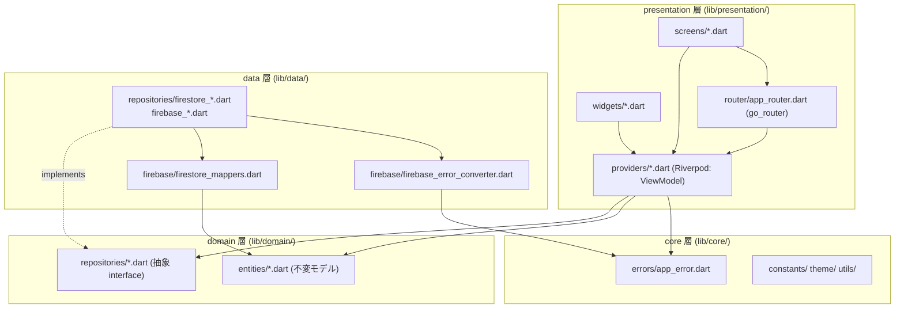
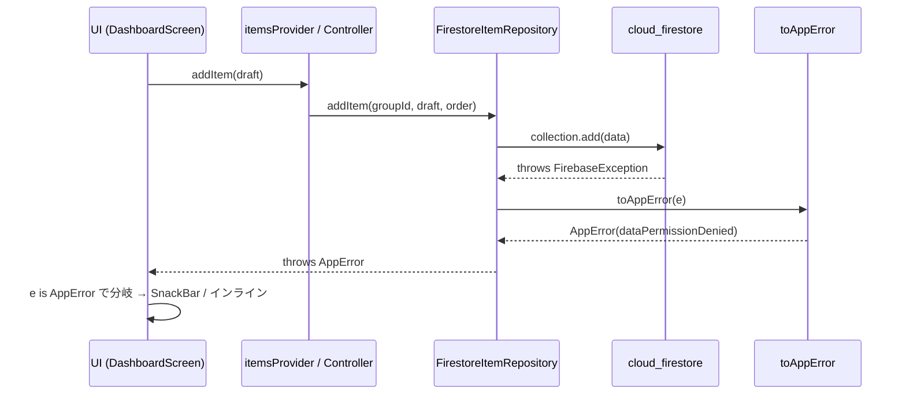
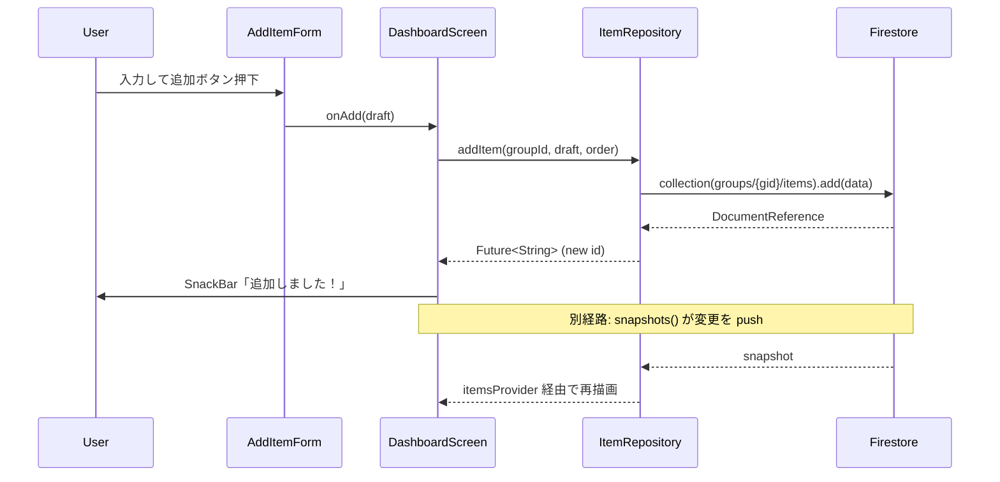

# アーキテクチャ概要

このドキュメントはアプリ内部のレイヤー構造、依存方向、エラーハンドリングの流れを示す。
スキーマ・ユーザーフロー・外部仕様は `docs/外部仕様/` を参照。

本リポジトリは **クリーンアーキテクチャ + MVVM** を採用し、状態管理 / DI に `flutter_riverpod`、宣言的ルーティングに `go_router` を用いる。Firebase（`firebase_auth` / `cloud_firestore` / `firebase_storage`）への依存は `data/` 層に閉じ込め、上位層はバックエンドを意識しない。

## 関連ドキュメント

`docs/内部設計/` 配下の図はこのドキュメントをハブとして相互参照する。役割分担は以下のとおり。

| ドキュメント | 何を読み解くか |
|---|---|
| [ドメインモデル.md](./ドメインモデル.md) | エンティティ・値オブジェクト・関連（クラス図 + Firestore パスの ER 図） |
| [ユースケース.md](./ユースケース.md) | アクター↔UC 俯瞰、Story と画面 / 実装エントリの索引 |
| [データフロー.md](./データフロー.md) | Firestore `snapshots()` 購読・招待コード参加・ルーティング判定の動的な流れ |
| [状態遷移.md](./状態遷移.md) | Item / 認証セッション / グループメンバーシップのライフサイクル |
| 本ドキュメント | レイヤー構造・依存方向・エラー変換・アイテム追加シーケンス |

## 1. レイヤー構成

UI からバックエンドまでをクリーンアーキテクチャの 4 ディレクトリに分ける。依存方向は **外側 → 内側（presentation → domain ← data）**。`domain/` が中心で、`presentation/` と `data/` は `domain/` の抽象（エンティティ・抽象リポジトリ）にのみ依存する。Firebase SDK への直接依存は `data/` 層と `firebase_options.dart` のみに閉じる。



### 各層の責務

| 層 | 置き場所 | 責務 |
|---|---|---|
| presentation（UI） | `lib/presentation/screens/`, `lib/presentation/widgets/` | 画面描画・ユーザー入力。Firebase 依存・リポジトリ直接参照を持たない。Riverpod プロバイダ経由でのみデータにアクセスする。 |
| presentation（ViewModel） | `lib/presentation/providers/` | アプリ状態と購読ライフサイクルの管理（`Notifier` / `Provider` / `StreamProvider`）。抽象リポジトリに委譲する。 |
| presentation（ルーティング） | `lib/presentation/router/app_router.dart` | 認証・グループ状態に応じた `go_router` の宣言的ルーティングとリダイレクト判定。 |
| domain | `lib/domain/entities/`, `lib/domain/repositories/` | 不変エンティティと抽象リポジトリ（interface）。Flutter / Firebase に依存しない純粋な層。 |
| data | `lib/data/repositories/`, `lib/data/firebase/` | Firebase SDK 呼び出しの集約。抽象リポジトリの Firestore / Auth / Storage 実装。例外は `AppError` に変換して throw する。 |
| core | `lib/core/errors/`, `lib/core/constants/`, `lib/core/theme/`, `lib/core/utils/` | 横断的関心事（`AppError` / プラン上限 / テーマ / 招待コード生成 等）。 |

### Firebase 依存の隔離（プラットフォーム差異の吸収）

元実装（React Native 版）は Web / Native の Firebase SDK 差異を `src/lib/*Client(.native).ts` のファイル分割（Metro の `.native.ts` 自動選択）で吸収していた。

Flutter 版では FlutterFire（`firebase_auth` / `cloud_firestore` / `firebase_storage`）が単一 API で各プラットフォームを抽象化するため、ファイル分割は不要。代わりに **抽象リポジトリ（`lib/domain/repositories/`）と Firestore 実装（`lib/data/repositories/`）の分離** によって、上位層を Firebase から切り離す。

```
lib/
  domain/repositories/        ← 抽象 interface（Firebase 非依存）
    auth_repository.dart           AuthRepository
    user_repository.dart           UserRepository
    group_repository.dart          GroupRepository
    tag_repository.dart            TagRepository
    item_repository.dart           ItemRepository
    storage_repository.dart        StorageRepository
  data/repositories/          ← Firestore / Auth / Storage 実装
    firebase_auth_repository.dart
    firestore_user_repository.dart
    firestore_group_repository.dart
    firestore_tag_repository.dart
    firestore_item_repository.dart
    firebase_storage_repository.dart
  data/firebase/
    firestore_mappers.dart         ← ドキュメント ↔ エンティティ変換
    firebase_error_converter.dart  ← FirebaseException → AppError 変換
  firebase_options.dart            ← Firebase 初期化設定（要差し替え）
```

実装は `lib/presentation/providers/repository_providers.dart` のプロバイダ経由で注入される。プロバイダを override すれば（Riverpod `ProviderScope.overrides`）、上位層のコードを変えずにモック実装へ差し替えられる。

ウィジェット / プロバイダ層のテストでは、`fake_cloud_firestore` / `firebase_auth_mocks` / `mocktail` を用いて Firebase を差し替え、上位層が Firebase に直接依存しないことを単体テストでも担保する。

---

## 2. エラー変換フロー

Firebase 固有の `FirebaseException`（`FirebaseAuthException` 含む）は UI 層に到達する前に必ず `AppError` へ変換される。



- 変換点は `lib/data/firebase/firebase_error_converter.dart` の `toAppError(Object e)` のみ。Repository 層の catch で本関数を通してから rethrow する。
- `AppError` / `AppErrorCode` は `lib/core/errors/app_error.dart`。`AppErrorCode` は元実装の文字列リテラル union を型安全な enum へ移植したもので、各値は元コードと同一の文字列（`auth/...` / `data/...` / `group/...`）を `code` に保持する。
- UI 層は `e is AppError` の型チェックを通して `e.code`（`AppErrorCode`）のみ参照する。`FirebaseException` を `import` することはない。エラー文言への変換は `lib/presentation/utils/error_messages.dart` が担う。

---

## 3. アイテム追加のシーケンス



`itemsProvider`（`lib/presentation/providers/item_providers.dart`）が `ItemRepository.watchItems` の `Stream` を購読しているため、追加直後のリスト反映は Firestore の `snapshots()` コールバックを介して自動で行われる。`DashboardScreen` の追加ハンドラ自身はアイテム一覧の state を書き換えない。

> 双方向購読の全体像（書き込み経路と購読経路の分離、オフライン挙動）は [データフロー.md (a)](./データフロー.md#a-snapshots-双方向購読) を参照。

---

## 4. 依存の方向性ルール

- **presentation（screens/widgets）→ presentation（providers）→ domain（抽象 repositories）← data（実装）** の一方向のみ。`data/` は `domain/` の抽象にのみ依存する。
- `lib/domain/` は Flutter / Firebase に依存しない（`flutter` / `firebase_*` を import しない純粋な Dart 層）。
- `firebase_auth` / `cloud_firestore` / `firebase_storage` の直接 import は `lib/data/` と `lib/firebase_options.dart` に限定する。`lib/presentation/` / `lib/domain/` / `lib/core/` からは import しない。
- UI（`screens/` / `widgets/`）は `data/` のリポジトリ実装を直接参照しない。必ず `providers/`（`repository_providers.dart` 経由）を通す。
- 抽象リポジトリ同士のオーケストレーション（例: サインアップ時のユーザードキュメント作成、退会時のオーナーガード）は `providers/` のコントローラ（`AuthController` 等）が担い、`data/` のリポジトリ実装は単一責務に保つ。

---

## 5. Firestore Security Rules 方針

`firestore.rules` でサーバー側の書き込みガードを実施する。クライアント側制御（`snapshots()` 購読による退場検知など）に加え、ルールによる二重防御でデータ整合性を保つ。

### コレクション別のアクセス制御

| コレクション | 読み取り | 書き込み |
|---|---|---|
| `users/{uid}` | 本人（`request.auth.uid == uid`） | 本人のみ |
| `groups/{groupId}` | `memberIds` に含まれる認証済みユーザー | 新規作成: ownerId=自分かつ memberIds に自分を含む。更新: 現在のメンバー |
| `groups/{groupId}/items/{itemId}` | グループの `memberIds` に含まれる認証済みユーザー | 同左 |
| `groups/{groupId}/tags/{tagId}` | グループの `memberIds` に含まれる認証済みユーザー | 同左 |
| `groups/{groupId}/lists/{listId}` | グループの `memberIds` に含まれる認証済みユーザー | 同左（#142 で廃止、後方互換のためルール維持） |
| `groups/{groupId}/lists/{listId}/items/{itemId}` | グループの `memberIds` に含まれる認証済みユーザー | 同左（旧パス、後方互換のためルール維持） |

### 強制退場との連動

`memberIds` からの除外はサーバー側ルールにより即座に有効となる。

- オフライン時に退場された場合でも、オンライン復帰後の Firestore 書き込みはルールによりブロックされる。
- クライアント側の `snapshots()` による退場検知（`GroupController._subscribeActiveGroup`）と組み合わせた二重防御。

### デプロイ・検証

`firestore.rules` のデプロイは `firebase deploy --only firestore:rules`（Docker 経由は `docker compose run --rm flutter firebase deploy --only firestore:rules`）。ローカル検証は `firebase emulators:start`。
リポジトリ層の読み書きアクセス挙動は `test/data/` の `fake_cloud_firestore` テストで検証し、実装理解の補助としても活用する。

---

## 6. 拡張ポイント

- **バックエンド差し替え**: `AuthRepository` 等の別実装（例: `MockAuthRepository`）を用意し、`repository_providers.dart` の対応プロバイダを `ProviderScope.overrides` で差し込む。他 BaaS への移行も抽象リポジトリの実装差し替えで可能。
- **テスト**: 抽象リポジトリのおかげで、provider / controller は `fake_cloud_firestore` / `firebase_auth_mocks` / `mocktail` で Firebase をモックして単体テスト可能。
- **新ドメイン追加**: 新しいエラー種別を `lib/core/errors/app_error.dart` の `AppErrorCode` enum に追加し、必要なら `firebase_error_converter.dart` の変換マップを更新する。エンティティは `lib/domain/entities/`、抽象リポジトリは `lib/domain/repositories/`、実装は `lib/data/repositories/`、ドキュメント変換は `firestore_mappers.dart` に追加する。
