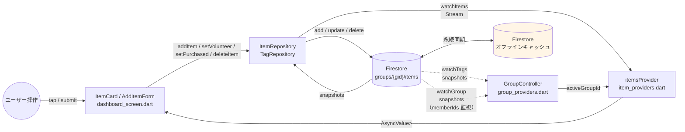
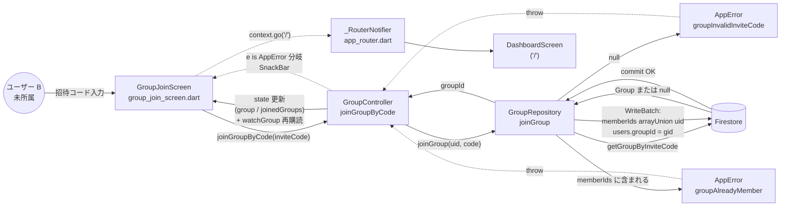
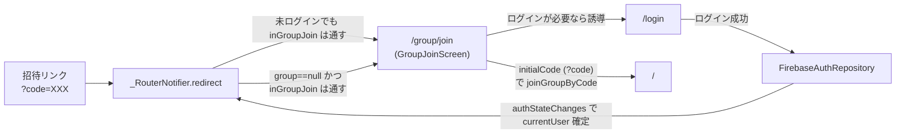
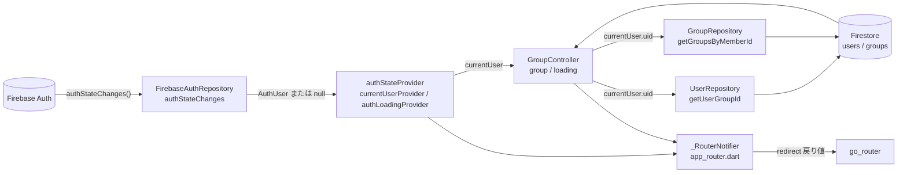

# データフロー

このドキュメントは、shopping-list-app-flutter の主要なデータの流れを 3 つの視点で図示する。
レイヤー静的構造は [アーキテクチャ概要.md §1](./アーキテクチャ概要.md#1-レイヤー構成) を参照（重複しないよう本ドキュメントは「動的なデータの動き」に焦点）。

リアルタイム購読は Firestore の `snapshots()`（`Stream`）を Riverpod の `StreamProvider` で配信する。元実装（React Native 版）の `onSnapshot` + `Context` / hooks は、Flutter 版では `Stream` + Riverpod プロバイダに対応する。

---

## (a) `snapshots()` 双方向購読

CRUD 結果はメソッドの戻り値ではなく、Firestore の `snapshots()` 経由で UI に反映される。
追加ハンドラ自身はアイテム一覧の state を書き換えず、購読 `Stream` が変更を拾ってから UI が再描画される。



**ポイント**:
- 書き込み経路（実線下向き）と読み取り経路（実線上向き）は **同じ Repository モジュール内で分離** されている。
- `itemsProvider` は `activeGroupIdProvider`（`GroupController` の `group?.id`）を watch して `groups/{gid}/items` パスを解決する（#142 でリスト廃止後フラット化）。グループ未所属時は購読を張らず空配列を返す（`item_providers.dart`）。
- **オフライン挙動**: Firestore SDK のローカルキャッシュ（オレンジ）が書き込みを保持し、オンライン復帰時に自動で同期する。アプリ層の能動制御は無し。失敗時のエラーは `Stream` の `onError` が `toAppError` で変換し、`AsyncValue.error` として UI に到達する。
- タグ変更も同じパターンで `TagRepository.watchTags` → `tagsProvider` を更新する。
- **退場検知**: `GroupController._subscribeActiveGroup` がグループドキュメント自体を `GroupRepository.watchGroup`（`snapshots()`）で購読する。`memberIds` に自分の uid が含まれなくなった場合、`GroupController` が `group` を null にセットし、`_RouterNotifier` が `/group/create` へ遷移させる（UC-G8）。

---

## (b) 招待コード参加フロー

`WriteBatch` で 2 ドキュメントをアトミックに更新するため、`memberIds` と `users.groupId` の整合は常に保たれる。



**ポイント**:
- `joinGroup` は **getGroupByInviteCode → ガード判定 → WriteBatch.commit** の 3 段階。エラーは `AppError` のまま再 throw、Firebase 由来は `toAppError` で変換する。
- 成功後は `GroupController` がローカルの `group / joinedGroups` を即時更新し、`watchGroup` を新グループへ張り直すため、`_RouterNotifier` が `/group/create` にリダイレクトしないまま `/` に到達できる。
- 招待コードは内部で大文字小文字を正規化して照合するため、入力時の大文字小文字は問わない（`core/utils/invite_code.dart`）。

### (b-2) 招待リンク経由・未ログイン経路 (#176)

招待リンク `https://<base>/group/join?code=XXXXXXXX` をログアウト状態で開いた場合の動線。



- `_RouterNotifier.redirect` は **未ログインでも `/group/join` を例外的に通す**（`user == null` かつ `inGroupJoin` のとき `null` を返し、`/login` に飛ばさない）。グループ未所属（`group == null`）でも `/group/join` を許可する。
- 招待コードはルートのクエリパラメータ `?code=XXX` から `GoRoute` の `state.uri.queryParameters['code']` で取得し、`GroupJoinScreen(initialCode: ...)` に渡す。元実装の `AsyncStorage` による `pendingInviteCode` の保留は不要で、URL のクエリパラメータをそのまま使う。
- 招待リンクのベース URL は `core/utils/invite_url.dart` の `buildInviteUrl()` が決定（優先順: `--dart-define=APP_URL` → Web の `Uri.base.origin` → Native のカスタムスキーム `shoppinglistapp://group/join?code=XXX`）。
- 共有手段は OS の共有シート（`share_plus`、`presentation/utils/share_helper.dart`）と URL コピーの両方を `group_create_screen.dart` と `group_settings_screen.dart` に配置。

---

## (c) 認証セッションと go_router ルーティング判定

`authStateProvider`（`FirebaseAuthRepository.authStateChanges` の `StreamProvider`）が認証状態を購読し、`currentUser` の変化が `GroupController` と `_RouterNotifier` に伝搬する。
`_RouterNotifier` は `go_router` の `redirect` 内で 5 段階の優先順位（`app_router.dart`）で遷移先を返す。



**判定の優先順位**（`_RouterNotifier.redirect`、`app_router.dart`）:

1. `authLoading` → `/splash`（初回の認証状態確定まで）
2. `user == null`: `/login` または `/signup`（`inAuthRoute`）・`/group/join`（`inGroupJoin`）なら通す。それ以外は `/login`
3. `groupLoading` → `/splash`
4. `group == null`: `/group/create`・`/group/join`・`/profile` なら通す。それ以外は `/group/create`
5. `group != null`: 認証画面・スプラッシュにいる場合は `/` へ。それ以外は遷移なし

`/group/join` と `/profile` はグループ未所属でもアクセス可能。前者は招待参加 UC のため、後者は退会フロー（`UC-A5`）のため。
グループ所属済みユーザーは `/group/create` を含む保護ルートにアクセス可能（GroupSwitcher からの追加グループ作成を含む）。

`go_router` は `refreshListenable` に `_RouterNotifier`（`ChangeNotifier`）を渡し、`authStateProvider` / `groupControllerProvider` の変化で `notifyListeners()` を発火して再評価する。

---

## (d) 補助：オフライン書き込み（補足説明）

専用の図は (a) に統合した。Firestore SDK と `connectivity_plus` の挙動を文章で補足する。

- 書き込み API（`add` / `update` / `delete` / `WriteBatch`）は **オフライン時もローカルキャッシュへ即時反映** し、`snapshots()` リスナーも楽観的に発火する。`Future` はオンライン復帰までは未完了のまま。
- オンライン復帰時、SDK が自動でキューを送信し、サーバ確定後にスナップショットがもう一度発火する（fromCache → fromServer）。
- 競合は **last-write-wins**（フィールド単位）。`memberIds` のような配列は `FieldValue.arrayUnion` / `arrayRemove` を使うことで競合に強い（`FirestoreGroupRepository.joinGroup` / `leaveGroup`）。

### オフライン関連の実装

| 項目 | 実装場所 | 振る舞い |
|---|---|---|
| オフラインキャッシュ | `cloud_firestore`（FlutterFire 標準） | Web は IndexedDB、Native は SQLite を用いた永続キャッシュ。アプリ層の有効化処理は不要 |
| ネットワーク状態 | `presentation/providers/network_providers.dart`（`isOnlineProvider`） | `connectivity_plus` の `onConnectivityChanged` を購読。`DashboardScreen` 上部に `network.offline_banner` を表示 |
| 同期待ちバッジ | `FirestoreItemRepository.watchItems` | 各 doc の `metadata.hasPendingWrites` を `Item.pendingWrite` に派生プロパティとして注入。`ItemCard` で `item.pending_sync` バッジを表示。未同期件数は `pendingItemCountProvider` |

> `isOnlineProvider` は厳密なインターネット到達性を保証せず、オフラインインジケーターの目安として使う（取得失敗時は安全側＝オンラインに倒す）。

---

## (e) クロスコレクション整合性操作（WriteBatch）

複数コレクション / ドキュメントをアトミックに更新する必要がある操作は `WriteBatch` を使用する。現行の該当箇所:

| 操作 | 対象コレクション | 実装場所 | 備考 |
|---|---|---|---|
| グループ作成 | `groups/{gid}`, `groups/{gid}/tags/*`, `users/{uid}` | `FirestoreGroupRepository.createGroup` | groups 作成 + デフォルトタグ作成 + users.groupId 更新を 1 バッチ |
| グループ参加 | `groups/{gid}`, `users/{uid}` | `FirestoreGroupRepository.joinGroup` | (b) 参照 |
| グループ脱退 | `groups/{gid}`, `users/{uid}` | `FirestoreGroupRepository.leaveGroup` | memberIds arrayRemove + users.groupId=null |
| メンバー強制退場 | `groups/{gid}`, `users/{targetUid}` | `FirestoreGroupRepository.removeMember` | memberIds arrayRemove + users.groupId=null |
| タグ削除 | `groups/{gid}/tags/{tagId}`, `groups/{gid}/items/*` | `FirestoreTagRepository.deleteTagAndClearItems` | タグ削除 + 参照アイテムの `tagId` クリアを 1 バッチ |

**タグ削除の詳細**:

```
deleteTagAndClearItems(groupId, tagId)
  ↓ items where tagId == tagId を取得
  ↓ WriteBatch:
      items[].update({ tagId: FieldValue.delete() })  ← 参照クリア
      tags[tagId].delete()                             ← タグ削除
  ↓ batch.commit()  // 全成功 or 全失敗（部分失敗なし）
```

- 現在の参照アイテムを取得してから `batch.commit` するため、取得後にアイテムが追加されても防衛フィルタが孤立アイテムを「タグなし」セクションに表示する。
- 取得が失敗した場合は `batch.commit` も実行されない（例外が catch されて `AppError` に変換）。

---

## 関連ドキュメント

- [アーキテクチャ概要.md](./アーキテクチャ概要.md) — レイヤー構成・エラー変換・アイテム追加シーケンス
- [ドメインモデル.md](./ドメインモデル.md) — エンティティ構造
- [ユースケース.md](./ユースケース.md) — UC↔データフローの索引
- [状態遷移.md](./状態遷移.md) — データフローの結果としてのドメイン状態遷移
- [`docs/外部仕様/エラー仕様.md`](../外部仕様/エラー仕様.md) — エラーコードと表示方法
