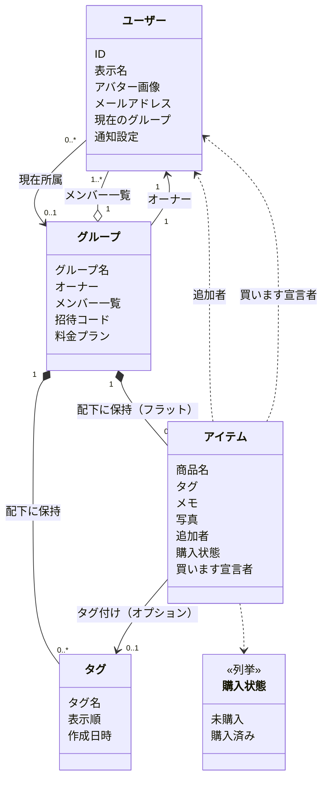
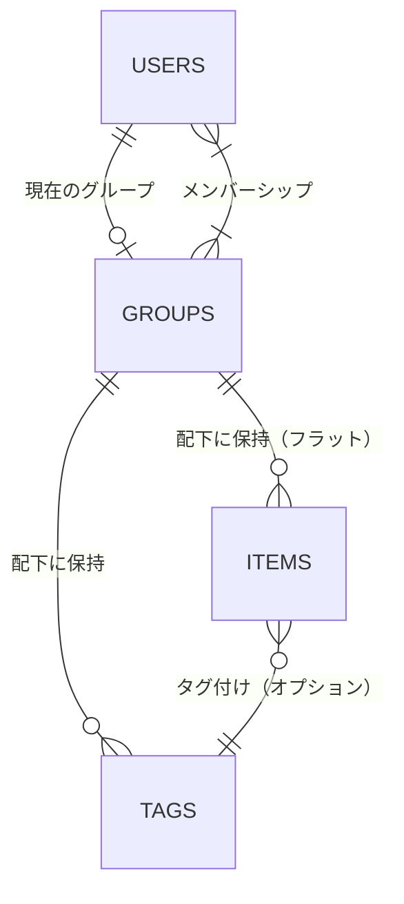
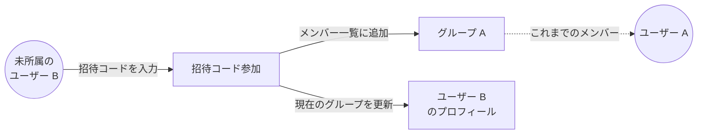

# ドメインモデル

このドキュメントは、shopping-list-app に登場する概念（エンティティ）と、それらの関係を図示する内部設計資料である。

実装の詳細（型・関数・ファイルパス）は本文では最小限にし、章末の「実装メモ」にまとめている。
画面 / ユースケースとの対応は [ユースケース.md](./ユースケース.md)、データの流れは [データフロー.md](./データフロー.md)、ライフサイクルは [状態遷移.md](./状態遷移.md) を参照。

---

## 1. 概念モデル図

家族で買い物リストを共有するために必要なエンティティ（ユーザー / グループ / タグ / アイテム）と、補助的な値オブジェクト（購入状態 / 招待コード）の関係を示す。

#142 でリスト・固定カテゴリを廃止し、ユーザー定義のタグに一本化した。実線は実装済みの関連、破線は Phase 1 計画分の関連。

> **凡例**
> - `*--` ＝ 親が消えると子も消える「コンポジション」関係（リスト、アイテム）
> - `o--` ＝ 親に紐づく集合（グループのメンバー一覧）
> - `-->` / `..>` ＝ 参照（実線=実装済み、破線=計画）

---

## 2. データの所在（Firestore パス階層）

各エンティティが Firestore のどこに格納されるかを俯瞰する補助図。
リスト・アイテムは「グループの配下」に階層的に格納される。

| 階層 | 格納場所 | 主な内容 |
|---|---|---|
| ユーザー | トップレベル | 表示名・アバター・通知設定・現在のグループ |
| グループ | トップレベル | グループ名・オーナー・メンバー一覧・招待コード・料金プラン |
| タグ | グループ配下 | ユーザー定義のラベル（上限: 無料5件/有料50件） |
| アイテム | グループ配下（フラット） | 商品名・タグID・購入状態等 |

---

## 3. ドメインルール

| ルール | 説明 |
|---|---|
| グループは作成者が必ずオーナーかつメンバー | 作成と同時にオーナー兼最初のメンバーとして登録される。 |
| ユーザーの「現在のグループ」は所属グループのいずれか | 複数グループに参加していても、画面に表示するアクティブなグループは 1 つだけ。 |
| 招待コードはグループ単位で一意 | グループ作成時に発行され、解散まで不変。失効・再発行はない。 |
| グループ作成時にデフォルトタグが自動生成される | 「急ぎ」「まとめ買い」をデフォルトタグとして生成する（表示言語に合わせる）。 |
| タグはアイテム 1 件につき最大 1 つ | 複数タグは付けられない。フィルタリングは OR 検索で行う。 |
| タグ名は最大 20 文字 | 入力フォームでバリデーションする。 |
| タグの上限はプランによる | 無料プランは 5 件、有料プランは 50 件。 |
| アイテムの購入状態の正本は「未購入 / 購入済み」 | 旧仕様のフラグ（章末「実装メモ・互換性」参照）からの移行中。 |
| オーナーは脱退できない | グループから抜けるには、解散またはオーナー権限の移譲が必要。 |

---

## 4. 招待コード参加と「現在のグループ」の関係

招待コードでグループに参加すると、参加先グループのメンバーに加わると同時に、
ユーザーの「現在のグループ」が参加先に切り替わる。
複数グループ参加時は、別途「グループ切替」操作で「現在のグループ」を変更する。

詳細な処理フローは [データフロー.md (b) 招待コード参加フロー](./データフロー.md#b-招待コード参加フロー) を、状態遷移は [状態遷移.md §3 グループメンバーシップ](./状態遷移.md#3-グループメンバーシップ) を参照。

---

## 5. 将来拡張（Phase 2 以降・図示対象外）

- **よく買う物リスト**（Epic-04）: ユーザーまたはグループ単位の「テンプレートアイテム集」を新エンティティとして追加予定。
- **アイテムの写真**（Epic-05）: 現状は最小実装。クラウドストレージとの本格連携を予定。

---

## 6. 実装メモ

### エンティティと実装上の対応

エンティティ（不変モデル）は `lib/domain/entities/` に定義する。元実装（React Native 版）では Firestore ドキュメント型 `XxxDoc` と ID 付き型 `XxxWithId` を分けていたが、Flutter 版では 1 クラスに統合している。

| 図中の概念 | Firestore コレクション | ドメインエンティティ（`lib/domain/entities/`） |
|---|---|---|
| ユーザー | `users/{uid}` | `AuthUser`（`auth_user.dart`）、`UserDoc`（`user_doc.dart`） |
| グループ | `groups/{groupId}` | `Group`（`group.dart`） |
| タグ | `groups/{groupId}/tags/{tagId}` | `Tag`（`tag.dart`） |
| アイテム | `groups/{groupId}/items/{itemId}` | `Item`（`item.dart`） |
| 購入状態 | （アイテムのフィールド） | `ItemStatus`（`item.dart` の enum） |

> **移行中の旧パス**: `groups/{groupId}/lists/{listId}/items/{itemId}` は #142 以前のパス。既存データの移行は開発フェーズのためリセット前提とし、Security Rules（`firestore.rules`）は旧パスのルールを残しつつ新パスのルールを追加している。

抽象リポジトリ（インターフェース）は `lib/domain/repositories/`、Firestore 実装は `lib/data/repositories/`、ドキュメント ↔ エンティティの相互変換は `lib/data/firebase/firestore_mappers.dart` に置く。

### 互換性

「購入状態」は新旧 2 種類のフィールドが併存している（移行期）。`Item`（`item.dart`）は両方を保持し、派生ゲッターで吸収する。

| 用途 | 新フィールド（正本） | 旧フィールド（廃止予定） | 吸収するゲッター |
|---|---|---|---|
| 購入状態 | `status: ItemStatus?` | `isBought: bool?` | `Item.isPurchased`（`status == ItemStatus.purchased \|\| isBought == true`） |
| 購入担当者 | `buyingBy: String?` | `buyerId: String?` | `Item.volunteerUid`（`buyingBy ?? buyerId`） |

- ドメインモデル図と状態遷移図は **新フィールドのみ** で描画する。
- UI 層の判定は上記ゲッター経由で新旧両方を OR で見るため、移行期間中も既存データが正しく表示される。
- 旧フィールドは将来的に完全削除する計画。

---

## 7. 関連ドキュメント

- [アーキテクチャ概要.md](./アーキテクチャ概要.md) — レイヤー構成・エラー変換・依存方向
- [ユースケース.md](./ユースケース.md) — アクター↔ユースケース・25 Story の索引
- [データフロー.md](./データフロー.md) — 招待参加・購読・ルーティング判定の流れ
- [状態遷移.md](./状態遷移.md) — Item / 認証 / グループのライフサイクル
- [`docs/外部仕様/エラー仕様.md`](../外部仕様/エラー仕様.md) — エラーコードの一覧
