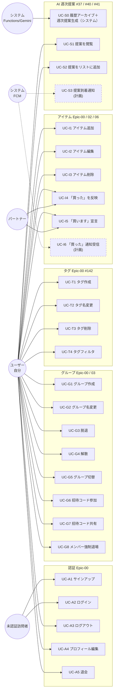

# ユースケース

このドキュメントは、shopping-list-app-flutter のアクターと主要ユースケース（UC）を俯瞰し、Story と画面・実装エントリへの索引を提供する。
Story の網羅的な定義は [`docs/初期検討/ユーザーストーリー検討.md`](../初期検討/ユーザーストーリー検討.md) を参照。
状態遷移は [状態遷移.md](./状態遷移.md)、データフローは [データフロー.md](./データフロー.md) を参照。

> **#142 の変更**: 元仕様の「リスト」「固定カテゴリ」は廃止し、ユーザー定義の **タグ** に一本化した。本ドキュメントの「リスト操作」UC（旧 UC-L1〜L4）はタグ管理 UC（UC-T1〜T4）に置き換わっている。

---

## 1. アクター

| アクター | 説明 |
|---|---|
| **未認証訪問者** | アプリを開いただけで、サインアップ / ログインが完了していないユーザー。 |
| **ユーザー（自分）** | 認証済みでアプリを操作している本人。グループ未所属の場合と所属済みの場合がある。 |
| **パートナー** | 同一グループに所属する別ユーザー。本人の操作が `snapshots()` 経由で見える側。 |
| **システム（Functions / Gemini）** | グループの購買履歴をアーカイブし（#37）、週次で AI 提案を生成する（#40）バックエンド。Cloud Functions v2 + Vertex AI Gemini。ユーザー操作を介さず Firestore トリガー / スケジューラで起動する。 |
| **システム（FCM）**（計画） | 「買った」通知・AI 提案到着通知を Push する送信元。将来実装（AI 提案 Phase 2）。 |

---

## 2. アクター↔ユースケース俯瞰図

実線＝実装済み、破線＋「(計画)」＝将来実装。

```mermaid
flowchart LR
    Visitor((未認証訪問者))
    User((ユーザー<br/>自分))
    Partner((パートナー))
    System((システム<br/>Functions/Gemini))
    FCM((システム<br/>FCM))

    subgraph Auth[認証 Epic-00]
        UC_Signup[UC-A1 サインアップ]
        UC_Login[UC-A2 ログイン]
        UC_Logout[UC-A3 ログアウト]
        UC_Profile[UC-A4 プロフィール編集]
        UC_Delete[UC-A5 退会]
    end

    subgraph Group[グループ Epic-00 / 03]
        UC_GCreate[UC-G1 グループ作成]
        UC_GRename[UC-G2 グループ名変更]
        UC_GLeave[UC-G3 脱退]
        UC_GDisband[UC-G4 解散]
        UC_GSwitch[UC-G5 グループ切替]
        UC_GJoin[UC-G6 招待コード参加]
        UC_GShowCode[UC-G7 招待コード共有]
        UC_GRemove[UC-G8 メンバー強制退場]
    end

    subgraph Tag[タグ Epic-00 #142]
        UC_TCreate[UC-T1 タグ作成]
        UC_TRename[UC-T2 タグ名変更]
        UC_TDelete[UC-T3 タグ削除]
        UC_TFilter[UC-T4 タグフィルタ]
    end

    subgraph Item[アイテム Epic-00 / 02 / 06]
        UC_IAdd[UC-I1 アイテム追加]
        UC_IEdit[UC-I2 アイテム編集]
        UC_IDelete[UC-I3 アイテム削除]
        UC_IBought[UC-I4 「買った」を反映]
        UC_IBuying["UC-I5 「買います」宣言"]
        UC_INotify["UC-I6 「買った」通知受信<br/>(計画)"]
    end

    subgraph Suggest[AI 週次提案 #37 / #40 / #41]
        UC_SGen["UC-S0 履歴アーカイブ＋<br/>週次提案生成（システム）"]
        UC_SView[UC-S1 提案を閲覧]
        UC_SAdd[UC-S2 提案をリストに追加]
        UC_SNotify["UC-S3 提案到着通知<br/>(計画)"]
    end

    Visitor --> UC_Signup
    Visitor --> UC_Login

    User --> UC_Logout
    User --> UC_Profile
    User --> UC_Delete

    User --> UC_GCreate
    User --> UC_GRename
    User --> UC_GLeave
    User --> UC_GDisband
    User --> UC_GSwitch
    User --> UC_GJoin
    User --> UC_GShowCode
    User --> UC_GRemove

    User --> UC_TCreate
    User --> UC_TRename
    User --> UC_TDelete
    User --> UC_TFilter

    User --> UC_IAdd
    User --> UC_IEdit
    User --> UC_IDelete
    User --> UC_IBought
    User --> UC_IBuying

    Partner --> UC_IBuying
    Partner --> UC_IBought
    FCM -.-> UC_INotify

    System --> UC_SGen
    User --> UC_SView
    User --> UC_SAdd
    FCM -.-> UC_SNotify

    classDef plan stroke-dasharray: 5 5
    class UC_INotify plan
    class UC_SNotify plan
```

---

## 3. ユースケース一覧

各 UC はストーリー番号 / 画面パス / 実装エントリ / 関連シーケンス を相互参照可能にしている。画面は `lib/presentation/screens/`、ウィジェットは `lib/presentation/widgets/`、状態・操作は `lib/presentation/providers/`、Firestore 実装は `lib/data/repositories/`。

> 各 UC の **処理フロー（バリデーション → コントローラ → リポジトリ → Firestore/Functions の分岐とエラー）** はアクティビティ図に切り出した。[アクティビティ図.md](./アクティビティ図.md) を参照。

### 3.1 認証（Epic-00）

| UC | ストーリー | 画面 | 主要実装エントリ | 関連 |
|---|---|---|---|---|
| UC-A1 サインアップ | S00-01 | `screens/auth/signup_screen.dart` | `AuthController.signup` → `FirebaseAuthRepository.signUp`（+ `UserRepository.createUserDocument`） | [データフロー (c)](./データフロー.md#c-認証セッションと-go_router-ルーティング判定) |
| UC-A2 ログイン | S00-02 | `screens/auth/login_screen.dart` | `AuthController.login` → `FirebaseAuthRepository.signIn` | 同上 |
| UC-A3 ログアウト | S00-03 | `screens/profile/profile_screen.dart`（サイドバー） | `AuthController.logout` → `FirebaseAuthRepository.signOut` | 同上 |
| UC-A4 プロフィール編集 | S00-04 | `screens/profile/profile_screen.dart` | `AuthController.updateProfile`（`StorageRepository.uploadAvatar` + `UserRepository.updateUserProfile`） | — |
| UC-A5 退会 | S00-05 | `screens/profile/profile_screen.dart` | `AuthController.deleteAccount`（オーナーガード `GroupRepository.isGroupOwner` → `authCannotDeleteOwner`） | [状態遷移 (2)](./状態遷移.md#2-認証セッション) |

### 3.2 グループ（Epic-00 / Epic-03）

| UC | ストーリー | 画面 | 主要実装エントリ | 関連 |
|---|---|---|---|---|
| UC-G1 グループ作成 | S03-01 | `screens/group/group_create_screen.dart` | `GroupController.createGroup` → `FirestoreGroupRepository.createGroup`（WriteBatch: groups + tags（デフォルト） + users.groupId） | — |
| UC-G2 グループ名変更 | S00-10 | `screens/group/group_settings_screen.dart` | `GroupController.renameGroup` → `updateGroupName` | — |
| UC-G3 脱退 | S00-11 | `screens/group/group_settings_screen.dart` | `GroupController.leaveGroup` → `leaveGroup`（オーナーは `groupOwnerCannotLeave`） | [状態遷移 (3)](./状態遷移.md#3-グループメンバーシップ) |
| UC-G4 解散 | S00-11 | `screens/group/group_settings_screen.dart` | `GroupController.disbandGroup` → `disbandGroup`（WriteBatch） | 同上 |
| UC-G5 グループ切替 | — | `widgets/group_switcher.dart` | `GroupController.switchGroup` → `UserRepository.updateUserGroupId` | — |
| **UC-G6 招待コード参加** | S03-02 | `screens/group/group_join_screen.dart` | `GroupController.joinGroupByCode` → `joinGroup`（WriteBatch: memberIds arrayUnion + users.groupId） | [データフロー (b)](./データフロー.md#b-招待コード参加フロー)、[状態遷移 (3)](./状態遷移.md#3-グループメンバーシップ) |
| UC-G7 招待コード共有 | S03-02 | `screens/group/group_create_screen.dart` / `group_settings_screen.dart` | `Group.inviteCode` を表示・コピー・`share_plus`（`share_helper.dart`）で共有。リンクは `buildInviteUrl`（`core/utils/invite_url.dart`） | [データフロー (b-2)](./データフロー.md#b-2-招待リンク経由未ログイン経路-176) |
| **UC-G8 メンバー強制退場** | — | `screens/group/group_settings_screen.dart` | `GroupController.removeMember` → `removeMember`（WriteBatch: memberIds arrayRemove + users.groupId=null）。退場検知は `watchGroup` の `snapshots()` 経由 | [状態遷移 (3)](./状態遷移.md#3-グループメンバーシップ)、[データフロー (a)](./データフロー.md#a-snapshots-双方向購読) |

### 3.3 タグ（Epic-00 / #142 — 旧リスト UC-L1〜L4 を置換）

旧仕様の「リスト」はユーザー定義のタグに置き換えた。タグはアイテム 1 件につき最大 1 つ、フィルタは OR 検索。上限はプランによる（無料 5 件 / 有料 50 件、`core/constants/plan_limits.dart`）。

| UC | 画面 | 主要実装エントリ | 関連 |
|---|---|---|---|
| UC-T1 タグ作成 | `widgets/tag_manager.dart` | `GroupController.addTag`（上限超過時 `dataTagLimitExceeded`） → `TagRepository.addTag` | [データフロー (a)](./データフロー.md#a-snapshots-双方向購読) |
| UC-T2 タグ名変更 | `widgets/tag_manager.dart` | `GroupController.renameTag` → `TagRepository.updateTagName` | 同上 |
| UC-T3 タグ削除 | `widgets/tag_manager.dart` | `GroupController.deleteTag` → `TagRepository.deleteTagAndClearItems`（WriteBatch: タグ削除 + 参照アイテムの tagId クリア） | [データフロー (e)](./データフロー.md#e-クロスコレクション整合性操作writebatch) |
| UC-T4 タグフィルタ | `widgets/filter_bar.dart` / `shopping_list.dart` | `tagsProvider` を参照し、選択タグで OR フィルタ表示 | — |

> 一括タグ付け（`widgets/bulk_action_bar.dart` → `ItemRepository.batchUpdateTag`）、購入済み一括削除（`GroupController.clearPurchasedItems` → `ItemRepository.deletePurchasedItems`）も提供する。

### 3.4 アイテム（Epic-00 / Epic-02 / Epic-06）

| UC | ストーリー | 画面 | 主要実装エントリ | 関連 |
|---|---|---|---|---|
| UC-I1 アイテム追加 | S00-06 / S02-01 | `screens/dashboard/dashboard_screen.dart` → `widgets/add_item_form.dart` / `widgets/quick_add_input.dart` | `ItemRepository.addItem(groupId, draft, order)` | [アーキテクチャ概要 §3](./アーキテクチャ概要.md#3-アイテム追加のシーケンス) |
| UC-I2 アイテム編集 | S00-07 | `widgets/item_card.dart` → `widgets/item_edit_modal.dart` | `ItemRepository.updateItemDetails`（name / tagId / note / imageUrl） | [データフロー (a)](./データフロー.md#a-snapshots-双方向購読) |
| UC-I3 アイテム削除 | S00-08 | `widgets/item_card.dart` | `ItemRepository.deleteItem` | 同上 |
| UC-I4 「買った」を反映 | S06-02 | `widgets/item_card.dart` | `ItemRepository.setPurchased(groupId, itemId, true)`。旧データ互換読み取りは `Item.isPurchased` ゲッター | [状態遷移 (1)](./状態遷移.md#1-item-ライフサイクル) |
| UC-I5 「買います」宣言 | S06-01 | `widgets/item_card.dart` | `ItemRepository.setVolunteer(groupId, itemId, uid)`。取り消し: `setVolunteer(..., null)`。`status` に `'buying'` 値はなく、`active_buying` は `buyingBy != null` の論理状態 | [状態遷移 (1)](./状態遷移.md#1-item-ライフサイクル) |
| **UC-I6 「買った」通知受信**（計画） | S03-04 | アプリ全体（バックグラウンド含む） | 計画: FCM + Cloud Functions トリガー。現状は `notification_providers.dart` の通知設定が `UserDoc` のフラグを Firestore に保存するのみ | — |

### 3.5 AI 週次提案（#37 / #40 / #41 — AI 提案 Phase 0〜1）

グループの購買履歴を裏側でアーカイブし、週次で AI が「購入忘れ」「次期購入候補」を生成してアプリ内に表示する。設計の詳細は [`docs/ドラフト/AI提案機能/`](../ドラフト/AI提案機能/00-概要とロードマップ.md) を参照。

| UC | 画面 / 実行主体 | 主要実装エントリ | 関連 |
|---|---|---|---|
| **UC-S0 履歴アーカイブ＋週次提案生成**（システム） | Cloud Functions（`functions/`、ユーザー操作なし） | `onItemUpdated` / `onItemDeleted` が `itemHistory` / `purchaseHistorySummaries` を更新（#37）。`weeklySuggestions`（`onSchedule` 毎週土 08:00 JST）が履歴を集計し Gemini で生成して `groups/{gid}/suggestions/{weekId}` に保存（#40） | [functions/README.md](../../functions/README.md)、[ドメインモデル §2](./ドメインモデル.md#2-データの所在firestore-パス階層) |
| **UC-S1 提案を閲覧** | `screens/dashboard/dashboard_screen.dart`（AI 提案ボタン `Icons.auto_awesome`・未読バッジ）→ `screens/suggestions/suggestions_screen.dart`（`/suggestions` deferred route） | `latestSuggestionProvider`（`suggestion_providers.dart`）が `SuggestionRepository.watchLatestSuggestion` で最新提案を購読。未読判定は `hasUnreadSuggestionProvider`（最新 `weekId` ↔ `SharedPreferences` の既読 `weekId`）。閲覧時 `markSuggestionAsRead` で既読化 | [データフロー (f)](./データフロー.md#f-ai-週次提案フロー) |
| **UC-S2 提案をリストに追加** | `screens/suggestions/suggestions_screen.dart`（各提案の「リストに追加」） | 既存の `ItemRepository.addItem` で買い物リストへ追加 | [アーキテクチャ概要 §3](./アーキテクチャ概要.md#3-アイテム追加のシーケンス) |
| **UC-S3 提案到着通知**（計画） | アプリ全体（バックグラウンド含む） | 計画: AI 提案 Phase 2 で FCM プッシュ（`docs/ドラフト/AI提案機能/03-提案の表示と通知設計.md`） | — |

### 3.6 よく買う物（#43 — Epic-04）

グループ共有の定番品テンプレートを管理し、選択したものを買い物リストへ一括追加する。アクター: User（操作）。

| UC | 画面 / 実行主体 | 主要実装エントリ | 関連 |
|---|---|---|---|
| **UC-F1 テンプレート一覧・追加・編集・削除** | `screens/favorites/favorites_screen.dart`（`/favorites` deferred route）→ `widgets/favorite_edit_modal.dart`（name / tag / note / **写真**） | `favoritesProvider`（`favorite_providers.dart`）が `FavoriteItemRepository.watchFavorites` でリアルタイム購読。追加: `FavoriteController.addFavorite`（プラン上限チェック → `AppErrorCode.dataFavoriteLimitExceeded`、画像は**アイテムと同じ 2 段保存**: `uploadFavoriteImage` → `updateFavorite` で imageUrl 更新）。編集: `updateFavorite`（新規画像アップロード／画像外し時の `deleteFavoriteImage` best-effort）。削除: `deleteFavorite`（ドキュメント削除後に `deleteFavoriteImage` で孤児画像清掃）。表示: `widgets/favorite_card.dart` | [アクティビティ図 §7](./アクティビティ図.md#7-よく買う物43) |
| **UC-F2 アイテムからテンプレートへ昇格** | `widgets/item_edit_modal.dart`（「よく買う物に追加」ボタン `Icons.bookmark_add_outlined`） | `FavoriteController.addFromItem(item)` — name / tagId / note / imageUrl をコピーして `addFavorite` を呼ぶ（同じ上限チェックを通過）。昇格は既存アイテムの `imageUrl`（Storage URL）をコピーするのみで再アップロードは行わない | [アクティビティ図 §7](./アクティビティ図.md#7-よく買う物43) |
| **UC-F3 テンプレートを買い物リストへ一括追加** | `screens/favorites/favorites_screen.dart`（選択モード → 「リストに追加」） | `FavoriteController.addFavoritesToList(selected)` — `filterNewFavorites`（`favorite_providers.dart` top-level 関数）で未購入アクティブ品と `normalizeName` 突合し重複をスキップ。非重複は現在の最小 order より小さい order を選択順で割り当て `ItemRepository.addItem` で先頭挿入。戻り値 `({int added, int skipped})` でトースト表示 | [アクティビティ図 §7](./アクティビティ図.md#7-よく買う物43) |

---

## 4. 主要シナリオ（Given-When-Then）

詳細な受け入れ条件は [`docs/初期検討/ユーザーストーリー検討.md`](../初期検討/ユーザーストーリー検討.md) の各 Story 節を参照。
ここでは特に図と紐づきが強いシナリオのみ抜粋する。

### UC-G6 招待コード参加（S03-02）

- **Given**: ユーザー B はサインアップ済みでグループ未所属（`/group/create` か `/group/join` に居る）。
- **When**: ユーザー A がオーナーであるグループの招待コード（8 文字英数字）を入力して「参加」を押す。
- **Then**: `groups/{A.groupId}.memberIds` に B が追加され、`users/{B.uid}.groupId` が更新される。`_RouterNotifier` が `/` へ遷移し、共有リストが見える。
- **代替**: コードが存在しない → `group/invalid-invite-code`（`groupInvalidInviteCode`）、既にメンバー → `group/already-member`（`groupAlreadyMember`）（[エラー仕様](../外部仕様/エラー仕様.md) 参照）。

### UC-I4 「買った」を反映（S06-02）

- **Given**: グループに `active` 状態のアイテムが存在する。
- **When**: ユーザーが `ItemCard` のチェックを ON にする。
- **Then**: `ItemRepository.setPurchased(group.id, item.id, true)` が実行され、`snapshots()` 経由でパートナー側にも反映される。
- **互換性メモ**: 書き込みは新フィールド `status: 'purchased'`。読み取りは `Item.isPurchased` ゲッターで旧 `isBought` もフォールバック判定する。

---

## 5. 将来拡張（図示対象外）

各構想の詳細は [`docs/ドラフト/機能構想/`](../ドラフト/機能構想/README.md) / [`docs/ドラフト/AI提案機能/`](../ドラフト/AI提案機能/00-概要とロードマップ.md) を参照。

- **購入履歴確認**（機能構想 02 / Pro 機能）: `itemHistory` / `purchaseHistorySummaries`（#37 で既に蓄積中）を閲覧・統計表示する UC。データ基盤は実装済みのため「画面を作るだけ」。Phase 2 想定。
- **UC-I6 「買った」通知 / UC-S3 提案到着通知**（機能構想 04 / AI 提案 Phase 2）: FCM + Cloud Functions による Push 通知。`firebase_messaging` 未導入。
- **マネタイズ**（機能構想 05）: フリーミアム化。プラン書き込み保護（`plan` / `planExpiresAt`）は #39（M0）で実装済み。課金フロー（RevenueCat）は M1 以降。

> **実装済みに移行した項目**: アイテムの写真（旧 Epic-05）は #38 で Firebase Storage 化が完了し `UC-I1 / UC-I2` のサブフローとして本実装済み（§3.4・[アーキテクチャ概要 §3](./アーキテクチャ概要.md#3-アイテム追加のシーケンス)）。AI 週次提案（旧「将来拡張」）は #37/#40/#41 で Phase 0〜1 を実装し §3.5 に昇格した。よく買う物リスト（旧 Epic-04）は #43 で UI 層まで実装し §3.6 に昇格した。

---

## 6. 関連ドキュメント

- [アクティビティ図.md](./アクティビティ図.md) — **各 UC の処理フロー（分岐・ガード・エラーコード）を 1 UC = 1 図で図示**
- [ドメインモデル.md](./ドメインモデル.md) — 各 UC が触れるエンティティ
- [データフロー.md](./データフロー.md) — UC 実行時のデータの流れ
- [状態遷移.md](./状態遷移.md) — UC 前後でのドメイン状態遷移
- [アーキテクチャ概要.md](./アーキテクチャ概要.md) — レイヤー構成・エラー変換
- [`docs/初期検討/ユーザーストーリー検討.md`](../初期検討/ユーザーストーリー検討.md) — Story と Acceptance Criteria の正本
