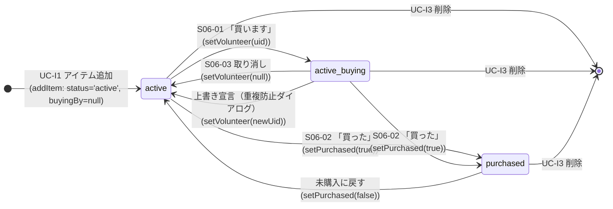
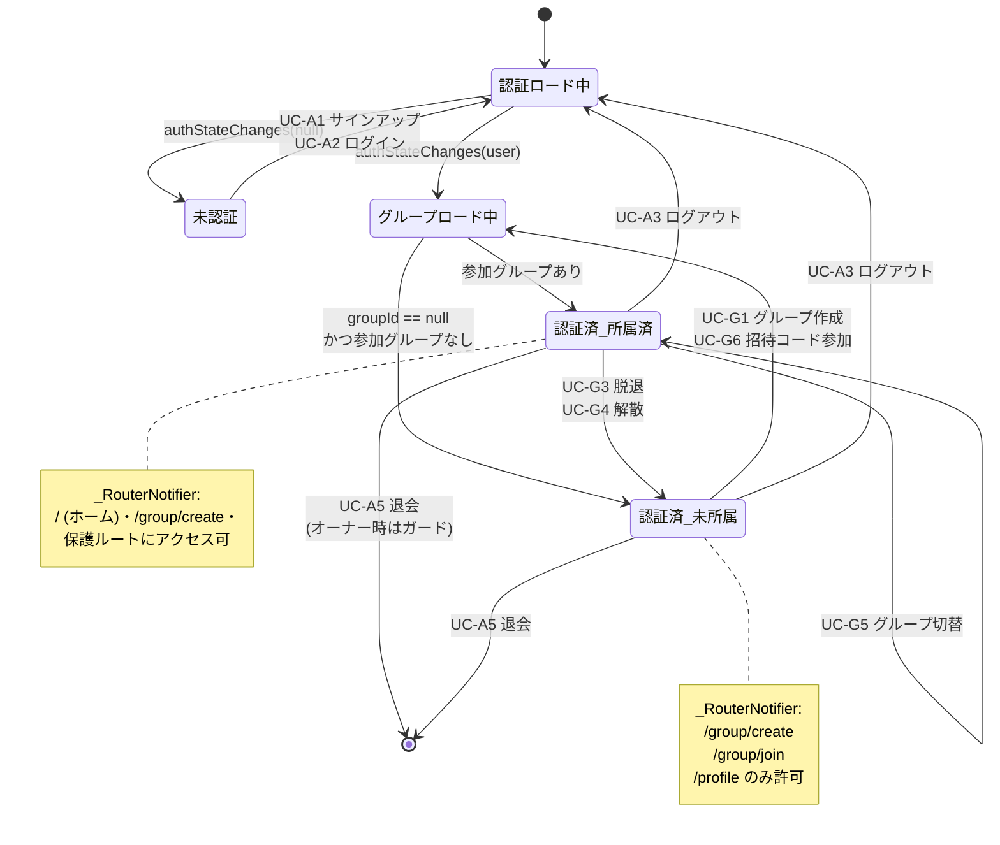
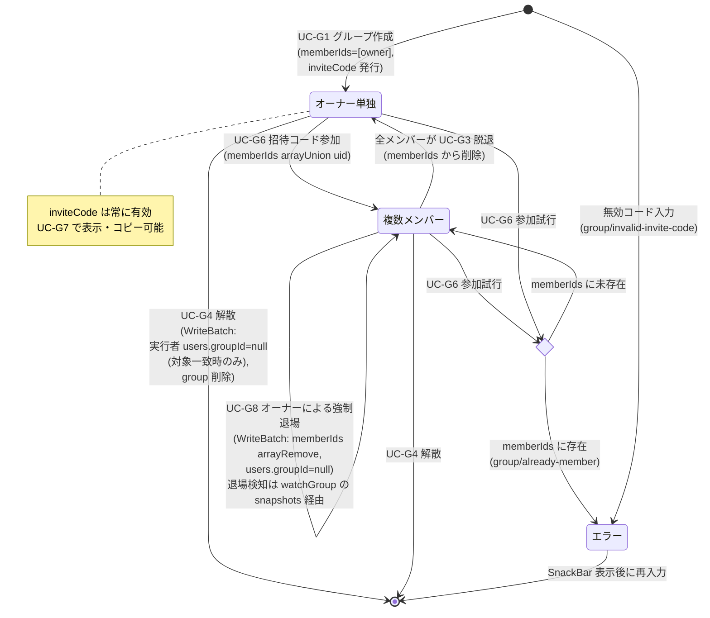

# 状態遷移

このドキュメントは、shopping-list-app-flutter の主要なドメイン状態のライフサイクルを 3 枚の状態遷移図で示す。
状態を変える操作（イベント）は [ユースケース.md](./ユースケース.md) の UC 番号と対応する。

---

## 1. Item ライフサイクル

`Item.status: ItemStatus?`（`active | purchased`）を正本とし、宣言の有無は独立フィールド `buyingBy: String?` で表す。
書き込みは新フィールドのみで行い、旧 `isBought` / `buyerId` は読み取り側のフォールバック（`Item.isPurchased` / `Item.volunteerUid` ゲッター）に限定。

**ポイント**:
- `active_buying` は `status='active'` かつ `buyingBy != null` の論理状態。`status` 自体に `'buying'` 値は持たせず、独立フィールドで表現する（`Item.isBeingBought` ゲッターが `volunteerUid != null` を判定）。
- `S06-01` の重複防止ダイアログは UI 層（`ItemCard`）で他人宣言時にのみ確認を取り、確認後は `setVolunteer` で `buyingBy` を上書き。
- `S06-03` の取り消しは UI 層で `buyingBy == currentUid` のときだけ実行可能（他人の宣言は取消ボタン非表示）。
- 「買った」（S06-02）は `buyingBy` を保持したまま `status='purchased'` に変える設計（誰が買ったかの履歴は `buyingBy` に残る）。
- 削除は全状態から可能。Firestore のドキュメント削除がそのまま終端状態。
- 書き込みは `ItemRepository` の意図別メソッド（`setVolunteer` / `setPurchased` / `updateItemDetails` / `deleteItem`）で行う。元実装の汎用 `updateItem(Partial<ItemDoc>)` を意図が明確なメソッドに分割している。

---

## 2. 認証セッション

`currentUserProvider` と `authLoadingProvider` の値、および `GroupController.state` の `group` / `loading` の組み合わせで `_RouterNotifier` のリダイレクト先が決まる。

**ポイント**:
- 「認証ロード中 / グループロード中」状態では `_RouterNotifier` が `/splash` を返し、保護ルートへは遷移させない（`app_router.dart`）。
- `UC-A5 退会` はオーナー状態だと `auth/cannot-delete-owner`（`AppErrorCode.authCannotDeleteOwner`）で弾かれる（`AuthController.deleteAccount` が `GroupRepository.isGroupOwner` を確認）。先に `UC-G3 脱退` か `UC-G4 解散` が必要。
- `UC-G5 グループ切替` は `joinedGroups` キャッシュ内の別グループへ即時切り替え、`users.groupId` は非同期で永続化する（`GroupController.switchGroup`）。
- `GroupController.build` はユーザー確定時に `_loadForUser` を起動し、`groupId` が指すグループが消えている / null でも参加グループが残っていれば先頭グループで復旧する（#177）。

---

## 3. グループメンバーシップ

グループドキュメントの `memberIds[]` と `ownerId` の組み合わせから見たライフサイクル。

**ポイント**:
- `inviteCode` はグループ作成時に 1 回だけ生成され、解散まで不変。失効・再発行の概念は現状なし。
- `UC-G3 脱退` はオーナーには許可されない（`GroupController.leaveGroup` で `AppErrorCode.groupOwnerCannotLeave` を throw）。オーナーは `UC-G4 解散` を選ぶ必要がある。
- `UC-G8 強制退場` はオーナーのみ実行可能。`FirestoreGroupRepository.removeMember` が WriteBatch で `memberIds arrayRemove` + `users.groupId=null` をアトミックに更新する。退場された側は `GroupController._subscribeActiveGroup`（`watchGroup` の `snapshots()`）が `memberIds` の変化を検知し、`group` を null にセット → `_RouterNotifier` が `/group/create` へ遷移する。
- `UC-G4 解散` は `WriteBatch` で実行者の `users.groupId` を必要に応じて `null` にしてから group を削除する（#177）。具体的には実行者の現在の `groupId` が解散対象と一致する場合のみ `null` 化し、別グループをアクティブにしている場合は維持する。他メンバーの `users.groupId` は Security Rules により本人以外書き込めないため触らず、次回ログイン時に `GroupController._loadForUser` の防御フォールバック（参加グループに無い `groupId` を先頭グループに置き換え）で復旧する。サブコレクション（items / tags）は Firestore SDK では削除されないため、将来 Cloud Function で清掃予定。

---

## 4. 互換性メモ

- 書き込みは新フィールド（`status` / `buyingBy` / `addedBy`）に統一。旧 `isBought` / `buyerId` は **読み取りのみフォールバック** で扱う（`Item.isPurchased` = `status == ItemStatus.purchased || isBought == true`、`Item.volunteerUid` = `buyingBy ?? buyerId`）。
- 旧データの Firestore マイグレーション（旧フィールド削除）は別途対応する。現コードはフォールバックを維持しているためマイグレーション前後どちらでも動作する。
- 宣言者表示名は `groupMemberNamesProvider`（`group_members_provider.dart`、`users/{uid}.displayName` 購読）で解決。`displayName` 未設定時は `uid` 先頭 6 文字をフォールバック表示する。

---

## 5. 関連ドキュメント

- [ユースケース.md](./ユースケース.md) — 各遷移を引き起こす UC の詳細
- [ドメインモデル.md](./ドメインモデル.md) — 状態を持つエンティティの構造
- [データフロー.md](./データフロー.md) — 状態を変える書き込みの経路
- [アーキテクチャ概要.md](./アーキテクチャ概要.md) — レイヤー構成・エラー変換
- [`docs/外部仕様/エラー仕様.md`](../外部仕様/エラー仕様.md) — エラーコードの一覧
