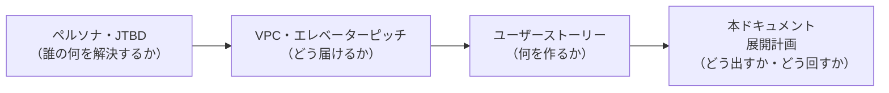
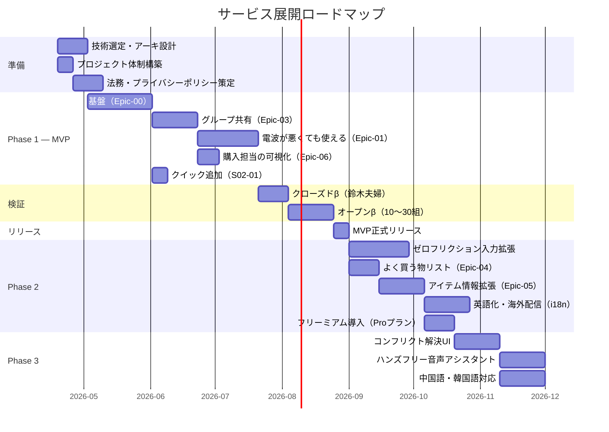
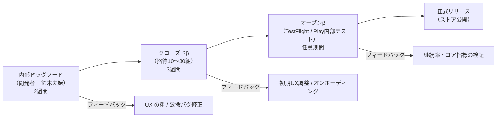
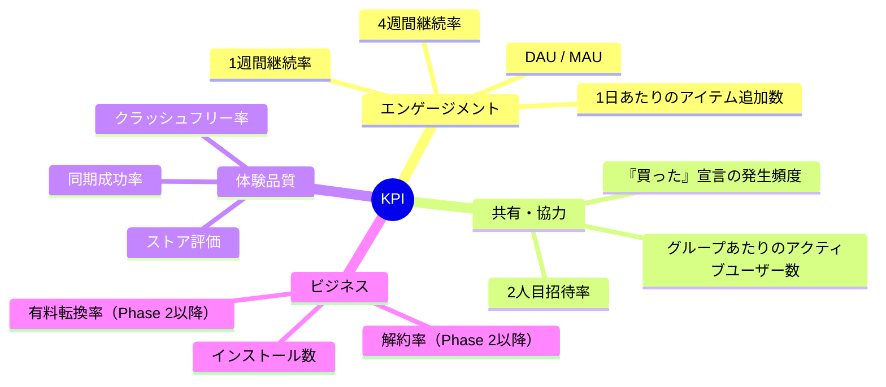
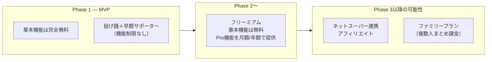
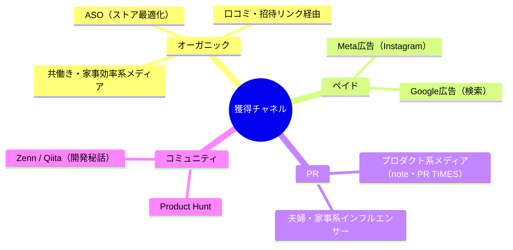
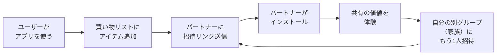
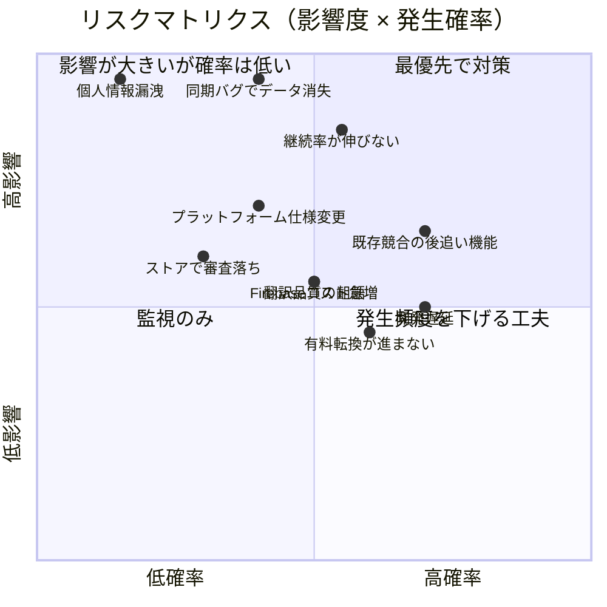
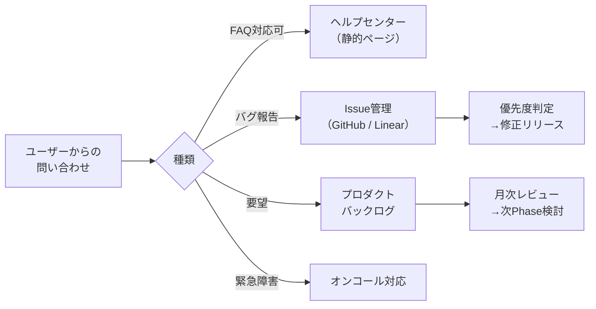
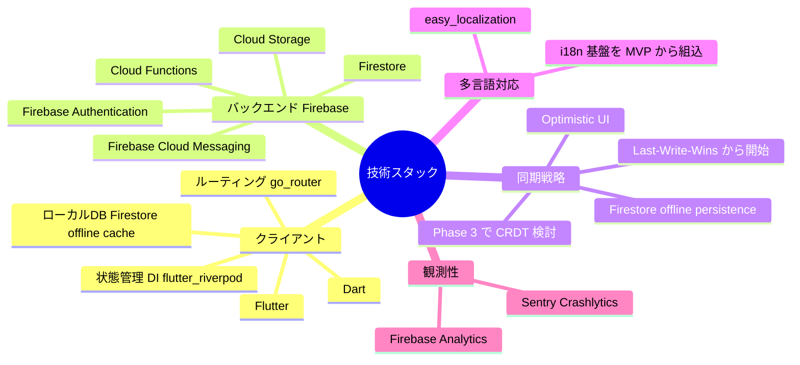

# サービス展開計画

> **対象ペルソナ：** 鈴木 太郎・花子（共働き夫婦 / 実ペルソナ）
> **関連資料 →** [サービス概要.md](./サービス概要.md) / [ユーザーストーリー検討.md](./ユーザーストーリー検討.md) / [バリュープロポジションキャンパス.md](./バリュープロポジションキャンパス.md) / [ペルソナ_深堀り.md](./ペルソナ_深堀り.md)
> **Next →** 技術仕様書 / プロジェクト計画書 / ビジネス計画書

---

## 目次

1. [本ドキュメントの目的](#本ドキュメントの目的)
2. [リリース計画](#リリース計画)
3. [成功指標（KPI）](#成功指標kpi)
4. [収益化モデル](#収益化モデル)
5. [マーケティング・ローンチ戦略](#マーケティングローンチ戦略)
6. [リスク分析と対策](#リスク分析と対策)
7. [プライバシー・セキュリティ方針](#プライバシーセキュリティ方針)
8. [法務・コンプライアンス](#法務コンプライアンス)
9. [サポート・運用体制](#サポート運用体制)
10. [コスト試算](#コスト試算)
11. [技術選定の方向性](#技術選定の方向性)
12. [その他の検討事項](#その他の検討事項)
13. [意思決定が必要な事項](#意思決定が必要な事項)

---

## 本ドキュメントの目的

ペルソナ・JTBD・VPC・ユーザーストーリーによる「何を作るか」の検討結果をもとに、  
**「いつ・どうやって世に出し、どう運用し、どう収益化するか」** を整理する。

---

## リリース計画

### ロードマップ全体像

### フェーズごとのマイルストーンと判定基準（Definition of Done）

| フェーズ | 目標時期 | マイルストーン | リリース判定基準 |
|:---:|:---:|---|---|
| **準備** | 2026-05上旬 | 技術スタック確定・アーキテクチャ文書作成・プライバシーポリシー草案 | 全メンバーが設計書をレビュー済み |
| **Phase 1（MVP）β** | 2026-08上旬 | Epic-00・01・02(S02-01)・03・06 完了。クローズドβ→オープンβ | 鈴木夫婦での連続1週間利用で致命的バグゼロ。週次の買い物で「忘れた・かぶった」が1度も発生しない |
| **Phase 1 正式リリース** | 2026-09上旬 | App Store / Google Play に公開 | オープンβ参加者の1週間継続率 ≥ 60%、クラッシュフリー率 ≥ 99.5% |
| **Phase 2** | 2026-11〜2026-12 | Epic-02拡張・04・05 追加リリース | Phase 1 の維持率を維持したまま機能追加可能なこと |
| **Phase 3** | 2027-Q1以降 | コンフリクト解決UI・ハンズフリー | Phase 2 までのDAU/MAU比 ≥ 40% 維持 |

> 日付は 2026-04-19 時点の目安。実装速度・検証結果により変動する。

### β検証の段階

---

## 成功指標（KPI）

「使わなくなる」ことが最大のリスクなので、**エンゲージメント系指標を優先**する。

### Phase 1 の北極星指標（North Star Metric）

> **「グループ作成から1週間以内に、2人目が『買った』宣言を1回以上する割合」**

これは以下すべてが成立していることを意味する：
- アプリが起動されている（記録）
- パートナーが招待されている（共有）
- パートナーが実際に買い物でアプリを使った（行動）

### 計測指標一覧

| カテゴリ | 指標 | Phase 1 目標 | Phase 2 目標 |
|---|---|:---:|:---:|
| エンゲージメント | 1週間継続率 | 60% | 65% |
| エンゲージメント | 4週間継続率 | 35% | 45% |
| エンゲージメント | DAU/MAU比 | 30% | 40% |
| エンゲージメント | 1日あたり追加数/アクティブユーザー | 1.5件 | 2件 |
| 共有・協力 | 2人目招待率（グループ作成者ベース） | 50% | 65% |
| 共有・協力 | グループあたりのアクティブメンバー | 1.5人 | 1.8人 |
| 体験品質 | クラッシュフリー率 | 99.5% | 99.8% |
| 体験品質 | 同期成功率 | 99% | 99.5% |
| 体験品質 | ストア平均評価 | 4.0 | 4.3 |

---

## 収益化モデル

### 基本方針

> **「買い物のたびに使うアプリ」を目指しているので、広告・UIノイズで体験を損なわない。**
> MVP段階から**機能制限を伴わない「応援型」の小規模収益**を置き、Phase 2 以降でフリーミアムへ移行する。

### モデル選定

### MVP 段階の小規模収益（応援型）

コアUXを一切変えずに、運用コストの一部を早期から回収する。

| 方式 | 金額 | 実装方法 | UX影響 |
|---|---|---|:---:|
| 投げ銭（都度課金） | ¥120 / ¥370 / ¥610 の3段階 | App Store / Google Play の Consumable IAP | なし（設定画面の隅に「運営を応援する」ボタン） |
| 早期サポーター（月額） | ¥200 / 月 | Subscription IAP | プロフィールに「サポーター」バッジ表示のみ |

> **ポイント：** いずれも機能制限を伴わないため、Free ユーザーが「制限で課金させられた」と感じない。位置づけは「運営応援」。Phase 2 で Pro プランを出した際に、サポーター経験者は自然に流入しやすい。

### フリーミアムの機能境界（Phase 2 以降）

| 機能 | Free | Pro |
|---|:---:|:---:|
| 基本CRUD・グループ共有・通知 | ✅ | ✅ |
| 電波が悪くても使える（オフライン対応） | ✅ | ✅ |
| 「買います」「買った」宣言 | ✅ | ✅ |
| **同時参加グループ数** | **3グループ** | 無制限 |
| グループ内メンバー上限 | 3名まで | 10名まで |
| よく買う物リスト件数 | 10件まで | 無制限 |
| **グループあたり写真総枚数** | **15枚**（よく買う物10件＋予備5枚相当） | 無制限 |
| アイテムあたり写真枚数 | 1枚 | 複数枚 |
| ホーム画面ウィジェット | 標準 | カスタマイズ可 |
| 履歴・統計ダッシュボード | — | ✅ |
| 優先サポート | — | ✅ |

> **設計意図：**
> - **同時参加グループ数を3に設定**することで「夫婦・実家・シェアハウス」など自然発生する複数コミュニティをカバーし、招待の機会を最大化する
> - **写真をグループ単位で総量制限**することで、バックエンドのストレージ／転送コストを予測可能に保ちつつ、「写真をもっと貯めたい」というニーズをPro導線に変換する
> - 主要ターゲット（共働き夫婦）は Free で過不足なく使える設計。規模拡大・履歴/統計の活用で Pro が必要になる流れを作る

### 価格（想定）

| プラン | 月額 | 年額（お得） | 備考 |
|---|:---:|:---:|---|
| Free | ¥0 | — | 広告なし |
| Pro（個人） | ¥380 | ¥3,480（23%off） | App Store / Google Play 課金 |
| Pro（ファミリー） | ¥580 | ¥4,980（28%off） | グループ全員がProに |

> 金額は日本市場の競合（Trello / Todoist / Microsoft To Do 等）のサブスク水準を参考にした仮置き。  
> ローンチ前にユーザーインタビューで支払い意思額を検証する。

### なぜ「広告モデル」を採らないか

| 理由 | 内容 |
|---|---|
| コア体験が破綻する | 「気づいた瞬間に2秒で記録」がゼロフリクション入力の原則。広告は必然的に秒数を奪う |
| ペルソナ属性と不整合 | 想定ユーザー（30〜40代共働き・可処分所得あり）は広告耐性が低く離脱しやすい |
| データ利活用の制約 | 買い物リストは購買傾向を暗示する機微情報。広告ネットワーク連携はプライバシーリスクが高い |

### 将来の収益源の可能性

| モデル | 概要 | 検討タイミング |
|---|---|:---:|
| ネットスーパー連携（アフィリエイト） | リストからワンタップで Amazonフレッシュ / イトーヨーカドーネット等へ送客 | Phase 3以降 |
| B2B（社内備品共有） | 小規模オフィスの備品管理用プラン | 有料転換率が安定してから |
| プレミアムテンプレート | 「新生児のいる家庭」「キャンプ用品」等の監修リスト販売 | Phase 2 運用で定番品データが溜まってから |

---

## マーケティング・ローンチ戦略

### ターゲットチャネル

### 成長ループ設計

> **「1人が招待すれば、相手も使い始める」構造をアプリに組み込む。**

### ローンチフェーズ別の戦略

| フェーズ | 戦略 | 狙い |
|:---:|---|---|
| プレリリース | ランディングページ公開・メール登録募集 | 正式リリース時の初動を作る |
| クローズドβ | 知人・SNSフォロワーから10〜30組募集 | 初期フィードバック・熱量あるレビュー獲得 |
| オープンβ | Product Hunt・Zenn・共働き系メディアに出稿 | オーガニック流入の種まき |
| 正式リリース | ASO最適化・Meta広告開始・プレスリリース | インストール数の積み上げ |
| Phase 2リリース時 | 既存ユーザーへのアップデート告知・Pro紹介 | 有料転換 |

---

## リスク分析と対策

| # | リスク | 影響 | 確率 | 対策 |
|---|---|:---:|:---:|---|
| R1 | オフライン同期バグによるデータ消失 | 🔴 | 🟠 | Conflict-Free Replicated Data Type (CRDT) 等の採用を検討。β期間でデータ整合性を徹底テスト |
| R2 | 継続率が伸びない（記録の習慣化に失敗） | 🔴 | 🟠 | オンボーディングで「電波が悪くても」「宣言」の価値を体感させる設計。初週の使い方リマインダー |
| R3 | 既存競合（LINEショッピング・各種メモアプリ）の追随機能 | 🟠 | 🔴 | 「電波が悪くても + 宣言」の組み合わせで独自のポジショニングを維持。差別化メッセージの一貫性 |
| R4 | プラットフォーム仕様変更（背景同期制限・通知制限） | 🟠 | 🟠 | iOS / Android 双方のベストプラクティスに準拠。WebSocket / Push両対応で冗長化 |
| R5 | ストア審査落ち（特に写真添付・権限まわり） | 🟠 | 🟡 | 権限リクエストの説明文を事前に英訳・日訳で準備。段階的権限リクエスト |
| R6 | 個人情報漏洩 | 🔴 | 🟢 | 買い物履歴のアナリティクス送信は匿名化。SDKの取捨選択は慎重に |
| R7 | 開発遅延による機会損失 | 🟠 | 🔴 | Phase単位のMVP判定を明確化。機能カットライン（S01-06等）を事前に定義 |
| R8 | 有料転換が進まない | 🟡 | 🟠 | Free/Pro境界線をユーザーインタビューで事前検証。転換率が低ければ価格・境界を調整 |
| R9 | Firebase のコスト急増（想定外のリード数） | 🟠 | 🟠 | ルール設計・クエリ最適化・読み取り回数監視。Phase 2 で予算アラート設定 |
| R10 | 多言語展開時の翻訳品質・文化的齟齬 | 🟠 | 🟠 | Phase 2 の英語はネイティブチェック必須。Phase 3 の中国語・韓国語は現地翻訳業者を利用 |

---

## プライバシー・セキュリティ方針

### 基本方針

> **「買い物リストは世帯の生活情報そのもの」** という認識で、収集・保管・共有を最小化する。

### データ分類と扱い

| データ種別 | 例 | 保管場所 | 第三者提供 |
|---|---|---|:---:|
| 認証情報 | メール・パスワードハッシュ | サーバー（暗号化） | なし |
| プロフィール | 表示名・アバター | サーバー | グループメンバーのみ可視 |
| リスト内容 | アイテム名・メモ・写真 | サーバー + ローカル | グループメンバーのみ可視 |
| 行動ログ | 追加・購入イベント | サーバー（匿名化集計） | なし |
| デバイス識別子 | Push通知トークン | サーバー | なし |

### セキュリティ設計

| 項目 | 方針 |
|---|---|
| 通信 | 全通信TLS。証明書ピンニング（Phase 2） |
| 認証 | パスワードはbcrypt/argon2保存。リフレッシュトークン方式。将来的にOAuth連携 |
| 写真 | オリジナルはサーバー保管。サーバーサイドでサイズ縮小・EXIF位置情報削除 |
| バックアップ | クラウドDBの日次バックアップ・30日保管 |
| 削除 | 退会時は関連データを物理削除（法令保管義務分のみ保持） |
| E2E暗号化 | Phase 3 以降で検討（同期・コンフリクト解決との相性を要確認） |

---

## 法務・コンプライアンス

### 必要な書類と作成方針

**方針：** ひな形ベースで MVP リリース前に初版を用意し、**有料プラン（Pro）導入前に弁護士レビューを入れる**。参照候補は JIPDEC のひな形、弁護士ドットコム／Cloud Sign のテンプレート、個人情報保護委員会のガイドライン。

#### プライバシーポリシー（必須項目）

| # | 項目 | 内容 |
|---|---|---|
| 1 | 事業者情報 | 運営者名・連絡先 |
| 2 | 取得する情報 | アカウント情報（メール・表示名）・端末情報・利用ログ・写真 |
| 3 | 利用目的 | サービス提供・不正防止・統計分析・サポート対応 |
| 4 | 第三者提供 | 原則として行わない。委託先（Firebase / Sentry等）は明記 |
| 5 | 保管期間 | 退会後に物理削除。法令保管義務分を除く |
| 6 | ユーザー権利 | 開示・訂正・削除・利用停止の請求方法 |
| 7 | Cookie / 解析ツール | Firebase Analytics 等の使用と無効化方法 |
| 8 | 未成年者への対応 | 18歳未満は保護者同意を得ること |
| 9 | 問い合わせ窓口 | メール／フォーム |
| 10 | 改定履歴 | 変更日と内容 |

#### 利用規約（必須項目）

| # | 項目 | 内容 |
|---|---|---|
| 1 | サービス内容 | 提供機能の概要と範囲 |
| 2 | 利用資格 | 年齢・登録要件 |
| 3 | アカウント責任 | ID/パスワード管理・なりすまし |
| 4 | 禁止事項 | 不正利用・第三者権利侵害・逆アセンブル等 |
| 5 | 知的財産 | サービス上のコンテンツ・ユーザー投稿の扱い |
| 6 | 有料プラン | 課金・自動更新・解約（Phase 2 以降） |
| 7 | サービスの変更・終了 | 事前通知期間と免責 |
| 8 | 免責・責任制限 | 損害賠償の上限（ストア課金額等） |
| 9 | 準拠法・管轄 | 日本法・東京地裁 |
| 10 | 改定履歴 | 変更日と内容 |

### 対応スケジュール

| 項目 | 対応 | 担当タイミング |
|---|---|:---:|
| 利用規約（ひな形ベース初版） | アカウント作成前に同意を取得 | MVPリリース前 |
| プライバシーポリシー（ひな形ベース初版） | 収集情報・利用目的・第三者提供・保管期間を明記 | MVPリリース前 |
| 弁護士レビュー | 両書類を法務観点でチェック | Phase 2 有料プラン導入前 |
| 個人情報保護法（APPI） | 匿名加工情報・保管期間の明記 | MVPリリース前 |
| 特定商取引法 | 有料プラン導入時に表記 | Phase 2 |
| 景品表示法 | 料金表記・打消表現の確認 | Phase 2 |
| GDPR（欧州配信時） | 同意ベース収集・削除権の実装 | 国際展開時 |
| APPC 規約（中国配信時） | 中国本土でのデータ保管要件 | Phase 3（中国配信時） |
| 개인정보 보호법（韓国配信時） | 韓国個人情報保護法対応 | Phase 3（韓国配信時） |
| App Store / Google Play ポリシー | 権限説明・購入フロー・データ共有表記 | 各リリース前 |
| 資金決済法 | ストア課金経由のみならば対象外 | 外部決済導入時に再検討 |

---

## サポート・運用体制

### サポート体制

### 運用のリズム

| 頻度 | 内容 |
|---|---|
| 毎日 | クラッシュ・エラー率の監視。致命ならhotfix |
| 週次 | KPIダッシュボード確認・レビュー返信 |
| 月次 | サーバーコスト・継続率レビュー・バックログ優先度見直し |
| Phase単位 | ユーザーインタビュー（5〜10名） |

### モニタリング項目

| カテゴリ | ツール例 | 監視対象 |
|---|---|---|
| クラッシュ | Firebase Crashlytics / Sentry | クラッシュ率・影響ユーザー数 |
| パフォーマンス | Firebase Performance / Sentry | API応答時間・起動時間 |
| ログ | Cloud Logging | エラーログ・同期失敗 |
| 解析 | Firebase Analytics / Amplitude | KPI全般（PIIなしで） |
| ストア評価 | AppFollow 等 | レビュー・評価推移 |

---

## コスト試算

### 主要コスト項目（月額・想定ユーザー10,000人時）

| 項目 | 概算月額 | 備考 |
|---|---|---|
| バックエンド（API・DB） | ¥20,000〜¥50,000 | Firebase / Supabase 等のマネージド前提 |
| ストレージ（写真） | ¥5,000〜¥15,000 | 1ユーザー平均20枚×500KBと仮定 |
| Push通知 | ¥0〜¥3,000 | FCMは無料枠で十分 |
| 認証 | ¥0〜¥5,000 | Firebase Authの無料枠内想定 |
| 監視・ログ | ¥5,000〜¥10,000 | Sentry Team プラン等 |
| ストア手数料 | 売上の15〜30% | サブスク2年目以降は15% |
| マーケティング | ¥50,000〜¥300,000 | Meta広告等の変動費 |
| その他（ドメイン・SSL等） | ¥2,000 | — |
| **合計** | **¥82,000〜¥385,000** | ユーザー数・広告予算次第 |

### 損益分岐の目安

| 前提 | 値 |
|---|---|
| 月額コスト（中央値） | ¥200,000 |
| ARPU（Pro想定 ¥380 × 転換率） | 5%転換で¥19/人、10%で¥38/人 |
| 必要MAU（5%転換時） | 約10,500人 |
| 必要MAU（10%転換時） | 約5,260人 |

> **Phase 2 までに5,000〜10,000 MAUを確保できるかが収益化成立の分岐点。**

---

## 技術選定の方向性

> 詳細な技術選定は別ドキュメント（技術仕様書）で行う。ここでは方向性と主要な決定事項を示す。

### クライアント：Flutter

> 本リポジトリ（shopping-list-app-flutter）は、当初 React Native（Expo）で実装した MVP を Flutter へ移植したもの。以下は Flutter 採用版としての選定理由。

| 選定理由 | 内容 |
|---|---|
| UI 一貫性 | 独自レンダリングエンジンにより iOS / Android / Web で見た目・挙動が揃う |
| 性能 | AOT コンパイルでネイティブに近い描画性能。リスト・フォーム中心の本サービス要件に十分 |
| 単一コードベース | クリーンアーキテクチャ + Riverpod で iOS / Android / Web を 1 コードベースで網羅（現状は Web ターゲットを優先検証） |
| 開発環境の再現性 | Flutter / Firebase CLI を Docker コンテナに封じ込め、ホスト非依存でセットアップを高速化 |

**React Native（Expo）と比較した上でのトレードオフ：**
- React Native は React 知識を Web（React/Next.js）等に転移しやすいが、Dart は他分野に転移しにくい
- 一方 Flutter は UI 一貫性・描画性能・ホットリロードの安定性で優位で、本サービスの UI 要件に適する

### バックエンド：Firebase

| 選定理由 | 内容 |
|---|---|
| オフラインファースト | Firestore SDKがローカルキャッシュ＋自動同期を標準提供。本サービスの生命線 |
| 初期コスト | Sparkプラン（無料枠）で MVP をカバー可能 |
| Push 通知の統合 | FCM が標準。iOS/Android のトークン管理を意識しなくて済む |
| 認証 | Firebase Authentication でメール・OAuth 連携を最短実装 |
| スケール | Google インフラで自動スケール。スパイクに強い |

**移行性（D2要件への対応）：**
- ドキュメント型のため、将来 Postgres 系に移行する場合はスキーマ再設計が必要
- データ量が小さい Phase 2 まで（想定MAU 5,000〜10,000）ならエクスポート＋再投入で現実的
- 移行の起点は「月額 Firebase コスト > 自前運用コスト」になった時点。経験則で MAU 50,000〜100,000 以降

### 重要な意思決定ポイント

| # | 論点 | 決定 | 備考 |
|---|---|---|---|
| T1 | クロスプラットフォーム | **Flutter** | React Native（Expo）版 MVP からの移植。UI 一貫性・描画性能で採用 |
| T2 | バックエンド | **Firebase（Firestore / Auth / FCM / Storage）** | 初期コスト・オフライン対応・Push の統合度で優位 |
| T3 | リアルタイム同期 | **Firestore listeners** | T2 の選定に伴い自動決定 |
| T4 | コンフリクト解決戦略 | **初期は LWW、Phase 3 で CRDT 検討** | 通常の共有シナリオでは LWW で十分 |
| T5 | 多言語対応基盤 | **MVP から i18n 基盤を組み込み、日本語のみで運用開始** | D7に基づく |

---

## その他の検討事項

優先度は低いが、ローンチまでに一度は判断したいトピック。

### 国際化・多言語対応

| 項目 | MVP | Phase 2 | Phase 3 | 将来 |
|---|:---:|:---:|:---:|:---:|
| 日本語 | ✅ | ✅ | ✅ | ✅ |
| 英語 | — | ✅ | ✅ | ✅ |
| 中国語（簡体字） | — | — | ✅ | ✅ |
| 韓国語 | — | — | ✅ | ✅ |
| 他言語（繁体字・欧州言語等） | — | — | — | 検討 |

**MVP段階の「i18n基盤」の要件：**

| 項目 | 対応内容 |
|---|---|
| 文言の外出し | すべてのUI文言を i18n キーに変更（例：`'item.add'.tr()`、easy_localization）。MVP は日本語リソースのみ |
| 日時・通貨・数値 | デバイスロケールに準拠（`intl` パッケージ経由） |
| UI レイアウト | 英語は日本語比で1.3〜1.5倍の文字幅に耐える設計。CJKはほぼ同等 |
| フォント | 日本語・中国語・韓国語で異なるため、Noto Sans 系で事前に切替検証 |
| サーバー側 | 通知文言・メールテンプレートも i18n 対応。ユーザーの言語設定を保存 |
| 言語切替 | 設定画面から明示的に変更可能（OS設定と独立） |

**翻訳運用：**
- Phase 2（英語）：開発者が一次翻訳、ネイティブチェックを外注
- Phase 3（中・韓）：翻訳サービス（Crowdin / Lokalise）または専門業者を利用
- 翻訳漏れを防ぐため、リソースファイルの鍵の抜けをCIでチェック

### アクセシビリティ

| 項目 | MVP | Phase 2以降 |
|---|:---:|:---:|
| VoiceOver / TalkBack 対応 | ✅（最低限） | ✅（完全対応） |
| ダイナミックタイプ（文字サイズ） | ✅ | ✅ |
| ハイコントラストモード | — | ✅ |
| カラーブラインド配慮の配色 | ✅ | ✅ |

### データエクスポート・アカウント移管

- 退会時にリスト・よく買う物リストをCSV/JSONでエクスポートできるオプション（Phase 2）
- 機種変更時のアカウント引き継ぎは認証経由で自動（MVPから対応）

### バックアップ・災害復旧

- クラウドDBは日次自動バックアップ・30日保管
- RPO: 24時間 / RTO: 8時間（MVPの暫定目標）
- リストの整合性を守るため「部分復元」フローを設計

### 将来のプラットフォーム拡張

| プラットフォーム | 優先度 | 備考 |
|---|:---:|---|
| iOS / Android（ネイティブ） | 🔴 最優先 | MVPスコープ |
| PWA（Web） | 🟡 | 電波が悪くても対応の方針と親和。Phase 2以降 |
| Apple Watch / Wear OS | 🟡 | ゼロフリクション入力と相性が良い。Phase 3 |
| CarPlay / Android Auto | 🟢 | ハンズフリー音声と併せて Phase 3 |

---

## 意思決定が必要な事項

2026-04-19 時点で以下の決定を行った。残る未決定事項は Phase 2 設計時に確定する。

| # | 論点 | 決定 | 決定日 |
|---|---|---|:---:|
| D1 | クロスプラットフォーム技術選定 | **Flutter** を採用。React Native（Expo）版 MVP からの移植で、UI 一貫性・描画性能・単一コードベースでの iOS / Android / Web 網羅を評価 | 2026-04-19 |
| D2 | バックエンド選定 | **Firebase（Firestore / Auth / FCM / Storage）** を採用。オフラインファースト・Push・認証が一体で、初期コストを最小化できる | 2026-04-19 |
| D3 | 課金モデル導入タイミング | **MVP から応援型小規模収益（投げ銭＋早期サポーター）を導入し、Phase 2 でフリーミアムへ拡張** | 2026-04-19 |
| D4 | Free/Pro の境界線 | **同時参加グループ数3・グループあたり写真総枚数15枚** を軸に、招待機会を増やしつつストレージコストを制御。詳細は Phase 2 設計時に再調整 | 2026-04-19（仮） |
| D5 | クローズドβ参加者の募集方法・人数 | **開発者の知人・関係者に直接声かけし 10〜30名** | 2026-04-19 |
| D6 | プライバシーポリシー・利用規約の作成方法 | **ひな形ベース（JIPDEC・弁護士ドットコム等）で MVP 前に初版作成 → Phase 2（Pro導入前）に弁護士レビュー** | 2026-04-19 |
| D7 | 英語化・海外展開の扱い | **MVP から i18n 基盤を組込、日本語のみで運用開始。Phase 2 で英語、Phase 3 で中国語簡体字・韓国語を追加** | 2026-04-19 |

### 今後の意思決定ポイント（Phase 2 設計時）

| # | 論点 | 判断時期 |
|---|---|:---:|
| D4' | Free/Pro 境界線の最終調整（実利用データに基づく） | Phase 2 設計時（2026-10頃） |
| D8 | Pro の価格設定（支払い意思額のユーザー検証） | Phase 2 設計時 |
| D9 | ネットスーパー連携（アフィリエイト）の実施可否 | Phase 3 検討時 |
| D10 | 海外配信の実施順（英→米→他）と各国ストア対応 | Phase 2 英語化完了後 |

---

## 更新履歴

| 日付 | 更新内容 |
|---|---|
| 2026-04-19 | 初版作成。リリース計画・KPI・収益化モデル・リスク・運用・コスト・技術方向性を定義 |
| 2026-04-19 | 意思決定事項 D1〜D7 を確定。Flutter / Firebase を採用。MVP から応援型小規模収益を導入。Free 同時グループ3・写真総量制限。クローズドβは直接招待。プラポリは弁護士レビュー前提のひな形運用。i18n基盤を MVP から組込み、Phase 2 で英語・Phase 3 で中・韓対応 |
