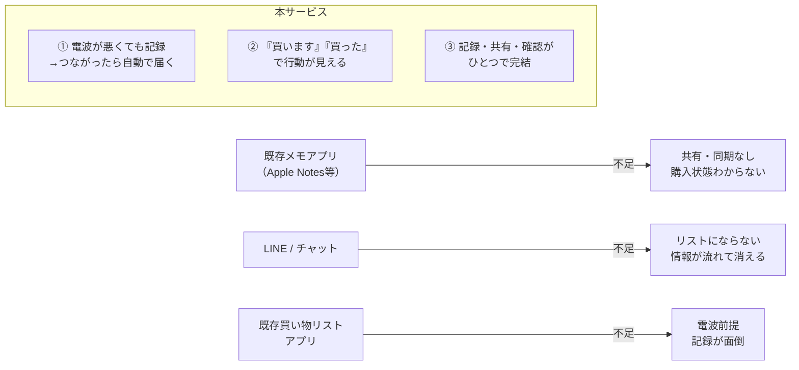
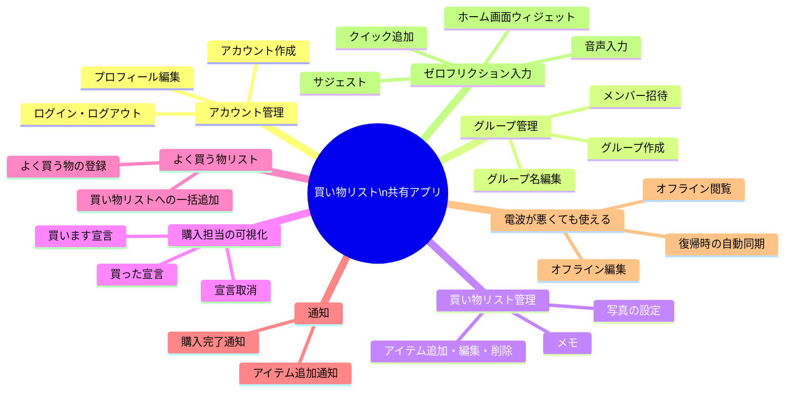
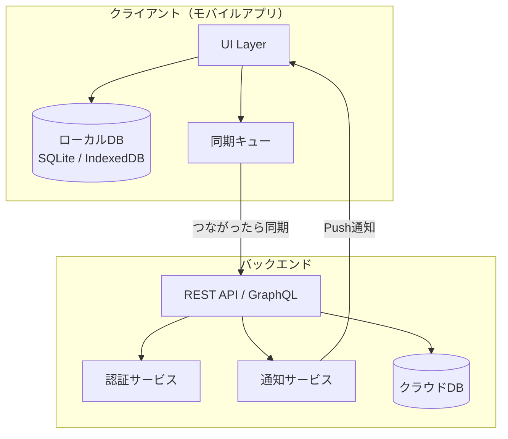
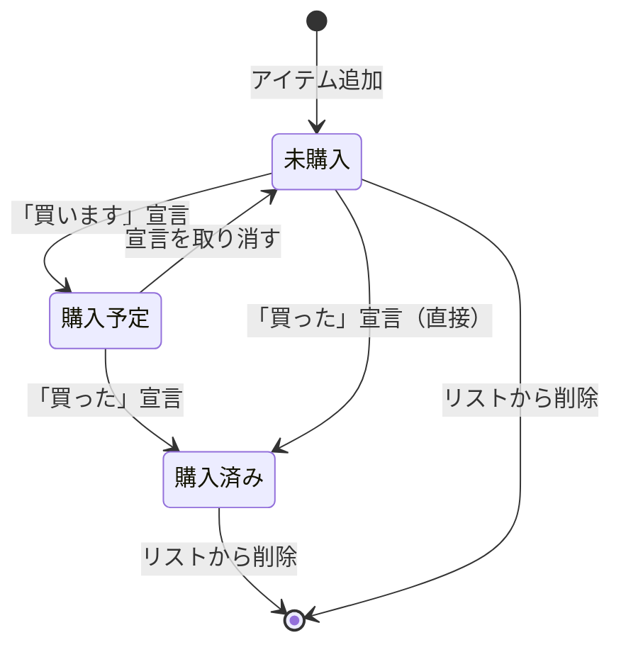
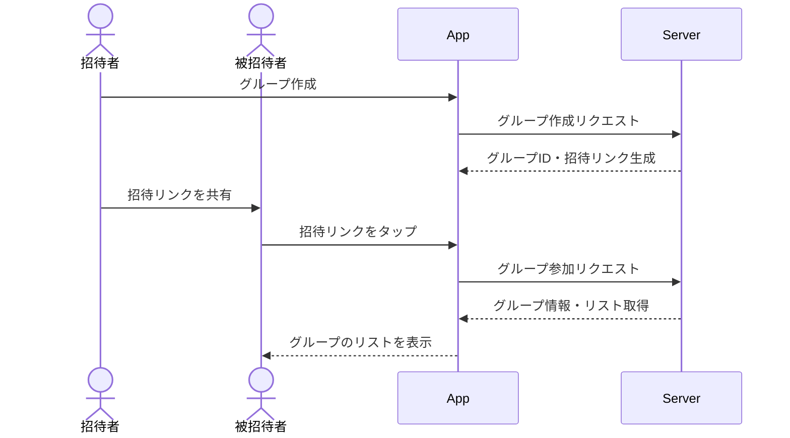
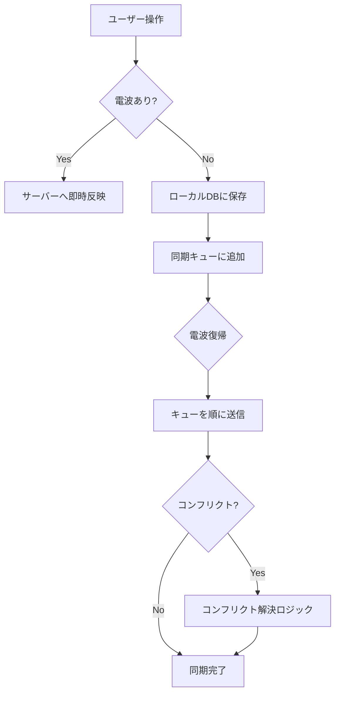
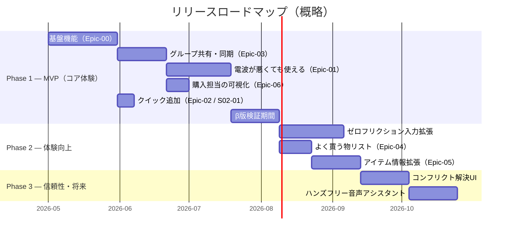

# 買い物リスト共有アプリ — サービス概要 & ユーザーストーリーマップ

> **対象ペルソナ：** 鈴木 太郎・花子（共働き夫婦 / 実ペルソナ）
> **関連資料 →** [ペルソナ_深堀り.md](./ペルソナ_深堀り.md) / [バリュープロポジションキャンパス.md](./バリュープロポジションキャンパス.md) / [ユーザーストーリー検討.md](./ユーザーストーリー検討.md) / [サービス展開計画.md](./サービス展開計画.md)

---

## 目次

1. [エレベーターピッチ](#エレベーターピッチ)
1. [サービス概要](#サービス概要)
1. [差別化ポイント](#差別化ポイント)
1. [主要機能一覧](#主要機能一覧)
1. [システム構成図](#システム構成図)
1. [ユーザーストーリーマップ](#ユーザーストーリーマップ)
1. [機能詳細](#機能詳細)
1. [リリースフェーズ](#リリースフェーズ)
1. [用語定義](#用語定義)

-----

## エレベーターピッチ

> **「気づいたら記録、記録したら自動で共有、『買います』『買った』で行動も共有。夫婦の買い物すれ違いをゼロにする買い物リストアプリ。」**

詳細は [バリュープロポジションキャンパス.md](./バリュープロポジションキャンパス.md#エレベーターピッチ) を参照。

-----

## サービス概要

共働き夫婦を中心に、家族・同居人といった**買い物を分担するパートナー同士で、買い物リストをリアルタイムに共有**できるモバイルアプリ。

**電波が悪くても記録でき、つながった瞬間に相手へ届く。** 「買います」「買った」のひと言で誰が何を担当するかも自然に共有されるため、「忘れた・かぶった・伝わらなかった」が起きない日常を実現する。

| 項目 | 内容 |
|---|---|
| 主要ターゲット | 共働き夫婦（実ペルソナ：鈴木太郎・花子） |
| 副次ターゲット | 家族・同居人・職場チームなど、買い物を分担するグループ |
| 主な価値 | 二重買い・買い忘れ・伝達漏れの解消。買い物で頭を使わない日常 |
| プラットフォーム | iOS / Android（PWA対応を想定） |
| 電波が悪い場所での利用 | 閲覧・追加・編集が可能、つながったときに自動同期 |

-----

## 差別化ポイント

| # | 差別化ポイント | 解消する課題 |
|---|---|---|
| ① | 電波が悪くても記録・編集でき、復帰時に自動同期 | 通勤中の圏外で気づきが消える |
| ② | 「買います」「買った」宣言でお互いの行動が見える | 二重買い・買い忘れ・担当の重複 |
| ③ | 記録・共有・確認がひとつのアプリで完結 | メモアプリ+LINEの併用による情報分断 |

-----

## 主要機能一覧

-----

## システム構成図

-----

## ユーザーストーリーマップ

ストーリーマップは **アクティビティ（横軸）→ ユーザーストーリー（縦軸）** で構成し、各ストーリーをリリースフェーズに割り当てています。

詳細なEpic・Story・Acceptance Criteriaは [ユーザーストーリー検討.md](./ユーザーストーリー検討.md) を参照。

### ストーリーマップ テーブル

| アクティビティ | ユーザーストーリー | 対応Epic | フェーズ |
|---|---|:---:|:---:|
| **🧑 アカウント管理** | アカウント作成・ログイン・プロフィール編集・退会 | Epic-00 | Phase 1 |
| **👥 グループ管理** | グループ作成・招待・名前編集・脱退・解散 | Epic-00, Epic-03 | Phase 1 |
| **🛒 買い物リスト — 基本** | アイテム追加・編集・削除・一覧表示 | Epic-00 | Phase 1 |
| **🛒 買い物リスト — 拡張** | メモ・写真添付・詳細画面 | Epic-05 | Phase 2 |
| **📣 購入担当の可視化** | 「買います」「買った」宣言・宣言取消 | Epic-06 | Phase 1 |
| **⭐ よく買う物リスト** | 登録・一括追加・選択追加 | Epic-04 | Phase 2 |
| **🔔 通知** | アイテム追加・購入完了の通知 | Epic-03 | Phase 1 |
| **📶 電波が悪くても使える** | 閲覧・編集・自動同期・同期ステータス | Epic-01 | Phase 1 |
| **📶 コンフリクト解決** | 競合発生時の解決UI | Epic-01 | Phase 3 |
| **⚡ ゼロフリクション入力 — 基本** | クイック追加 | Epic-02 | Phase 1 |
| **⚡ ゼロフリクション入力 — 拡張** | ウィジェット・音声入力・サジェスト | Epic-02 | Phase 2 |
| **⚡ ゼロフリクション入力 — 将来** | ハンズフリー音声アシスタント連携 | Epic-02 | Phase 3 |

-----

## 機能詳細

### 買い物リストのアイテムライフサイクル

### グループ参加フロー

### オフライン同期フロー

-----

## リリースフェーズ

詳細なストーリー単位の実装計画は [ユーザーストーリー検討.md — フェーズ別実装計画](./ユーザーストーリー検討.md#フェーズ別実装計画)、全体スケジュール・マイルストーンは [サービス展開計画.md](./サービス展開計画.md) を参照。

| フェーズ | 位置づけ | 含まれるEpic | 目指す状態 |
|:---:|---|---|---|
| **Phase 1** | MVP（コア体験） | Epic-00・01・02（クイック追加のみ）・03・06 | 電波が悪くても夫婦で買い物リストを共有でき、誰が何を買うかが見える |
| **Phase 2** | 体験向上 | Epic-02（拡張）・04・05 | 入力の摩擦を更に減らし、商品指定まで完結する |
| **Phase 3** | 信頼性・将来 | Epic-01（コンフリクト解決）・02（ハンズフリー） | 同期の競合解決とハンズフリー操作に対応 |

-----

## 用語定義

| 用語 | 定義 |
|---|---|
| **グループ** | 買い物リストを共有する複数ユーザーの集合 |
| **アイテム** | 買い物リストに登録された個別の購入品 |
| **買います宣言** | 「自分がこれを買う」と他メンバーに通知するアクション |
| **買った宣言** | アイテムを購入済みとしてマークするアクション |
| **急ぎフラグ** | アイテムの優先度が高いことを示すフラグ |
| **よく買う物リスト** | 繰り返し買う商品をテンプレートとして管理するリスト |
| **同期キュー** | 電波が悪いときの変更をつながったあとに送信するための待機リスト |
| **ゼロフリクション入力** | アプリ起動から記録完了までを最小ステップで行えるUIコンセプト |

-----

## 更新履歴

| 日付 | 更新内容 |
|---|---|
| 2026-04-19 | バリュープロポジション・ユーザーストーリー検討の結果を反映。エレベーターピッチ・差別化ポイント・フェーズ別計画を更新 |
