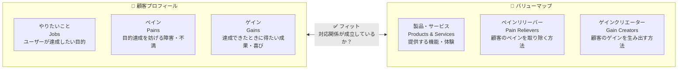
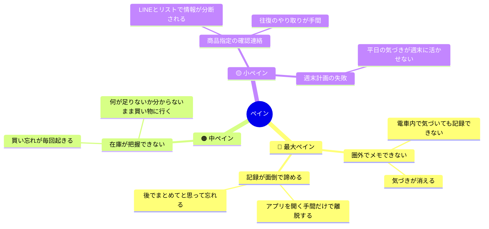
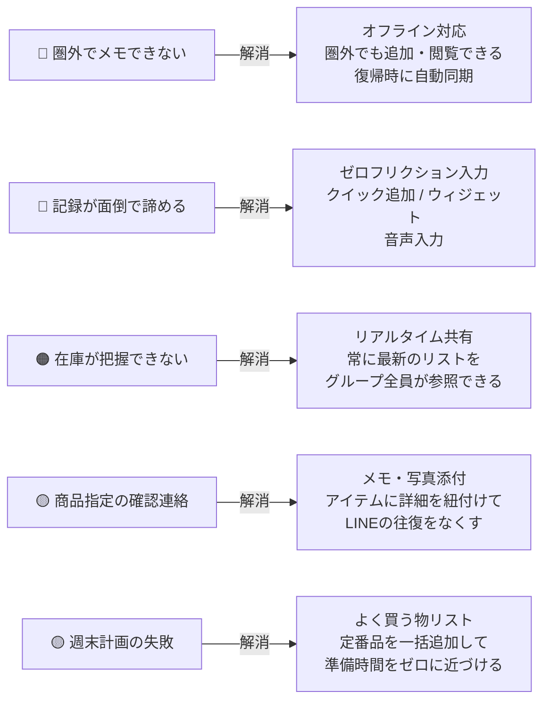
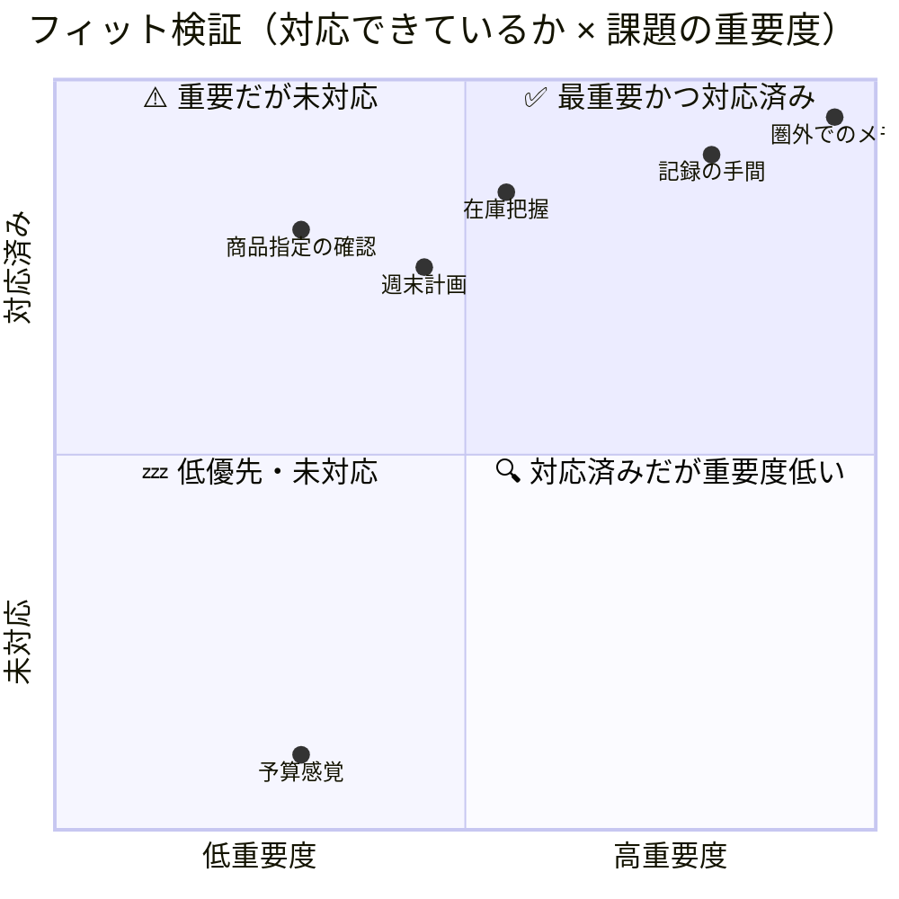
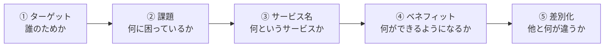

# バリュープロポジションキャンバス & エレベーターピッチ

> **対象ペルソナ：** 鈴木 太郎・花子（共働き夫婦 / 実ペルソナ）  
> **前提資料 →** [PERSONA_F_JTBD.md](./PERSONA_F_JTBD.md) / [USER_STORIES.md](./USER_STORIES.md)  
> **Next →** SERVICE_OVERVIEW.md のストーリーマップ・フェーズ計画への反映

---

## 目次

1. [バリュープロポジションキャンバスとは](#バリュープロポジションキャンバスとは)
2. [顧客プロフィール（ペルソナF）](#顧客プロフィールペルソナf)
3. [バリューマップ（サービス）](#バリューマップサービス)
4. [フィット検証](#フィット検証)
5. [エレベーターピッチとは](#エレベーターピッチとは)
6. [エレベーターピッチ](#エレベーターピッチ)

---

## バリュープロポジションキャンバスとは

**「ペルソナの課題・ニーズ」と「サービスの提供価値」が本当に噛み合っているかを可視化するフレームワーク。**

2つのブロックで構成され、両者が対応しているかを検証する。

> **フィットの定義：**  
> ペインリリーバーがペインに対応し、ゲインクリエーターがゲインに対応しているとき「フィットしている」と言う。  
> フィットしていない機能は過剰設計、フィットしていない課題は解決されないままになる。

---

## 顧客プロフィール（ペルソナF）

### やりたいこと（Jobs）

日常の買い物に関するすべての気づき・伝達・確認を、**考えなくてもうまく回る仕組み**に乗せたい。

| 優先度 | Job | 詳細 |
|:---:|---|---|
| 🔴 | 気づいた瞬間に記録したい | 場所・状況を問わず、頭に浮かんだ不足品を即座にメモしたい |
| 🔴 | 記録をパートナーと自動共有したい | 自分が追加したものが、操作なしにパートナーのリストに反映されてほしい |
| 🔴 | 圏外でもリストを使いたい | 地下鉄や電波の悪い店舗内でも閲覧・追加ができてほしい |
| 🟠 | 誰が何を買うかを把握したい | 二人で別々に買い物するとき、担当が一目でわかってほしい |
| 🟡 | 週末の買い物準備を楽にしたい | 定番品をゼロから入力するのではなく一括で追加したい |
| 🟡 | 商品の指定をリスト内で完結させたい | 「これいつものやつ？」という確認LINEをなくしたい |

---

### ペイン（Pains）

---

### ゲイン（Gains）

| ゲイン | 詳細 |
|---|---|
| **「忘れた」がゼロになる** | 気づいたその瞬間に記録できるので、買い物で頭を使わなくてよい |
| **パートナーへの伝達が自動化される** | 自分が記録したらそのまま共有される。連絡・確認が不要になる |
| **「あれ買ったっけ？」がなくなる** | リストの状態が常に最新で、買い物中の不安がなくなる |
| **買い物のルーティンが軽くなる** | よく買う物リストで準備時間がゼロに近づく |
| **夫婦の小さな摩擦がなくなる** | 「なんで買ってないの？」という会話がなくなる |

---

## バリューマップ（サービス）

### 製品・サービス（Products & Services）

| カテゴリ | 機能 | フェーズ |
|---|---|:---:|
| **基盤** | アカウント管理・リスト基本CRUD・グループ管理 | Phase 1 |
| **コア** | オフライン対応（閲覧・追加・編集・自動同期） | Phase 1 |
| **コア** | クイック追加・ウィジェット・音声入力 | Phase 1〜2 |
| **共有** | グループ共有・リアルタイム同期・通知 | Phase 1 |
| **宣言** | 買います宣言・買った宣言・宣言取消 | Phase 1 |
| **拡張** | よく買う物リスト・一括追加 | Phase 2 |
| **拡張** | アイテムへのメモ・写真添付 | Phase 2 |
| **将来** | ハンズフリー音声アシスタント連携 | Phase 3 |

---

### ペインリリーバー（Pain Relievers）

| ペイン | ペインリリーバー | 対応Story |
|---|---|---|
| 圏外でメモできない | オフライン対応（閲覧・追加・自動同期） | S01-01〜05 |
| 記録が面倒で諦める | クイック追加 / ウィジェット / 音声入力 | S02-01〜05 |
| 在庫が把握できない | リアルタイム共有・通知 | S03-03〜04 |
| 商品指定の確認連絡 | メモ・写真添付 | S05-01〜03 |
| 週末計画の失敗 | よく買う物リスト・一括追加 | S04-01〜03 |

---

### ゲインクリエーター（Gain Creators）

| ゲイン | ゲインクリエーター | 対応Story |
|---|---|---|
| 「忘れた」がゼロになる | オフライン記録 + ゼロフリクション入力の組み合わせ | S01-02, S02-01〜03 |
| パートナーへの伝達が自動化される | グループ共有 + 自動同期 + 通知 | S03-03〜04, S01-04 |
| 「あれ買ったっけ？」がなくなる | 買います宣言 + 買った宣言でリスト状態を可視化 | S06-01〜02 |
| 買い物のルーティンが軽くなる | よく買う物リストからの一括追加 | S04-02 |
| 夫婦の小さな摩擦がなくなる | 上記すべての組み合わせによる副次効果 | — |

---

## フィット検証

各ペイン・ゲインに対してサービスが対応できているかをチェックする。

| # | 課題 | フィット状態 | 備考 |
|---|---|:---:|---|
| ④ | 圏外でのメモ | ✅ 対応済み | Epic-01 で完全カバー |
| ② | 記録の手間 | ✅ 対応済み | Epic-02 で複数手段を用意 |
| ① | 在庫把握 | ✅ 対応済み | Epic-03 のリアルタイム共有で解消 |
| ⑤ | 商品指定の確認 | ✅ 対応済み | Epic-05 のメモ・写真で解消 |
| ⑥ | 週末計画 | ✅ 対応済み | Epic-04 の一括追加で解消 |
| ⑦ | 予算感覚 | ❌ 対応しない | スコープ外と判断。家計簿アプリの領域 |

> **フィット結論：**  
> 定義した全課題（⑦を除く）に対してサービスが対応できている。  
> 未対応の⑦は意図的なスコープ外であり、過剰設計を避ける判断として妥当。

---

## エレベーターピッチとは

**「エレベーターに乗り合わせた30秒でサービスを説明できる一文」**

ふわっとした説明を排除し、以下の5要素を一文に凝縮する。

---

## エレベーターピッチ

### バージョン1｜課題起点（社内・開発チーム向け）

> **「買い物のたびに『忘れた・かぶった・伝わらなかった』が起きる共働き夫婦のために、  
> このアプリは気づいた瞬間に電波が悪くても記録でき、つながった瞬間に自動でパートナーへ届く買い物リストを提供します。  
> メモアプリやLINEとは違い、記録・共有・確認がひとつのアプリで完結し、  
> 『買います』『買った』のひと言でお互いの行動が見えるから、  
> 『買い物のことで頭を使わない』日常を実現します。」**

---

### バージョン2｜価値起点（対外・投資家・ユーザー向け）

> **「電車の中でふと気づいた『醤油がない』を、電波が悪くてもそのままメモする。  
> それだけでパートナーのスマホにも届く。  
> 『買います』『買った』のひと言で誰が何を担うかも一目でわかる。  
> 買い物に関するすべての気づきと伝達を、考えなくてもうまく回る仕組みにするアプリです。」**

---

### バージョン3｜一行版（SNS・ストア説明文向け）

> **「気づいたら記録、記録したら自動で共有、『買います』『買った』で行動も共有。夫婦の買い物すれ違いをゼロにする買い物リストアプリ。」**

---

### ピッチの構成要素マッピング

| 要素 | バージョン1 | バージョン2 | バージョン3 |
|---|---|---|---|
| **ターゲット** | 共働き夫婦 | （暗示） | 夫婦 |
| **課題** | 忘れた・かぶった・伝わらなかった | 電波が悪くてもメモしたい | すれ違い |
| **サービス** | 買い物リスト | 買い物アプリ | 買い物リストアプリ |
| **ベネフィット** | 買い物のことで頭を使わない | 考えなくてもうまく回る | すれ違いゼロ |
| **差別化** | 記録・共有・確認がひとつで完結＋行動の可視化 | 電波が悪くても記録→自動共有＋行動の宣言 | 意思表示で協力できる |

---

## 次のアクション

ここまでの定義をもとに、`SERVICE_OVERVIEW.md` の以下を更新する。

- [ ] サービス概要の説明文をエレベーターピッチ（バージョン3）に合わせて改訂
- [ ] ユーザーストーリーマップにEpic-00を追加
- [ ] リリースフェーズの優先順位をJTBD・VPCのフィット結果に合わせて見直し

---

## 更新履歴

| 日付 | 更新内容 |
|---|---|
| 2026-04-19 | 初版作成。VPC・エレベーターピッチ（3バージョン）を定義 |
