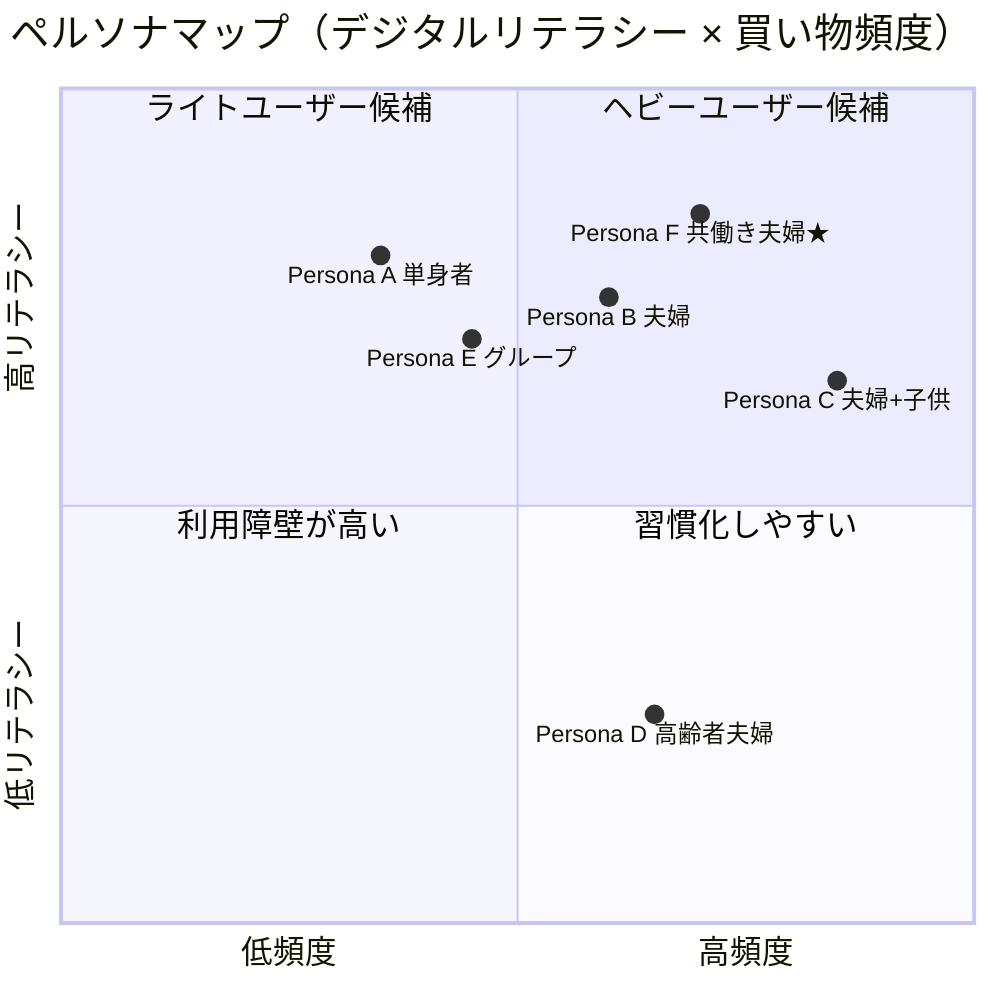
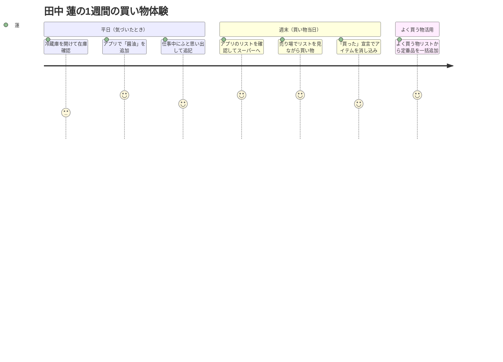
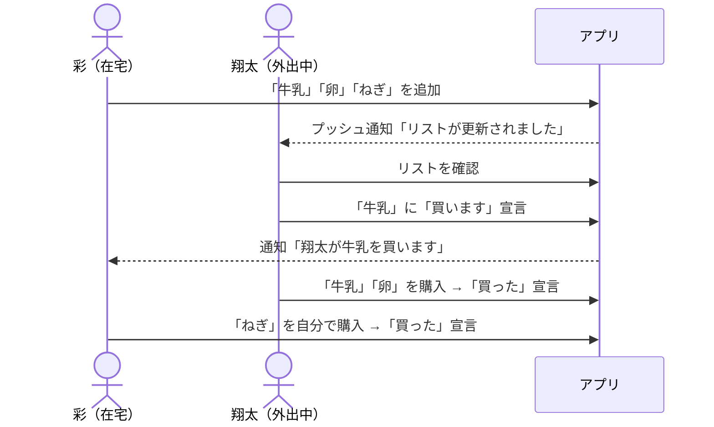
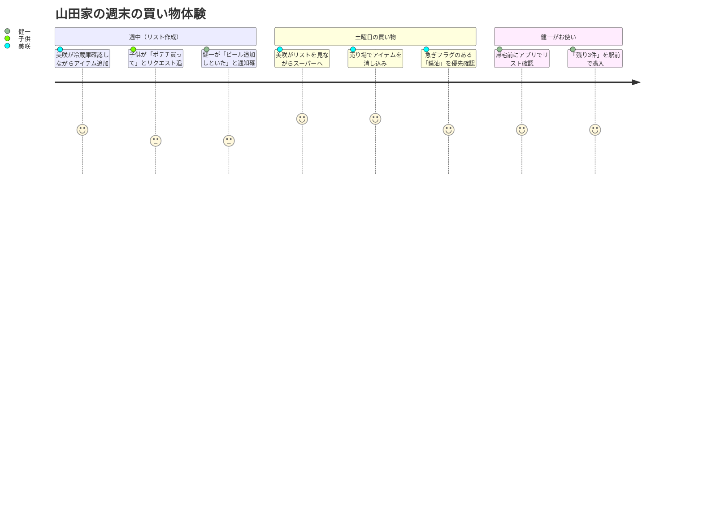
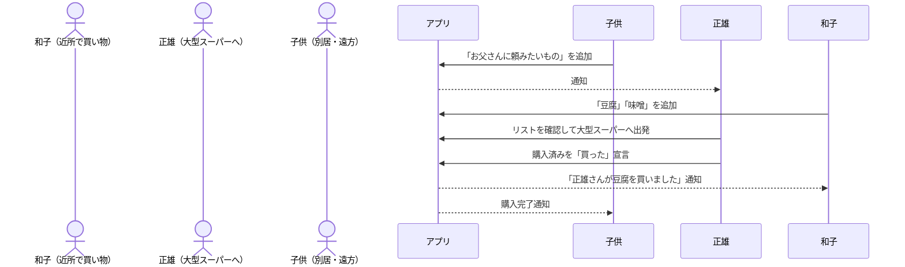
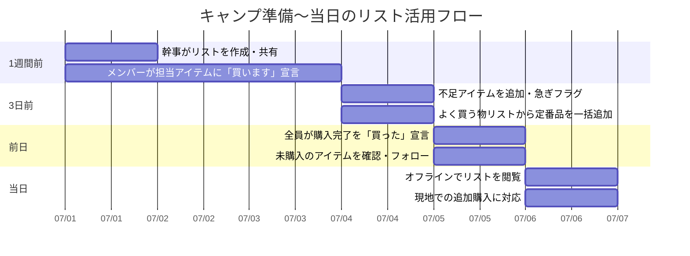
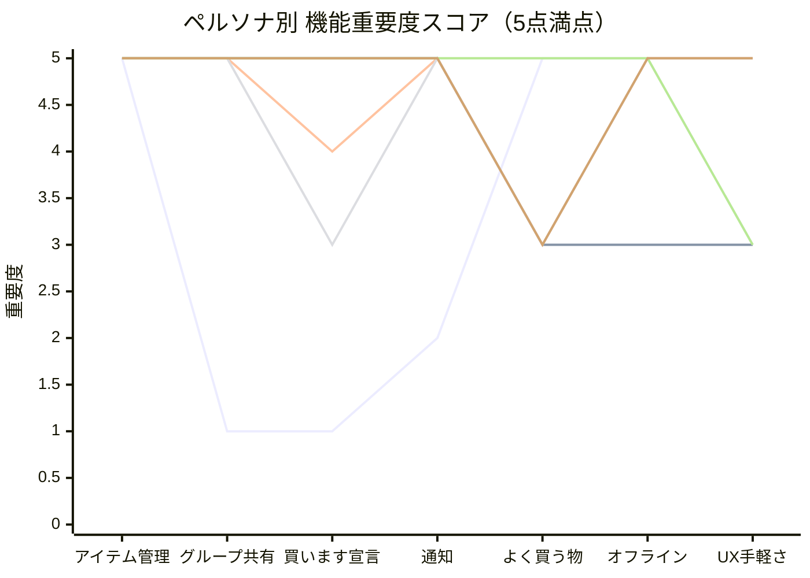

# ペルソナ定義 & 利用シナリオ（仮）

> このドキュメントはサービスの価値明確化を目的とした**仮ペルソナ**です。  
> ユーザーインタビュー・調査結果をもとに随時アップデートしてください。

---

## 目次

1. [ペルソナ一覧](#ペルソナ一覧)
2. [Persona A — 単身者](#persona-a--単身者)
3. [Persona B — 夫婦（子なし）](#persona-b--夫婦子なし)
4. [Persona C — 夫婦＋子供](#persona-c--夫婦子供)
5. [Persona D — 高齢者夫婦](#persona-d--高齢者夫婦)
6. [Persona E — 友人・サークルグループ](#persona-e--友人サークルグループ)
7. [Persona F — 共働き夫婦（実ペルソナ）](#persona-f--共働き夫婦実ペルソナ)
8. [ペルソナ横断まとめ](#ペルソナ横断まとめ)

---

## ペルソナ一覧

---

## Persona A — 単身者

### プロフィール

| 項目 | 内容 |
|---|---|
| 名前（仮） | 田中 蓮（たなか れん） |
| 年齢 | 27歳 |
| 職業 | ITエンジニア（フルリモート勤務） |
| 居住形態 | 都市部・1Kマンション独り暮らし |
| デジタルリテラシー | 高い（スマホアプリを積極的に活用） |
| 買い物スタイル | 週1〜2回まとめ買い＋近くのコンビニで補完 |

### 課題・ペイン

- スーパーに着いてから「何が足りなかったか」思い出せない
- 頭の中で管理しているうちに忘れて同じものを二重買いする
- 仕事に集中していると食材の在庫確認を後回しにしてしまう
- 一人なので「誰かに頼む」という選択肢がない

### 利用機会

### 主な利用機能

- **よく買う物リスト** — 毎週買う定番品をテンプレート化して時短
- **アイテム追加（随時）** — 気づいたタイミングでメモ代わりに使う
- **買った宣言** — 売り場でリストを消し込みながら使う
- **オフライン対応** — 地下や電波の悪い店舗内でも使える

### このペルソナが感じる価値

> 「メモアプリより使いやすい買い物専用のチェックリスト。よく買う物リストのおかげで毎週のリスト作成が30秒で終わる。」

---

## Persona B — 夫婦（子なし）

### プロフィール

| 項目 | 内容 |
|---|---|
| 名前（仮） | 佐藤 翔太・佐藤 彩（さとう しょうた・あや） |
| 年齢 | 翔太 34歳 / 彩 32歳 |
| 職業 | 翔太：営業職（外回り多め） / 彩：デザイナー（在宅メイン） |
| 居住形態 | 郊外・2LDKマンション |
| デジタルリテラシー | 二人とも高め |
| 買い物スタイル | 彩が平日に小まめ買い、翔太が週末にまとめ買い担当 |

### 課題・ペイン

- 「あれ買っといて」をLINEで送るが埋もれて忘れられる
- 翔太が仕事帰りにスーパーに寄るとき、彩のリクエストを把握していない
- 二人が別々に買い物して同じものを重複購入してしまう
- 翔太が外出先から「今日何か買って帰ろうか？」と連絡しても、彩がすぐに答えられない

### 利用機会

### 主な利用機能

- **グループ共有** — 夫婦間でリストをリアルタイム共有
- **買います宣言** — 「誰が何を買うか」をかぶらせない
- **通知** — 追加・購入のタイミングをリアルタイムに把握
- **急ぎフラグ** — 「今日中に欲しい」アイテムを目立たせる

### このペルソナが感じる価値

> 「LINEのやり取りがなくなった。翔太が仕事帰りに確認するだけで、無駄なコミュニケーションゼロで買い物が完結する。」

---

## Persona C — 夫婦＋子供

### プロフィール

| 項目 | 内容 |
|---|---|
| 名前（仮） | 山田 健一・山田 美咲（やまだ けんいち・みさき） |
| 年齢 | 健一 41歳 / 美咲 39歳 / 子供 11歳・8歳 |
| 職業 | 健一：会社員（通勤） / 美咲：パート（午前のみ） |
| 居住形態 | 郊外・一戸建て |
| デジタルリテラシー | 健一・美咲ともに普通 |
| 買い物スタイル | 美咲が主担当。健一は頼まれたときのみ。子供がお使いに行くことも |

### 課題・ペイン

- 子供のおやつや学校用品など、リクエストが多くて管理しきれない
- 健一に買い物を頼むとき、口頭やLINEでは伝達もれが起きる
- 子供がお使いに行くとき、何を買えばいいかを紙のメモで渡すのが手間
- 美咲がパートで忙しく、在庫確認の時間が取れないまま買い物に行ってしまう

### 利用機会

### 主な利用機能

- **グループ共有（家族全員）** — 家族全員でリストを一元管理
- **写真設定** — 子供のお使い用に商品写真を添付して分かりやすく
- **急ぎフラグ** — 「今日買わないといけないもの」を目立たせる
- **通知** — 家族が追加したらすぐ気づける
- **オフライン対応** — 地下のスーパーでも使える

### このペルソナが感じる価値

> 「子供のお使いに写真付きリストを渡せるのが地味にすごく便利。家族全員の要望が一箇所にまとまって、漏れがなくなった。」

---

## Persona D — 高齢者夫婦

### プロフィール

| 項目 | 内容 |
|---|---|
| 名前（仮） | 鈴木 正雄・鈴木 和子（すずき まさお・かずこ） |
| 年齢 | 正雄 72歳 / 和子 69歳 |
| 職業 | 二人とも退職済み |
| 居住形態 | 郊外・一戸建て（成人した子供は別居） |
| デジタルリテラシー | 低め（スマホは通話・LINEが中心） |
| 買い物スタイル | 和子が近所のスーパーへほぼ毎日。正雄は週1回大きなスーパーへ |

### 課題・ペイン

- 「あれを買ってきて」を口頭で伝えて忘れる・聞き間違える
- 紙のメモを持ち歩くが、書き忘れ・読めないことがある
- 離れて暮らす子供から「これ買って送って」と頼まれるが管理しきれない
- 正雄が大きな店で買い物するとき、和子が必要なものを伝えるタイミングを逃す
- 操作が複雑なアプリは使いたくない

### 利用機会

### 主な利用機能

- **グループ共有（家族間）** — 別居の子供も含めて共有可能
- **通知** — 買い物完了を家族全員がリアルタイムで把握
- **写真設定** — 商品の写真があると正雄が間違えにくい
- **シンプルな基本操作** — 追加・確認・完了のみで使えるシンプルさが重要
- **オフライン閲覧** — 電波が悪くてもリストを見られる

### UX上の考慮事項

> ⚠️ このペルソナには**UIのシンプルさと文字の大きさ**が重要。  
> アクセシビリティ対応（フォントサイズ設定、コントラスト比）を検討すること。

### このペルソナが感じる価値

> 「紙のメモと違って、追加したらすぐ正雄に伝わる。遠くに住む子供も何を頼んだか確認できるから安心。」

---

## Persona E — 友人・サークルグループ

### プロフィール

| 項目 | 内容 |
|---|---|
| 名前（仮） | アウトドアサークル「山の会」（6名） |
| 年齢層 | 28〜45歳 |
| 活動内容 | 月1〜2回のキャンプ・登山 |
| デジタルリテラシー | メンバーによってばらつきあり（高〜中） |
| 買い物スタイル | 活動前に役割分担で食材・消耗品を分散購入 |

### 課題・ペイン

- グループLINEで「誰が何を買うか」の割り振りが混乱する
- 誰かが重複して買ってきたり、必需品が誰も買わなかったりする
- 「急ぎで○○を追加購入」の連絡がLINEに埋もれて気づかれない
- 活動が月1回なので毎回リストをゼロから作り直すのが面倒
- キャンプ場では電波が悪く、当日リストが確認できないことがある

### 利用機会

### 主な利用機能

- **グループ管理** — サークルメンバー全員を1グループで管理
- **買います宣言** — 誰が何を担当するか可視化して重複・漏れを防ぐ
- **急ぎフラグ** — 直前の追加購入を目立たせる
- **よく買う物リスト** — 毎回買う定番品（炭・食器用洗剤等）をテンプレート化
- **オフライン対応** — 電波がないキャンプ場でも使える

### このペルソナが感じる価値

> 「LINEの混乱がなくなった。『誰が何を買うか』が一目瞭然で、直前まで誰も気づかなかった買い忘れがゼロになった。」

---

## Persona F — 共働き夫婦（実ペルソナ）

> 🏷️ プロダクトオーナー自身の実体験を元に定義した**一次情報ペルソナ**。設計・優先度判断の基準として扱う。  
> 課題の重みづけ・インサイト・機能優先度の詳細 → **[PERSONA_F_INSIGHTS.md](./PERSONA_F_INSIGHTS.md)**

### プロフィール

| 項目 | 内容 |
|---|---|
| 名前 | 鈴木 太郎・鈴木 花子（すずき たろう・はなこ） |
| 年齢 | 太郎 31歳 / 花子 30歳 |
| 職業 | 二人ともITエンジニア（都内勤務） |
| 居住形態 | 住宅地マンション 3DK・夫婦2人暮らし |
| デジタルリテラシー | 高い — ただし**面倒くさがりで操作ステップが多いと使わなくなる** |
| 買い物スタイル | 平日は必要なものを少量だけ購入、休日に車でまとめ買い |
| 通勤環境 | 都内通勤・路線によってネット環境が不安定な区間あり |

### 課題サマリー

| 優先度 | 課題 | スコア |
|:---:|---|:---:|
| 🔴 1位 | オフライン問題 — 通勤中に連絡・メモが見られない | 25 |
| 🔴 2位 | 入力の手間 — 面倒で入力漏れが起きる | 16 |
| 🟠 3位 | 在庫把握 — 何が不足しているか分からなくなる | 9 |
| 🟡 4位 | 週末まとめ買いの計画 — 平日のニーズを蓄積できない | 6 |
| 🟡 5位 | 商品指定の確認 — 具体的な商品指定で確認連絡が発生する | 4 |
| ⚪ 参考 | 夫婦のすれ違い — 買い忘れ・二重購入（上位課題の解決で連鎖解消） | 2 |

### 主な利用機能

- **オフライン対応・ゼロフリクション入力** — 圏外でも即記録できることが前提条件
- **グループ共有・リアルタイム同期** — 夫婦間のすれ違いをなくす
- **アイテムへのメモ・写真設定** — 商品指定をリスト内に完結させLINE往復を不要にする
- **買います宣言・通知** — 店内での担当分担と購入状況の把握
- **よく買う物リスト** — 毎週の定番品リスト作成を自動化

### このペルソナが感じる価値

> 「電車の中で思い出したことを圏外でもメモできて、妻に自動で伝わる。スーパーで『あ、それもう買ったよ』がなくなった。」

---

## ペルソナ横断まとめ

### 機能ニーズ対応表

| 機能 | A 単身者 | B 夫婦 | C 夫婦+子供 | D 高齢者 | E グループ | **F 共働き夫婦★** |
|---|:---:|:---:|:---:|:---:|:---:|:---:|
| アイテム追加・編集・削除 | ◎ | ◎ | ◎ | ◎ | ◎ | **◎** |
| グループ共有 | — | ◎ | ◎ | ◎ | ◎ | **◎** |
| 買います宣言 | — | ◎ | ○ | ○ | ◎ | **◎** |
| 買った宣言 | ◎ | ◎ | ◎ | ◎ | ◎ | **◎** |
| 急ぎフラグ | ○ | ◎ | ◎ | ○ | ◎ | **○** |
| 写真設定 | ○ | ○ | ◎ | ◎ | ○ | **—** |
| 通知 | ○ | ◎ | ◎ | ◎ | ◎ | **◎** |
| よく買う物リスト | ◎ | ○ | ○ | ○ | ◎ | **○** |
| オフライン対応 | ◎ | ○ | ◎ | ◎ | ◎ | **◎** |
| 入力の手軽さ（UX） | ○ | ○ | ○ | ◎ | ○ | **◎** |
| アクセシビリティ | — | — | ○ | ◎ | — | **—** |

> ◎ 強いニーズ　○ あると嬉しい　— ニーズ小または対象外

### ペルソナ別 最重要機能

### 共通する本質的価値

1. **「忘れない」** — 気づいたときにすぐ記録できる
2. **「かぶらない」** — 買います宣言で役割の重複を防ぐ
3. **「伝わる」** — リアルタイム共有で口頭・LINEの伝言ゲームをなくす
4. **「どこでも使える」** — オフラインでも売り場でリストを確認できる

---

> **Next Action**  
> - [ ] 各ペルソナに対してユーザーインタビューを実施し、課題の重みづけを検証する  
> - [ ] Persona D（高齢者）向けに UI プロトタイプのアクセシビリティ評価を行う  
> - [ ] Persona E（グループ）の「よく買う物リスト」をグループ単位で持てるか仕様を検討する  
> - [ ] **Persona F（実ペルソナ）の「ゼロフリクション入力」を実現するUXを設計する（ウィジェット・音声入力・ホーム画面ショートカット）**  
> - [ ] **オフライン同期のコンフリクト解決ロジックをPersona Fのユースケースで検証する**
