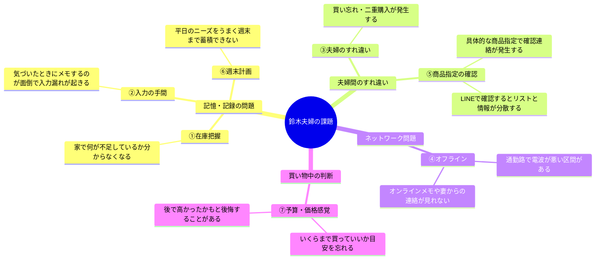
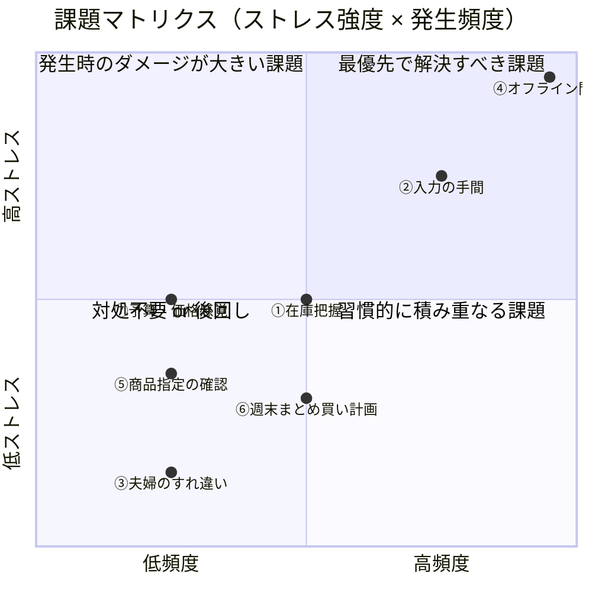
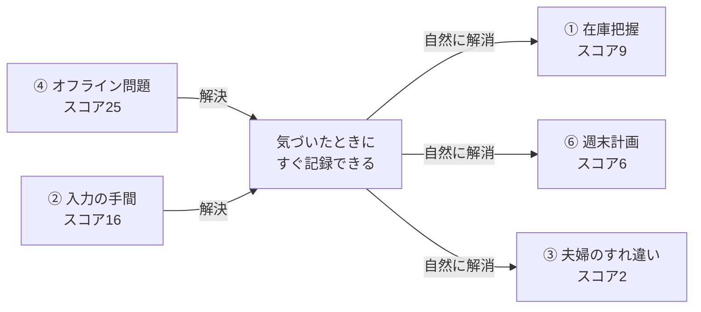
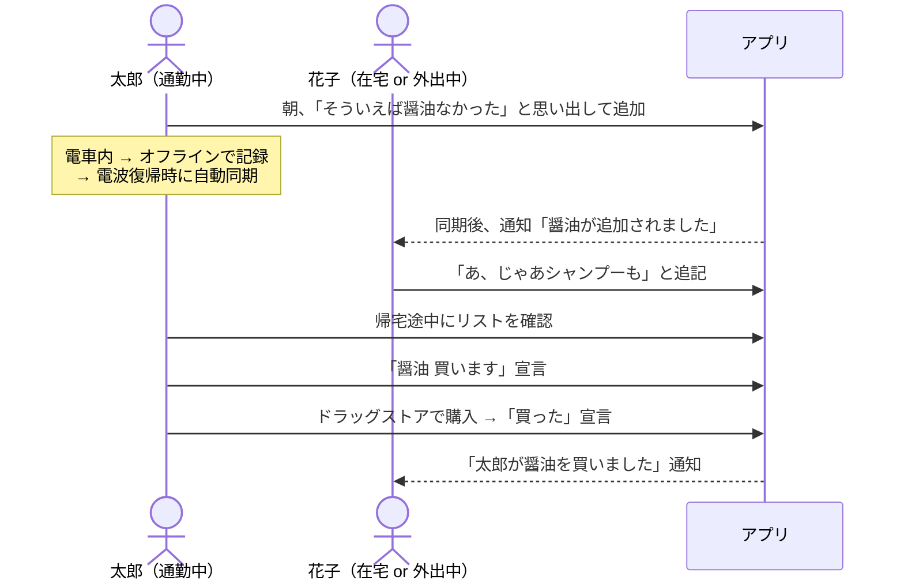
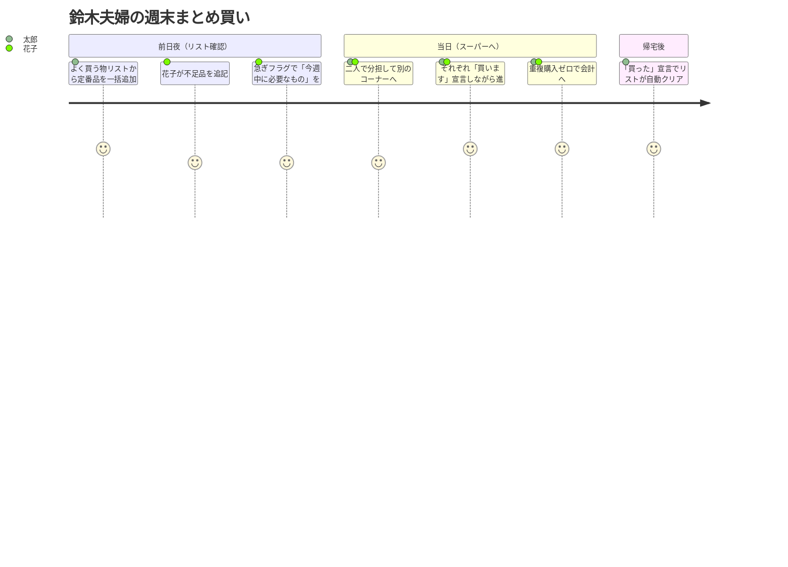
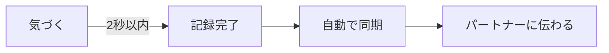

# Persona F — 深掘り分析（課題・インサイト・優先度）

> **対象ペルソナ：** 鈴木 太郎・花子（共働き夫婦 / 実ペルソナ）  
> **位置づけ：** プロダクトオーナー自身の実体験を元にした一次情報ペルソナ。設計・優先度判断の基準として扱う。  
> **概略 →** [PERSONAS.md — Persona F](./PERSONAS.md#persona-f--共働き夫婦実ペルソナ)

---

## 目次

1. [課題一覧と重みづけ](#課題一覧と重みづけ)
2. [課題マトリクス](#課題マトリクス)
3. [核心的インサイト](#核心的インサイト)
4. [利用シナリオ](#利用シナリオ)
5. [機能優先度](#機能優先度)
6. [UX設計指針](#ux設計指針)
7. [スコープ外の判断](#スコープ外の判断)

---

## 課題一覧と重みづけ

> ストレス強度・発生頻度ともに 1〜5 点で評価。**優先度スコア = 強度 × 頻度**。

| # | 課題 | ストレス強度 | 発生頻度 | **優先度スコア** | フェーズ目安 |
|---|---|:---:|:---:|:---:|:---:|
| ④ | オフライン問題 | 5 | 5（ほぼ毎日） | **25** | Phase 1 |
| ② | 入力の手間 | 4 | 4（週3〜4回） | **16** | Phase 1 |
| ① | 在庫把握 | 3 | 3（週1〜2回） | **9** | Phase 1 |
| ⑥ | 週末まとめ買いの計画 | 2 | 3（ほぼ毎週末） | **6** | Phase 2 |
| ⑦ | 予算・価格感覚 | 3 | 2（月数回） | **6** | スコープ外※ |
| ⑤ | 商品指定の確認 | 2 | 2（月数回） | **4** | Phase 2 |
| ③ | 夫婦のすれ違い | 1 | 2（月2〜3回） | **2** | Phase 1※ |

> ※③夫婦のすれ違い — スコアは低いが④②①の解決で**連鎖的に解消される**ため実質 Phase 1 スコープ。独立した機能開発は不要。  
> ※⑦予算・価格感覚 — コアスコープから外れると判断。詳細は[スコープ外の判断](#スコープ外の判断)を参照。

---

## 課題マトリクス

### 課題間の連鎖構造

> **④と②を解決することが、他の課題の大部分を連鎖的に解消する**。  
> 設計の最優先はこの2点に集中してよい。

---

## 核心的インサイト

| # | インサイト | 裏付け課題 | 背景・詳細 |
|---|---|:---:|---|
| 1 | **「気づいた瞬間に記録できないと記録しない」** | ②④ | ITリテラシーは高いが面倒くさがり。アプリを開く・タイプするの2ステップでも離脱する。ゼロフリクション入力が必須 |
| 2 | **「電波がなくても使えることは非交渉条件」** | ④ | 通勤中にリストを見たい・更新したいが地下鉄では圏外になる。オフライン対応はあると嬉しい機能ではなく使う前提の条件 |
| 3 | **「平日の小さな気づきを週末まで橋渡しできていない」** | ①⑥ | 冷蔵庫を見て「あ、切れてる」と思っても週末まで覚えていられない。①②が解決すればこの課題は自然に解消する |
| 4 | **「確認連絡がリストと分離すると情報が混乱する」** | ③⑤ | 「これいつものやつ？」という確認がLINEに飛ぶとリストと情報が分断される。メモ・写真をアイテムに紐付けることで解消できる |
| 5 | **「予算感覚の管理はリストアプリに求めていない」** | ⑦ | ストレスは中程度だが頻度が低く、家計簿アプリ等で代替している可能性が高い。コアスコープへの追加は不要と判断 |

---

## 利用シナリオ

### 平日シナリオ — 気づいたときに即メモ

### 休日シナリオ — 車でまとめ買い

---

## 機能優先度

| 機能 | 優先度 | 対応課題 | 理由 |
|---|:---:|:---:|---|
| **オフライン対応（閲覧・編集）** | 🔴 最高 | ④ | 通勤中の圏外区間で使えることが前提条件 |
| **アイテム追加の手軽さ** | 🔴 最高 | ② | 面倒と感じたら使わなくなる。1タップ・音声入力を検討 |
| **グループ共有・リアルタイム同期** | 🔴 最高 | ③ | 夫婦間のすれ違い解消がこのサービスの主目的 |
| **アイテムへのメモ・コメント機能** | 🔴 最高 | ⑤ | 商品指定をリスト内に添付しLINEへの確認連絡を不要にする |
| **買います宣言** | 🟠 高 | ③ | 店内で二人が別行動するとき担当分担に使う |
| **通知** | 🟠 高 | ③⑤ | 相手の追加・購入をリアルタイムで把握しすれ違いを防ぐ |
| **写真設定** | 🟠 高 | ⑤ | 商品指定が具体的な場合、パッケージ写真で確実に伝えられる |
| **よく買う物リスト** | 🟡 中 | ①⑥ | 毎週買う定番品のリスト作成コストを下げる |
| **急ぎフラグ** | 🟡 中 | ① | 「今週中に必要」を夫婦で共通認識するため |

---

## UX設計指針

### 最重要設計原則：ゼロフリクション入力

> デジタルリテラシーが高くても「面倒くさい」と使われない。  
> **ホーム画面から2秒以内に記録できる**ことを目指す。

| 検討施策 | 概要 |
|---|---|
| **ホーム画面ウィジェット** | アプリを開かずにアイテムを追加できる |
| **音声入力対応** | 両手がふさがっていても「醤油」と言えば追加できる |
| **クイック追加ボタン** | アプリ起動後1タップで入力フォームにフォーカス |
| **オフラインキュー** | 圏外でも操作でき、復帰時に自動送信される |

---

## スコープ外の判断

### ⑦ 予算・価格感覚

| 評価軸 | 内容 |
|---|---|
| 優先度スコア | 6（ストレス3 × 頻度2） |
| スコープ判断 | **対象外** |
| 理由 | 買い物リストアプリのコアバリューから外れる。家計簿アプリ（Zaim・マネーフォワード等）が既に解決している領域であり、本サービスで追いかけると価値が分散する |
| 将来の検討余地 | アイテムに「目安金額」をメモとして添付できれば、⑤商品指定の確認と合わせて自然な形で補完できる可能性がある |

---

## 更新履歴

| 日付 | 更新内容 |
|---|---|
| 2026-04-18 | 初版作成。課題の重みづけ・インサイト・優先度を定義 |
