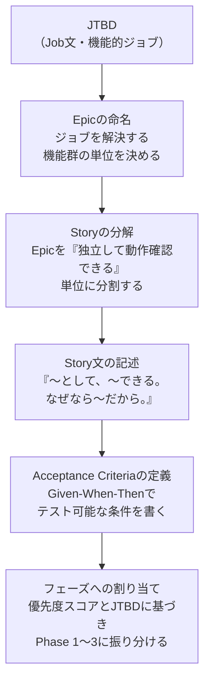
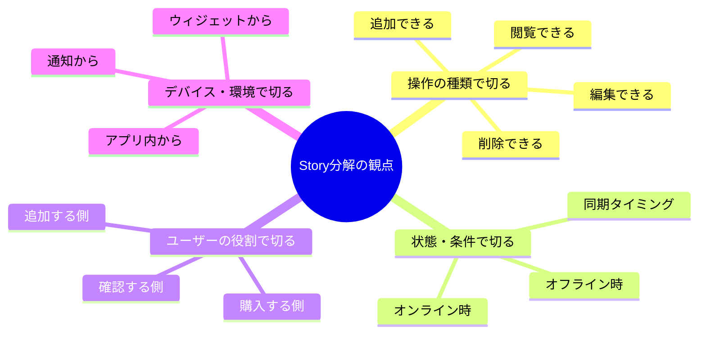
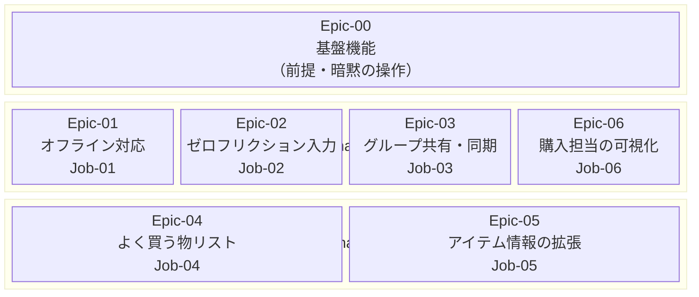
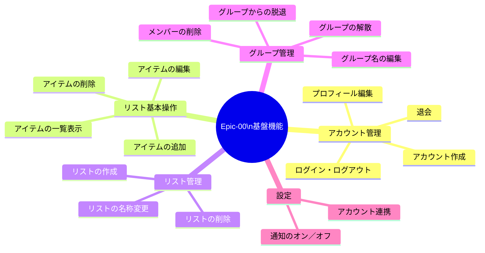
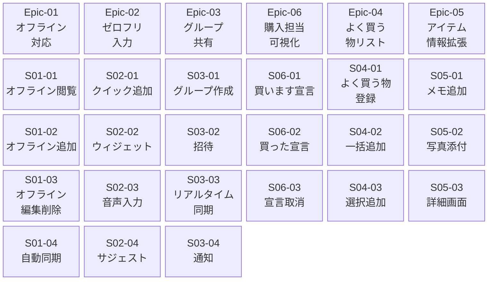
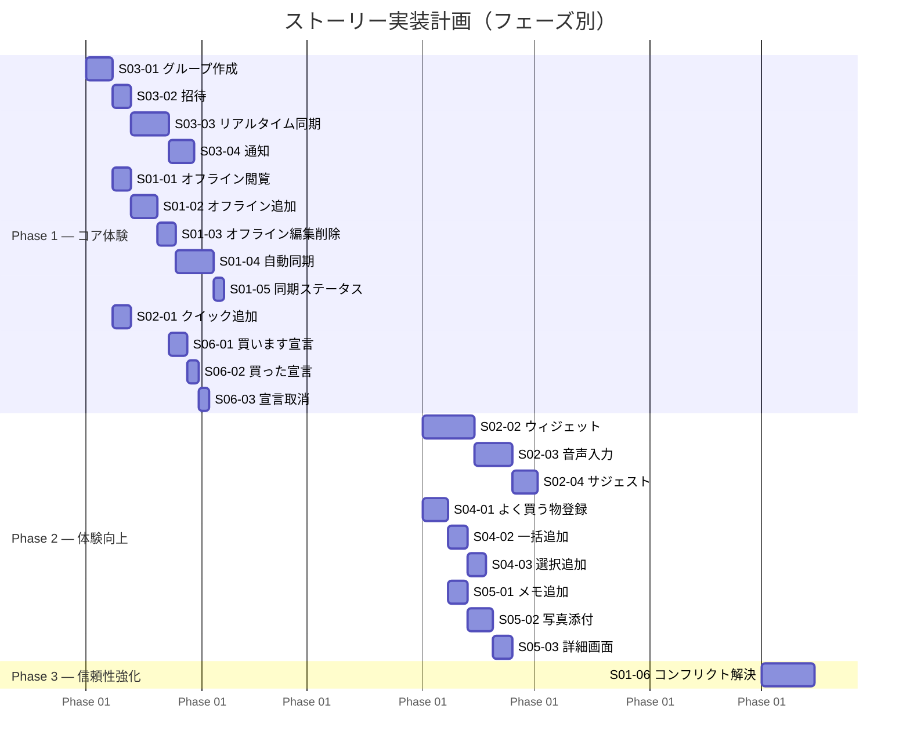

# ユーザーストーリー定義

> **対象ペルソナ：** 鈴木 太郎・花子（共働き夫婦 / 実ペルソナ）  
> **前提資料 →** [PERSONA_F_JTBD.md](./PERSONA_F_JTBD.md)  
> **Next →** バリュープロポジションキャンバス / ストーリーマップ更新

---

## 目次

1. [用語定義](#用語定義)
2. [作成プロセス](#作成プロセス)
3. [Epic一覧](#epic一覧)
4. [Epic-00 基盤機能](#epic-00--基盤機能)
5. [Epic-01 オフライン対応](#epic-01--オフライン対応)
6. [Epic-02 ゼロフリクション入力](#epic-02--ゼロフリクション入力)
7. [Epic-03 グループ共有・リアルタイム同期](#epic-03--グループ共有リアルタイム同期)
8. [Epic-04 よく買う物リスト](#epic-04--よく買う物リスト)
9. [Epic-05 アイテム情報の拡張](#epic-05--アイテム情報の拡張)
10. [Epic-06 購入担当の可視化](#epic-06--購入担当の可視化)
11. [ストーリー全体マップ](#ストーリー全体マップ)
12. [フェーズ別実装計画](#フェーズ別実装計画)

---

## 用語定義

### Epic（エピック）

**「ひとつのジョブを解決するための機能群をまとめた大きな単位」**

単一のストーリーに収まらない大きな要求のかたまり。  
1つのEpicは複数のStoryで構成され、リリースをまたいで実装されることもある。

```
【例】
Epic : オフライン対応
  → Story : オフラインでリストを閲覧できる
  → Story : オフラインでアイテムを追加できる
  → Story : オンライン復帰時に自動で同期できる
```

---

### Story（ユーザーストーリー）

**「ユーザー視点で書かれた、1つの体験・価値の単位」**

フォーマット：
> 「**〔ユーザー〕** として、**〔したいこと〕** ができる。  
> なぜなら **〔得たい価値〕** だから。」

Storyは **「独立して動作確認できる」「1スプリントで完了できる」** 粒度が理想。  
大きすぎる場合はさらに分割する。

```
【良い例】
「ユーザーとして、オフライン中にアイテムを追加できる。
なぜなら圏外の電車内でも気づきをすぐ記録したいから。」

【悪い例 — 大きすぎる】
「ユーザーとして、オフラインで何でもできる。」
→ 範囲が広すぎて完了の定義が曖昧になる
```

---

### Acceptance Criteria（受け入れ条件）

**「このStoryが『完成した』と判断できる具体的な条件の一覧」**

フォーマット（Given-When-Then）：
> - **Given**（前提）: 〜の状態のとき
> - **When**（操作）: 〜したとき
> - **Then**（結果）: 〜になる

受け入れ条件は **テスト可能** であることが原則。  
「使いやすい」「スムーズに」などの主観的表現は使わない。

```
【良い例】
- Given: デバイスがオフライン状態のとき
- When: アイテム名を入力して追加ボタンをタップしたとき
- Then: アイテムがローカルに保存され、リストに表示される

【悪い例 — テスト不可】
- スムーズに追加できること
- 快適に使えること
```

---

## 作成プロセス

JTBDで定義した6つのJobからStoryを導出するまでの手順を示す。



### Job → Epic への変換ルール

| Job | 変換の考え方 | Epic |
|---|---|---|
| —（前提機能） | JTBDに現れない「できて当然」の操作をまとめる | Epic-00 基盤機能 |
| Job-01 オフライン記録・確認 | オフラインで動作するために必要な機能群をまとめる | Epic-01 オフライン対応 |
| Job-02 摩擦ゼロの即時記録 | 入力ステップを減らすすべての手段をまとめる | Epic-02 ゼロフリクション入力 |
| Job-03 買い物前の在庫把握 | リストが常に最新状態で共有されることをまとめる | Epic-03 グループ共有・同期 |
| Job-04 週末まとめ買いの準備 | 定番品の管理・一括追加をまとめる | Epic-04 よく買う物リスト |
| Job-05 商品指定の伝達 | アイテムに付帯する情報をまとめる | Epic-05 アイテム情報の拡張 |
| Job-06 購入担当の可視化 | 誰が何を買うかの状態管理をまとめる | Epic-06 購入担当の可視化 |

### Story 分解の考え方

Epicを分割するときは以下の観点で切り出す。



---

## Epic一覧



---

## Epic-00 ｜ 基盤機能

> **対応Job :** —（JTBDに現れない「できて当然」の前提機能）  
> **フェーズ :** Phase 1（他のすべてのEpicより先に実装が必要）

### なぜ基盤Epicが必要か

JTBDはユーザーが「不便だと意識している課題」から導出するため、  
**「あって当然」な操作はJobとして現れない。**  
これらを明示しないと実装漏れ・仕様の抜けが発生するため、独立したEpicとして管理する。



### Story一覧

| ID | Story | フェーズ |
|---|---|:---:|
| S00-01 | アカウントを新規作成できる | Phase 1 |
| S00-02 | ログイン・ログアウトできる | Phase 1 |
| S00-03 | プロフィールを編集できる | Phase 1 |
| S00-04 | アカウントを退会できる | Phase 1 |
| S00-05 | リストのアイテムを一覧表示できる | Phase 1 |
| S00-06 | リストにアイテムを追加できる | Phase 1 |
| S00-07 | アイテムの名称を編集できる | Phase 1 |
| S00-08 | アイテムを削除できる | Phase 1 |
| S00-09 | リストを作成・名称変更・削除できる | Phase 1 |
| S00-10 | グループ名を編集できる | Phase 1 |
| S00-11 | グループから脱退・解散できる | Phase 1 |
| S00-12 | 通知のオン／オフを設定できる | Phase 1 |

---

### S00-01｜アカウントを新規作成できる

> 「**ユーザーとして**、メールアドレスとパスワードでアカウントを作成できる。  
> なぜなら、グループ共有機能を使うためにはアカウントが必要だから。」

**Acceptance Criteria**

| # | Given | When | Then |
|---|---|---|---|
| 1 | アプリを初回起動した状態 | メールアドレス・パスワードを入力して登録する | アカウントが作成され、ホーム画面に遷移する |
| 2 | すでに登録済みのメールアドレスを入力した状態 | 登録ボタンをタップする | 「このメールアドレスはすでに使用されています」と表示される |
| 3 | パスワードが要件（8文字以上等）を満たさない状態 | 登録ボタンをタップする | パスワード要件のエラーメッセージが表示される |

---

### S00-02｜ログイン・ログアウトできる

> 「**ユーザーとして**、登録したアカウントでログイン・ログアウトできる。  
> なぜなら、機種変更や複数デバイスでも同じデータにアクセスしたいから。」

**Acceptance Criteria**

| # | Given | When | Then |
|---|---|---|---|
| 1 | アカウント作成済みの状態 | 正しいメールアドレス・パスワードを入力してログインする | ホーム画面に遷移し、自分のリストが表示される |
| 2 | 誤ったパスワードを入力した状態 | ログインボタンをタップする | 「メールアドレスまたはパスワードが正しくありません」と表示される |
| 3 | ログイン中の状態 | ログアウトをタップする | ログイン画面に戻り、ローカルのキャッシュが削除される |

---

### S00-03｜プロフィールを編集できる

> 「**ユーザーとして**、表示名とアバター画像を編集できる。  
> なぜなら、グループ内でパートナーが誰の操作か識別できるようにしたいから。」

**Acceptance Criteria**

| # | Given | When | Then |
|---|---|---|---|
| 1 | プロフィール編集画面を開いている状態 | 表示名を変更して保存する | 変更がグループ内のすべてのメンバーの画面に反映される |
| 2 | プロフィール編集画面を開いている状態 | アバター画像を変更して保存する | 新しい画像が自分のアイコンとして表示される |

---

### S00-04｜アカウントを退会できる

> 「**ユーザーとして**、アカウントを完全に削除して退会できる。  
> なぜなら、サービスを使わなくなったときにデータを残したくないから。」

**Acceptance Criteria**

| # | Given | When | Then |
|---|---|---|---|
| 1 | 退会フォームを開いている状態 | 確認文言を入力して退会ボタンをタップする | アカウントと関連データが削除され、ログイン画面に戻る |
| 2 | グループのオーナーが退会しようとしている状態 | 退会フォームを開く | 「グループを先に解散または譲渡してください」と表示される |

---

### S00-05｜リストのアイテムを一覧表示できる

> 「**ユーザーとして**、グループの買い物リストのアイテムを一覧で確認できる。  
> なぜなら、今何が買うべきアイテムとして登録されているかを把握したいから。」

**Acceptance Criteria**

| # | Given | When | Then |
|---|---|---|---|
| 1 | グループのリストにアイテムが登録されている状態 | リスト画面を開く | 未購入のアイテムが一覧表示される |
| 2 | 「買った」状態のアイテムがある場合 | — | 未購入アイテムとは区別して表示される（別セクション or グレーアウト） |
| 3 | アイテムが0件の状態 | リスト画面を開く | 「アイテムがありません」等の空状態メッセージが表示される |

---

### S00-06｜リストにアイテムを追加できる

> 「**ユーザーとして**、リストにアイテムを追加できる。  
> なぜなら、買う必要があるものを記録したいから。」

**Acceptance Criteria**

| # | Given | When | Then |
|---|---|---|---|
| 1 | リスト画面を開いている状態 | アイテム名を入力して追加する | アイテムがリストに表示される |
| 2 | アイテム名が空の状態 | 追加ボタンをタップする | アイテムは追加されず、入力フォームにフォーカスが当たる |

---

### S00-07｜アイテムの名称を編集できる

> 「**ユーザーとして**、登録済みのアイテム名を編集できる。  
> なぜなら、入力ミスや気づきがあったときに修正したいから。」

**Acceptance Criteria**

| # | Given | When | Then |
|---|---|---|---|
| 1 | アイテムが登録されている状態 | アイテムをタップして名称を変更し保存する | 変更後の名称がリストに表示される |
| 2 | 名称を空にして保存しようとした場合 | — | 「アイテム名を入力してください」と表示され保存されない |

---

### S00-08｜アイテムを削除できる

> 「**ユーザーとして**、不要になったアイテムをリストから削除できる。  
> なぜなら、買う必要がなくなったものをリストから消したいから。」

**Acceptance Criteria**

| # | Given | When | Then |
|---|---|---|---|
| 1 | アイテムが登録されている状態 | スワイプまたは削除ボタンで削除を実行する | 確認ダイアログが表示される |
| 2 | 確認ダイアログで「削除」をタップした状態 | — | アイテムがリストから消え、グループ全員の画面から即時削除される |
| 3 | 確認ダイアログで「キャンセル」をタップした状態 | — | 削除されずリストの状態が維持される |

---

### S00-09｜リストを作成・名称変更・削除できる

> 「**ユーザーとして**、グループ内のリストを作成・名称変更・削除できる。  
> なぜなら、用途別にリストを分けて管理したいから。（例：日常の買い物 / キャンプ用品）」

**Acceptance Criteria**

| # | Given | When | Then |
|---|---|---|---|
| 1 | グループ内に居る状態 | リスト名を入力して作成する | 新しいリストが作成されグループ内に表示される |
| 2 | リスト名を変更して保存した状態 | — | グループ全員の画面に新しい名称が反映される |
| 3 | リストを削除しようとした状態 | — | 「リスト内のアイテムもすべて削除されます」と確認ダイアログが表示される |
| 4 | グループ内のリストが1件のみの状態 | リスト削除を試みる | 「最低1件のリストが必要です」と表示され削除できない |

---

### S00-10｜グループ名を編集できる

> 「**ユーザーとして**、グループの名称を変更できる。  
> なぜなら、用途やメンバーの変化に合わせてグループ名を更新したいから。」

**Acceptance Criteria**

| # | Given | When | Then |
|---|---|---|---|
| 1 | グループ設定画面を開いている状態 | グループ名を変更して保存する | 全メンバーの画面に新しいグループ名が反映される |

---

### S00-11｜グループから脱退・解散できる

> 「**ユーザーとして**、グループから脱退、またはグループを解散できる。  
> なぜなら、共有が不要になったときにクリーンな状態に戻したいから。」

**Acceptance Criteria**

| # | Given | When | Then |
|---|---|---|---|
| 1 | グループメンバーの状態 | 「グループを脱退」をタップして確認する | 自分がグループから除外され、リストにアクセスできなくなる |
| 2 | グループオーナーが「グループを解散」をタップした状態 | — | 全メンバーがグループから除外され、グループとリストが削除される |
| 3 | グループオーナーが脱退しようとしている状態 | — | 「解散するか、他のメンバーにオーナーを譲渡してください」と表示される |

---

### S00-12｜通知のオン／オフを設定できる

> 「**ユーザーとして**、アプリの通知をオン／オフに設定できる。  
> なぜなら、通知が不要なタイミングではオフにしたいから。」

**Acceptance Criteria**

| # | Given | When | Then |
|---|---|---|---|
| 1 | 設定画面を開いている状態 | 通知トグルをオフにする | 以降のプッシュ通知が届かなくなる |
| 2 | 通知をオフにしている状態 | トグルをオンにする | 以降のプッシュ通知が再び届くようになる |

---

> **対応Job :** Job-01 オフライン下での記録・確認  
> **優先度スコア :** 25（最高）  
> **フェーズ :** Phase 1

### Epicの目的

> 「電波の有無にかかわらず、リストの閲覧・編集ができる。  
> オンライン復帰時には自動でサーバーと同期され、パートナーに伝わる。」

### Story一覧

| ID | Story | フェーズ |
|---|---|:---:|
| S01-01 | オフライン中にリストを閲覧できる | Phase 1 |
| S01-02 | オフライン中にアイテムを追加できる | Phase 1 |
| S01-03 | オフライン中にアイテムを編集・削除できる | Phase 1 |
| S01-04 | オンライン復帰時にローカルの変更が自動同期される | Phase 1 |
| S01-05 | 同期中・同期完了のステータスが確認できる | Phase 1 |
| S01-06 | オフライン中に発生したコンフリクトを解決できる | Phase 3 |

---

### S01-01｜オフライン中にリストを閲覧できる

> 「**ユーザーとして**、オフライン中にリストを閲覧できる。  
> なぜなら、電波のない地下鉄や店舗内でも買い物リストを確認したいから。」

**Acceptance Criteria**

| # | Given | When | Then |
|---|---|---|---|
| 1 | デバイスがオフライン状態で、過去にリストを一度読み込んでいる | リストを開く | 最後に同期した時点のリストが表示される |
| 2 | デバイスがオフライン状態 | アプリを起動する | オフライン状態であることを示すインジケーターが表示される |
| 3 | デバイスがオフライン状態 | リストを開く | 「オフライン中のため最新情報を取得できません」等の旨が表示される |

---

### S01-02｜オフライン中にアイテムを追加できる

> 「**ユーザーとして**、オフライン中にアイテムを追加できる。  
> なぜなら、圏外の電車内で気づいた不足品を即記録したいから。」

**Acceptance Criteria**

| # | Given | When | Then |
|---|---|---|---|
| 1 | デバイスがオフライン状態 | アイテム名を入力して追加する | アイテムがローカルに保存され、リストに表示される |
| 2 | デバイスがオフライン状態でアイテムを追加した後、オンラインになる | 自動同期が実行される | 追加したアイテムがサーバーに反映され、パートナーのリストにも表示される |
| 3 | デバイスがオフライン状態 | アイテムを追加する | 「同期待ち」を示すアイコンがアイテムに表示される |

---

### S01-03｜オフライン中にアイテムを編集・削除できる

> 「**ユーザーとして**、オフライン中にアイテムを編集・削除できる。  
> なぜなら、追加済みのアイテムの内容を電車内で修正できるようにしたいから。」

**Acceptance Criteria**

| # | Given | When | Then |
|---|---|---|---|
| 1 | デバイスがオフライン状態 | 既存アイテムの名称を変更する | 変更がローカルに保存され、リスト上に即時反映される |
| 2 | デバイスがオフライン状態 | アイテムを削除する | アイテムがローカルから即時削除され、リストから消える |
| 3 | オフライン中に編集・削除し、その後オンラインになる | 自動同期が実行される | 編集・削除の内容がサーバーに反映される |

---

### S01-04｜オンライン復帰時にローカルの変更が自動同期される

> 「**ユーザーとして**、オンライン復帰時に手動操作なしで変更が同期される。  
> なぜなら、『同期するの忘れた』という操作ミスをなくしたいから。」

**Acceptance Criteria**

| # | Given | When | Then |
|---|---|---|---|
| 1 | オフライン中に追加・編集・削除を行った状態 | デバイスがオンラインになる | バックグラウンドで自動的に同期が開始される |
| 2 | 自動同期が完了した | — | 「同期待ち」アイコンが消え、通常表示に戻る |
| 3 | 自動同期が失敗した | — | エラー通知が表示され、手動再試行が可能な状態になる |

---

### S01-05｜同期中・同期完了のステータスが確認できる

> 「**ユーザーとして**、リストが最新かどうかをひと目で確認できる。  
> なぜなら、パートナーの変更が反映済みかどうか不安なく使いたいから。」

**Acceptance Criteria**

| # | Given | When | Then |
|---|---|---|---|
| 1 | 同期が完了している状態 | リストを開く | 最終同期日時が表示される |
| 2 | 同期中の状態 | リストを開く | 同期中を示すインジケーターが表示される |
| 3 | 未同期の変更がある状態 | リストを開く | 未同期であることがわかるバッジやアイコンが表示される |

---

## Epic-02 ｜ ゼロフリクション入力

> **対応Job :** Job-02 摩擦ゼロの即時記録  
> **優先度スコア :** 16  
> **フェーズ :** Phase 1

### Epicの目的

> 「アプリを開く操作を最小化し、気づいた瞬間にアイテムを追加できる。  
> ホーム画面から2秒以内に記録完了できる状態を目指す。」

### Story一覧

| ID | Story | フェーズ |
|---|---|:---:|
| S02-01 | アプリ内のクイック追加で1タップから入力できる | Phase 1 |
| S02-02 | ホーム画面ウィジェットからアイテムを追加できる | Phase 2 |
| S02-03 | 入力フォームのマイクボタンから音声入力でアイテムを追加できる | Phase 2 |
| S02-04 | よく使う単語がサジェストされる | Phase 2 |
| S02-05 | 音声アシスタント経由でハンズフリーにアイテムを追加できる | Phase 3 |

---

### S02-01｜アプリ内のクイック追加で1タップから入力できる

> 「**ユーザーとして**、アプリを開いた直後に1タップで入力状態になれる。  
> なぜなら、リストを探してから追加ボタンを探す手順が面倒で離脱するから。」

**Acceptance Criteria**

| # | Given | When | Then |
|---|---|---|---|
| 1 | アプリを起動した状態 | — | 入力フォームまたはクイック追加ボタンがリスト画面の最上部または固定位置に表示される |
| 2 | クイック追加ボタンをタップした状態 | — | キーボードが自動的に展開され、テキスト入力が即時可能な状態になる |
| 3 | アイテム名を入力してEnter/追加をタップした状態 | — | アイテムがリストに追加され、入力フォームが空になり次の入力が可能な状態になる |
| 4 | 入力フォームが表示されている状態 | 何も入力せずに閉じる | アイテムは追加されず、リストに変化がない |

---

### S02-02｜ホーム画面ウィジェットからアイテムを追加できる

> 「**ユーザーとして**、アプリを開かずにホーム画面からアイテムを追加できる。  
> なぜなら、冷蔵庫の前でアプリを探して開く手順が面倒で記録を諦めるから。」

**Acceptance Criteria**

| # | Given | When | Then |
|---|---|---|---|
| 1 | ホーム画面にウィジェットを配置している状態 | ウィジェットのテキストフィールドをタップする | キーボードが展開され、入力可能な状態になる |
| 2 | ウィジェットからアイテム名を入力してEnterをタップした状態 | — | アイテムがリストに追加され、アプリを開かなくてもウィジェット上に反映される |
| 3 | デバイスがオフライン状態でウィジェットからアイテムを追加した状態 | オンラインになる | 追加したアイテムが自動同期される（S01-04との連携） |

---

### S02-03｜入力フォームのマイクボタンから音声入力でアイテムを追加できる

> ⚠️ **修正履歴：** 初版では「両手がふさがっているとき」を前提としていたが、マイクボタンのタップ自体に片手が必要なため矛盾していた。本Storyはアプリを開いた状態での音声入力に限定し、ハンズフリー操作はS02-05として分離した。

> 「**ユーザーとして**、入力フォームのマイクボタンをタップして声でアイテムを追加できる。  
> なぜなら、テキスト入力よりも素早くアイテムを記録できるから。」

**Acceptance Criteria**

| # | Given | When | Then |
|---|---|---|---|
| 1 | 入力フォームが表示されている状態 | マイクアイコンをタップして「醤油」と発話する | 「醤油」がテキストフォームに入力される |
| 2 | 音声認識が完了した状態 | — | 認識結果を確認・修正してから追加できる |
| 3 | 音声認識に失敗した状態 | — | エラーが表示され、テキスト入力に切り替えられる |
| 4 | デバイスのマイク権限が未許可の状態 | マイクアイコンをタップする | 「マイクの使用を許可してください」と権限リクエストが表示される |

---

### S02-04｜よく使う単語がサジェストされる

> 「**ユーザーとして**、入力中に過去に追加したアイテム名がサジェストされる。  
> なぜなら、毎回同じ単語を入力する手間を省きたいから。」

**Acceptance Criteria**

| # | Given | When | Then |
|---|---|---|---|
| 1 | 過去に「醤油」を追加したことがある状態 | 「し」と入力する | 「醤油」がサジェスト候補として表示される |
| 2 | サジェスト候補をタップした状態 | — | アイテムがリストに追加される |
| 3 | 初回利用でサジェスト履歴がない状態 | — | サジェストは表示されず、通常のテキスト入力となる |

---

### S02-05｜音声アシスタント経由でハンズフリーにアイテムを追加できる

> 「**ユーザーとして**、SiriやGoogleアシスタントに話しかけるだけでアイテムを追加できる。  
> なぜなら、料理中や両手がふさがっているときにアプリを操作せずに記録したいから。」

**Acceptance Criteria**

| # | Given | When | Then |
|---|---|---|---|
| 1 | アプリがSiri / Googleアシスタントと連携設定されている状態 | 「醤油をリストに追加して」と話しかける | アプリを開かずにアイテムがリストに追加される |
| 2 | アシスタントがアイテムを追加した状態 | — | 「醤油をリストに追加しました」と音声でフィードバックされる |
| 3 | デバイスがオフライン状態でアシスタント経由で追加した場合 | オンラインになる | 追加されたアイテムが自動同期される（S01-04との連携） |

---

> **対応Job :** Job-03 買い物前の在庫把握  
> **優先度スコア :** 9（Job-01・02の基盤となる機能）  
> **フェーズ :** Phase 1

### Epicの目的

> 「夫婦でひとつのリストをリアルタイムに共有し、  
> 常に最新の状態を全員が把握できる。」

### Story一覧

| ID | Story | フェーズ |
|---|---|:---:|
| S03-01 | グループを作成できる | Phase 1 |
| S03-02 | パートナーをグループに招待できる | Phase 1 |
| S03-03 | グループのリストをリアルタイムで共有できる | Phase 1 |
| S03-04 | パートナーがリストを更新したとき通知を受け取れる | Phase 1 |

---

### S03-01｜グループを作成できる

> 「**ユーザーとして**、新しいグループを作成できる。  
> なぜなら、パートナーとリストを共有する単位が必要だから。」

**Acceptance Criteria**

| # | Given | When | Then |
|---|---|---|---|
| 1 | アカウント作成済みの状態 | グループ作成ボタンをタップしてグループ名を入力する | グループが作成され、グループ専用のリストが生成される |
| 2 | グループ作成直後 | — | 招待リンクまたは招待コードが発行される |

---

### S03-02｜パートナーをグループに招待できる

> 「**ユーザーとして**、発行された招待リンクでパートナーをグループに追加できる。  
> なぜなら、共有を始めるための手順を最小限にしたいから。」

**Acceptance Criteria**

| # | Given | When | Then |
|---|---|---|---|
| 1 | 招待リンクを受け取った状態 | リンクをタップしてアプリを開く | グループへの参加確認画面が表示される |
| 2 | 参加確認をタップした状態 | — | グループに追加され、共有リストが表示される |
| 3 | すでにグループに参加している状態 | 同じ招待リンクをタップする | 「すでに参加済みです」と表示され重複参加が防がれる |

---

### S03-03｜グループのリストをリアルタイムで共有できる

> 「**ユーザーとして**、パートナーがアイテムを追加・編集・削除するとリストに即時反映される。  
> なぜなら、常に最新のリストを見ていると安心して買い物できるから。」

**Acceptance Criteria**

| # | Given | When | Then |
|---|---|---|---|
| 1 | 二人ともオンラインでグループのリストを開いている状態 | パートナーがアイテムを追加する | 相手の画面に5秒以内に反映される |
| 2 | 二人ともオンラインでグループのリストを開いている状態 | パートナーがアイテムを削除する | 相手のリストから即時消える |

---

### S03-04｜パートナーがリストを更新したとき通知を受け取れる

> 「**ユーザーとして**、パートナーがアイテムを追加・購入完了にしたとき通知が届く。  
> なぜなら、アプリを開いていなくても変化に気づけるようにしたいから。」

**Acceptance Criteria**

| # | Given | When | Then |
|---|---|---|---|
| 1 | 通知をオンにしている状態 | パートナーがアイテムを追加する | プッシュ通知に「〇〇が追加されました」と表示される |
| 2 | 通知をオンにしている状態 | パートナーがアイテムを「買った」にする | プッシュ通知に「〇〇が購入されました」と表示される |
| 3 | 通知をオフにしている状態 | パートナーがアイテムを追加する | 通知は届かず、アプリを開いたときにリストに反映されている |

---

## Epic-04 ｜ よく買う物リスト

> **対応Job :** Job-04 週末まとめ買いの準備  
> **優先度スコア :** 6  
> **フェーズ :** Phase 2

### Epicの目的

> 「毎週買う定番品をテンプレートとして管理し、  
> 週末の買い物リスト作成を一括操作で完了できる。」

### Story一覧

| ID | Story | フェーズ |
|---|---|:---:|
| S04-01 | よく買う物リストにアイテムを登録できる | Phase 2 |
| S04-02 | よく買う物リストから買い物リストに一括追加できる | Phase 2 |
| S04-03 | 買い物リストへの追加対象を選択して追加できる | Phase 2 |

---

### S04-01｜よく買う物リストにアイテムを登録できる

> 「**ユーザーとして**、よく買う物リストにアイテムを登録できる。  
> なぜなら、毎週同じ商品をゼロから入力する手間をなくしたいから。」

**Acceptance Criteria**

| # | Given | When | Then |
|---|---|---|---|
| 1 | よく買う物リスト画面を開いている状態 | アイテムを追加する | アイテムが登録されてよく買う物リストに表示される |
| 2 | 買い物リストで「買った」にしたアイテムがある状態 | 「よく買う物に追加」をタップする | そのアイテムがよく買う物リストに登録される |

---

### S04-02｜よく買う物リストから買い物リストに一括追加できる

> 「**ユーザーとして**、よく買う物リスト全件を買い物リストにまとめて追加できる。  
> なぜなら、週末の買い物前に1タップでリストの準備を終わらせたいから。」

**Acceptance Criteria**

| # | Given | When | Then |
|---|---|---|---|
| 1 | よく買う物リストに3件以上登録されている状態 | 「全件追加」をタップする | 登録されている全アイテムが買い物リストに追加される |
| 2 | 全件追加後、すでに買い物リストに存在するアイテムがある場合 | — | 重複は追加されず、新規アイテムのみが追加される |

---

### S04-03｜買い物リストへの追加対象を選択して追加できる

> 「**ユーザーとして**、よく買う物リストから任意のアイテムだけを選んで追加できる。  
> なぜなら、今週は買わなくていいものまで追加したくないから。」

**Acceptance Criteria**

| # | Given | When | Then |
|---|---|---|---|
| 1 | よく買う物リストを開いている状態 | 複数のアイテムにチェックをつけて「追加」をタップする | チェックしたアイテムのみが買い物リストに追加される |
| 2 | 1件もチェックせずに「追加」をタップした場合 | — | 追加は実行されず、「アイテムを選択してください」と表示される |

---

## Epic-05 ｜ アイテム情報の拡張

> **対応Job :** Job-05 商品指定の確実な伝達  
> **優先度スコア :** 4  
> **フェーズ :** Phase 2

### Epicの目的

> 「アイテムに写真・メモを紐付け、  
> 商品の詳細をLINEを使わずリスト内で完結して伝達できる。」

### Story一覧

| ID | Story | フェーズ |
|---|---|:---:|
| S05-01 | アイテムにメモ（テキスト）を追加できる | Phase 2 |
| S05-02 | アイテムに写真を添付できる | Phase 2 |
| S05-03 | アイテムの詳細画面でメモ・写真を確認できる | Phase 2 |

---

### S05-01｜アイテムにメモ（テキスト）を追加できる

> 「**ユーザーとして**、アイテムにメモを追加できる。  
> なぜなら『いつものブランドで』『500mlサイズで』という指定をリスト内で伝えたいから。」

**Acceptance Criteria**

| # | Given | When | Then |
|---|---|---|---|
| 1 | アイテム編集画面を開いている状態 | メモ欄にテキストを入力して保存する | メモが保存され、リスト一覧でメモアイコンが表示される |
| 2 | メモが登録されているアイテムを開いた状態 | — | 登録されたメモテキストが表示される |
| 3 | パートナーがメモ付きアイテムのリストを開いた状態 | — | メモの内容が同様に表示される |

---

### S05-02｜アイテムに写真を添付できる

> 「**ユーザーとして**、アイテムに商品の写真を添付できる。  
> なぜなら、商品のパッケージ写真があれば『これ』と一目で伝えられるから。」

**Acceptance Criteria**

| # | Given | When | Then |
|---|---|---|---|
| 1 | アイテム編集画面を開いている状態 | カメラまたはライブラリから写真を選択する | 写真が添付されてアイテムに紐付けられる |
| 2 | 写真が添付されたアイテムがリストに表示されている状態 | — | サムネイルがリスト一覧に表示される |
| 3 | パートナーが写真付きアイテムのリストを開いた状態 | — | 同じ写真が表示される |

---

### S05-03｜アイテムの詳細画面でメモ・写真を確認できる

> 「**ユーザーとして**、アイテムをタップして詳細画面でメモと写真を確認できる。  
> なぜなら、リスト一覧では見きれない情報を売り場で確認したいから。」

**Acceptance Criteria**

| # | Given | When | Then |
|---|---|---|---|
| 1 | メモと写真が添付されたアイテムがある状態 | アイテムをタップする | 詳細画面にアイテム名・メモ・写真が表示される |
| 2 | デバイスがオフライン状態 | アイテムをタップする | キャッシュされた写真・メモが表示される |

---

## Epic-06 ｜ 購入担当の可視化

> **対応Job :** Job-06 夫婦間の購入担当の可視化  
> **優先度スコア :** 2（Job-01〜03の解決で連鎖解消）  
> **フェーズ :** Phase 1（グループ共有の付随機能として実装）

### Epicの目的

> 「誰が何を買うかをリスト上で可視化し、  
> 二重購入と買い忘れを構造的に防ぐ。」

### Story一覧

| ID | Story | フェーズ |
|---|---|:---:|
| S06-01 | アイテムに「買います」宣言ができる | Phase 1 |
| S06-02 | 「買った」宣言でアイテムを完了にできる | Phase 1 |
| S06-03 | 宣言を取り消しできる | Phase 1 |

---

### S06-01｜アイテムに「買います」宣言ができる

> 「**ユーザーとして**、アイテムに「自分が買う」と宣言できる。  
> なぜなら、パートナーと同じ店にいるとき、誰が担当するかを明確にしたいから。」

**Acceptance Criteria**

| # | Given | When | Then |
|---|---|---|---|
| 1 | 未購入状態のアイテムがある状態 | 「買います」ボタンをタップする | アイテムに「〇〇が購入予定」と表示され、パートナーのリストにも反映される |
| 2 | すでに別のメンバーが「買います」宣言しているアイテムに対して | 「買います」をタップする | 「すでに〇〇が買う予定です」と表示され、重複宣言を防ぐ |

---

### S06-02｜「買った」宣言でアイテムを完了にできる

> 「**ユーザーとして**、購入したアイテムを「買った」にできる。  
> なぜなら、パートナーにリアルタイムで購入完了を伝えたいから。」

**Acceptance Criteria**

| # | Given | When | Then |
|---|---|---|---|
| 1 | 未購入・購入予定状態のアイテムがある状態 | 「買った」ボタンをタップする | アイテムが完了状態になり、リストの下部または別セクションに移動する |
| 2 | アイテムが「買った」状態になった後 | — | パートナーに「〇〇が購入されました」の通知が届く（通知オンの場合） |

---

### S06-03｜宣言を取り消しできる

> 「**ユーザーとして**、「買います」宣言を取り消しできる。  
> なぜなら、買えなかった場合にパートナーが代わりに買えるようにしたいから。」

**Acceptance Criteria**

| # | Given | When | Then |
|---|---|---|---|
| 1 | 自分が「買います」宣言しているアイテムがある状態 | 「宣言を取り消す」をタップする | アイテムが未購入状態に戻り、誰でも宣言できる状態になる |
| 2 | 他のメンバーが「買います」宣言しているアイテムに対して | — | 取り消しボタンは表示されない（自分の宣言のみ取り消し可能） |

---

## ストーリー全体マップ



---

## フェーズ別実装計画



---

## 更新履歴

| 日付 | 更新内容 |
|---|---|
| 2026-04-18 | 初版作成。Epic-01〜06・Story・Acceptance Criteria を定義 |
| 2026-04-19 | Epic-00（基盤機能）を追加。S02-03の矛盾を修正・S02-05（ハンズフリー）を分離追加 |
