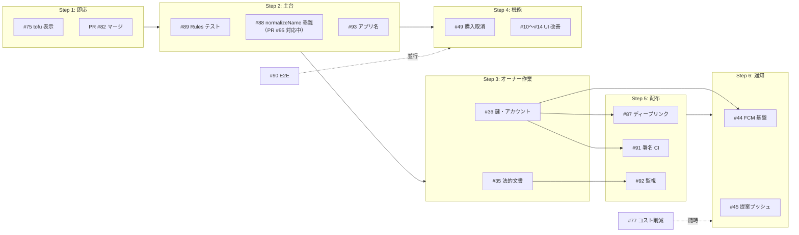

# 実装順序案

> **更新日:** 2026-09-08（前回: 2026-08-27）
> **前提資料 →** [スプリント計画](./スプリント計画.md) / [残作業](../REMAINING_TASKS.md) / ロードマップ Issue #46
> **位置づけ:** Open Issue をどの順で片付けるかの提案。Issue の依存関係は #46 が正、
> 本書は **「今週何をやるか」を決めるための順序と根拠**を持つ。
> 完了した項目は表から外し、下の「消化済み」に記録する。

---

## 消化済み

| 日付 | 対象 | 結果 |
|---|---|---|
| 2026-09-05 | **#52 functions レイヤ分割** | 実装済みを確認しクローズ（Step 1-3） |
| 2026-09-05 | **#39 マネタイズ M0** | `PlanLimits` と Rules の `planFieldsUnchanged()` が実装済み・文書化済みであることを確認しクローズ（旧 Step 4-9）。受け入れ条件のうち Rules の自動テストのみ未達で、#89 のスコープに含める |
| 2026-09-05 | **#88 normalizeName の乖離** | PR #95 で対応中（Step 2-5） |

---

## 判断の軸

| 軸 | 内容 |
|---|---|
| **不可逆性** | 後から取り返せない作業を先に置く（データ蓄積・ストア登録前の命名確定） |
| **ブロック解除** | 他の複数 Issue を止めている作業を優先する（#35 / #36 のオーナー作業） |
| **壊れても気づけない領域** | 検知手段が無い箇所（ルール・E2E・監視）は機能追加より前に土台を作る |
| **コスト** | 実装コストと、着手が遅れることで増える手戻りコストを比較する |

---

## 全体像

---

## Step 1: 即応（数時間〜1 日）

着手コストが小さく、放置するほど紛らわしいもの。

| 順 | 対象 | 理由 |
|:--:|---|---|
| 1 | **#75 Web の tofu 表示** | 唯一「今ユーザーに見えている不具合」。Web が主要な評価経路である以上、最優先 |
| 2 | **PR #82 のマージ** | 2026-07-25 から open。ドキュメントのみで衝突リスクが増えるだけ |

> ~~#52 のクローズ~~ は 2026-09-05 に完了（「消化済み」参照）。

---

## Step 2: 土台（1〜2 スプリント）

**機能追加の前に置く。**後から入れるほど、それまでに書いたコードの検証をやり直すことになる。

| 順 | 対象 | 理由 |
|:--:|---|---|
| 4 | **#89 セキュリティルールの自動テスト** | グループ境界は本アプリ唯一のアクセス制御。#38 → #60 で構文誤りを追いかけた実績がある。**#39 で入れた `plan` / `planExpiresAt` の書き込み保護が既に無検証で載っている**ため、#39 の受け入れ条件の積み残しでもある。ここを埋めると以降ずっと効く |
| 5 | **#88 normalizeName の Dart / TS 乖離** | 放置すると**不整合データが増え続ける**。全角名の商品でサーバ（集約済み）とクライアント（別物扱い）が食い違い、履歴が積まれるほど手当てが重くなる。→ **PR #95 で対応中** |
| 6 | **#93 のうちネイティブのアプリ名** | ストア登録（#36）でアプリ名が確定してしまう。**登録前**に `Kaimono` へ寄せる。テーマカラー側は #10 に合流させる |

> #90（E2E）はここに入れてもよいが、実行環境（chromedriver / エミュレータ）の検討を伴うので
> **Step 4 と並行**で進め、βテスト（Sprint 8）までに間に合えばよい。

---

## Step 3: オーナー作業（並行・リードタイム長）

**コードの作業ではないが、着手から完了までに日数がかかる**ため、Step 2 と並行で走らせる。

| 順 | 対象 | 理由 |
|:--:|---|---|
| 7 | **#35 法的文書** | #92（Analytics 導入）と AI 提案のリリースが両方これを待っている。文面作成 → 公開先の用意にリードタイムがある |
| 8 | **#36 鍵・アカウント整備** | #87 / #91 / #44 / #92 の 4 つをまとめてブロックしている。Apple Developer Program の加入審査など待ち時間があるので早めに開始する |

> この 2 つが遅れると Step 5 以降が丸ごと止まる。**Step 2 の実装と同時に着手する**のが重要。

---

## Step 4: 機能追加（2〜3 スプリント）

土台が整った状態で載せる。#36 の完了を待たずに進められる。

| 順 | 対象 | 理由 |
|:--:|---|---|
| 9 | **#49 誤購入の取り消し** | 履歴・サマリーの整合性に関わるバグ寄りの改善。#88 と同じく**データが増える前**に直したい |
| 10 | **#10 → #11 → #12 → #13 → #14 UI 改善** | βテストの体験品質に直結。#10（カラートークン）が他の 4 件の前提なので順序固定。#93 のテーマカラー修正を #10 に合流させる。#14 は**マルチセレクトが実装済み**（`selection_controller.dart`）でスワイプ操作のみ残っているため、着手時にスコープを縮小できる |

> ~~#39 マネタイズ M0~~ は実装済みだったため 2026-09-05 にクローズ（「消化済み」参照）。

**#90（E2E）をこの期間に並行で進める。** UI 改善で画面構造が変わるため、#10〜#14 の後半に
書き始めると手戻りが少ない。

---

## Step 5: 配布準備（#36 完了後）

| 順 | 対象 | 理由 |
|:--:|---|---|
| 11 | **#87 ディープリンク** | 招待フローがモバイルで機能していない。App Links / Universal Links は #36 の署名フィンガープリントが前提。**ストア配布前に必須**（招待が成立しないと 2 人目招待率の KPI が測れない） |
| 12 | **#91 署名 CI（AAB / iOS 連携）** | #36 のキーストアを Secrets に載せる作業。ここまで来ればストアに出せる成果物が CI から出る |
| 13 | **#92 Crashlytics / Analytics** | Sprint 8 / 9 のゲート条件（クラッシュフリー率・リテンション・招待率）を測る手段。**βテスト開始前**に入っている必要がある。#35 の公開とセットで |

---

## Step 6: 通知（最後）

| 順 | 対象 | 理由 |
|:--:|---|---|
| 14 | **#44 通知第 1 弾（FCM 基盤 + イベント通知）** | APNs 認証キー / VAPID キー（#36）が前提。基盤を作れば #45 は送信 1 箇所の追加で済む |
| 15 | **#45 AI 提案 Phase 2（提案プッシュ）** | #44 の基盤に週次提案の送信を足すだけ |

> **#77（コスト削減）は随時。** Functions / Gemini の利用が増える #45 の前後で一度見直すのが自然。
> Blaze 移行済み（#34）のため、請求アラートの閾値確認は早めにやっておく。

---

## 未起票分（着手条件が揃ってから起票）

#46 に記載のとおり、以下は前提が揃うまで起票しない。

| 内容 | 起票条件 |
|---|---|
| 購入履歴 Step 2: 統計ダッシュボード | マネタイズ M2 の着手時期 |
| マネタイズ M1（RevenueCat / 投げ銭） | #36 のストア配布が完了 |
| マネタイズ M2（Pro 購読・Free/Pro 境界） | M1 + 対象機能の実装完了 |
| マネタイズ M3（ファミリープラン） | M2 の運用実績 |
| AI 提案 Phase 3（フィードバック還流） | #45 完了 |

---

## 更新履歴

| 日付 | 更新内容 |
|---|---|
| 2026-08-27 | 初版作成。Open Issue（#87〜#93 の新規起票分を含む）を 6 ステップに整理 |
| 2026-09-08 | #52 / #39 の完了（2026-09-05 クローズ）を反映して表から除去し「消化済み」を新設。#88 を PR #95 対応中として更新。#89 の根拠を #39 クローズ後の状況に更新し、Step 5・6 の番号を詰めた |
